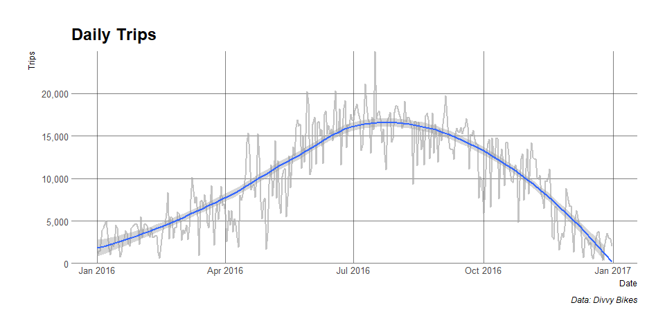
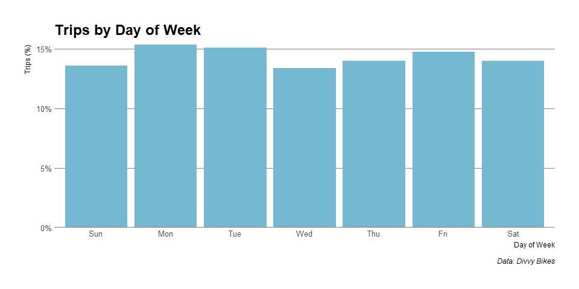
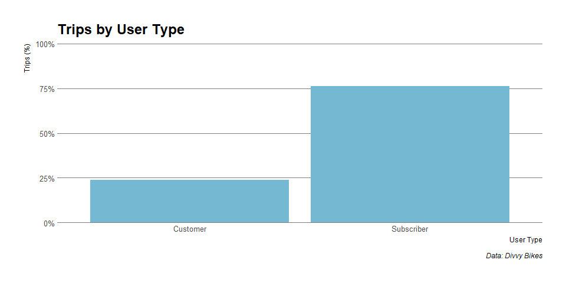
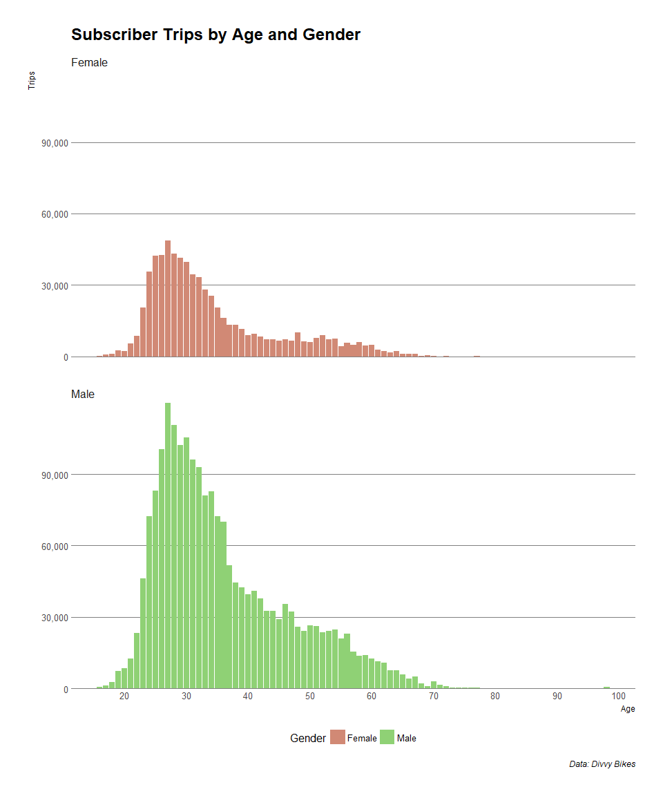
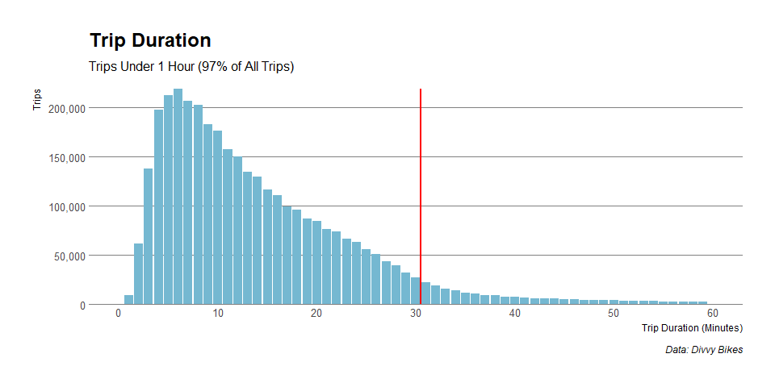

Welcome to my inaugural Github post! After many months spent learning the basics of R, I finally feel comfortable posting some code. This space will, hopefully, contain my monthly data-dives, visualizations, modelling exercises, and general musings on data sets that I find interesting. I would appreciate any comments, constructive or otherwise. 

With introductions out of the way, let's dive into our first data set, generously provided by Divvy, the Chicago bike-share program - you can find more information [here](https://www.divvybikes.com/system-data). For the purposes of this analysis, I examine the 3,595,293 Divvy trips made in 2016. Here is what the tidied data frame looks like:


```r
DT::datatable(head(trips,5),rownames= F,options = list(dom = "t",scrollX = T))
```

<!--html_preserve--><div id="htmlwidget-37783741e18a3bc623ad" style="width:100%;height:auto;" class="datatables html-widget"></div>
<script type="application/json" data-for="htmlwidget-37783741e18a3bc623ad">{"x":{"filter":"none","data":[[9379901,9379900,9379899,9379898,9379897],["2016-04-30T23:59:00Z","2016-04-30T23:58:00Z","2016-04-30T23:58:00Z","2016-04-30T23:54:00Z","2016-04-30T23:52:00Z"],["2016-05-01T00:11:00Z","2016-05-01T00:07:00Z","2016-05-01T00:02:00Z","2016-05-01T00:08:00Z","2016-05-01T00:11:00Z"],[21,3583,4557,2443,50],[733,556,253,802,1146],["Subscriber","Subscriber","Subscriber","Subscriber","Customer"],["Male","Male","Male","Male",null],[1982,1991,1984,1978,null],[123,349,59,289,239],["California Ave &amp; Milwaukee Ave","Halsted St &amp; Wrightwood Ave","Wabash Ave &amp; Roosevelt Rd","Wells St &amp; Concord Ln","Western Ave &amp; Leland Ave"],[-87.697153,-87.649077,-87.625961,-87.634656,-87.688487],[41.922695,41.929143,41.867227,41.912133,41.966555],[374,165,273,199,227],["Western Ave &amp; Walton St","Clark St &amp; Grace St","Michigan Ave &amp; 18th St","Wabash Ave &amp; Grand Ave","Southport Ave &amp; Waveland Ave"],[-87.68659602,-87.659172,-87.62455,-87.626937,-87.66394],[41.89841769,41.95078,41.857813,41.891738,41.94815]],"container":"<table class=\"display\">\n  <thead>\n    <tr>\n      <th>trip_id<\/th>\n      <th>start_time<\/th>\n      <th>stop_time<\/th>\n      <th>bike_id<\/th>\n      <th>trip_duration<\/th>\n      <th>user_type<\/th>\n      <th>gender<\/th>\n      <th>birth_year<\/th>\n      <th>from_station_id<\/th>\n      <th>from_station_name<\/th>\n      <th>from_long<\/th>\n      <th>from_lat<\/th>\n      <th>to_station_id<\/th>\n      <th>to_station_name<\/th>\n      <th>to_long<\/th>\n      <th>to_lat<\/th>\n    <\/tr>\n  <\/thead>\n<\/table>","options":{"dom":"t","scrollX":true,"columnDefs":[{"className":"dt-right","targets":[0,3,4,7,8,10,11,12,14,15]}],"order":[],"autoWidth":false,"orderClasses":false},"selection":{"mode":"multiple","selected":null,"target":"row"}},"evals":[],"jsHooks":[]}</script><!--/html_preserve-->
<p>
If you are interested in how the raw data was transformed into a usable format, this repository also includes the cleaning script.

##Spatial
###Trips by Station
Before examining any other features, I want to map rides by station to get a sense of the spatial distribution of Divvy across Chicago. I am especially interested in whether some stations act exclusively as start or endpoints compared to others. The code chunk below first summarizes the data by originating station, and then maps the output using leaflet. Data for terminating stations was compiled in the exact same manner, just by switching "from to "to".


```r
#=============
#From
#=============

#Dataframe
trips_from <- trips %>%
  group_by(from_station_id,from_station_name,
           from_long,from_lat) %>% 
  summarize(trips= n_distinct(trip_id))

#Map
pal <- colorNumeric("viridis",domain = trips_from$trips)
  
tooltip <- paste("<strong>Station:</strong>",
                 trips_from$from_station_name,"<br>",
                 "<strong>Trips Originating:</strong>",
                 comma(trips_from$trips))

map_from <- leaflet() %>% 
  addProviderTiles("CartoDB.Positron") %>% 
  addCircles(data = trips_from,lng = ~from_long,lat = ~from_lat,
             stroke = F,fill = T,fillColor = ~pal(trips),
             fillOpacity = 0.7,radius = ~(trips/100),
             popup = tooltip) %>% 
  addLegend(position = "bottomright",pal = pal,
            values = trips_from$trips,
            title = "Trips<br>Originating")
```


<p>
Once we have made the maps for both originating and terminating stations, we can plot them together like so:


```r
#Map together
sync(map_from,map_to)
```

<!--html_preserve--><div style="display:inline;width:49%;float:left;border-style:solid;border-color:#BEBEBE;border-width:1px 1px 1px 1px;">
<div id="htmlwidget-2156" style="width:100%;height:400px;" class="leaflet html-widget"></div>
<script type="application/json" data-for="htmlwidget-2156">{"x":{"options":{"crs":{"crsClass":"L.CRS.EPSG3857","code":null,"proj4def":null,"projectedBounds":null,"options":{}}},"calls":[{"method":"addProviderTiles","args":["CartoDB.Positron",null,null,{"errorTileUrl":"","noWrap":false,"zIndex":null,"unloadInvisibleTiles":null,"updateWhenIdle":null,"detectRetina":false,"reuseTiles":false}]},{"method":"addCircles","args":[[41.872638,41.86722596,41.856268,41.874053,41.88504199,41.88634906,41.82879202,41.76663824,41.76640946,41.932418,41.858086,41.858166,41.910337,41.90332,41.88327159,41.869417,41.910522,41.87772613,41.8694821,41.902924,41.89186,41.89766,41.89102,41.91021,41.91468,41.90068,41.899643,41.896776,41.87464,41.877181,41.92675599,41.892278,41.87770796,41.87935636,41.88602083,41.87947235,41.87934437,41.87207763,41.852619,41.88389277,41.8847302,41.876243,41.89993001,41.88918,41.897764,41.88131982,41.87593267,41.88457623,41.886024,41.894729,41.89636246,41.867324,41.88871604,41.86711778,41.916017,41.867227,41.91057803,41.907655,41.85137517,41.885637,41.92560188,41.875885,41.90939601,41.88548331,41.860384,41.880422,41.893882,41.878412,41.880958,41.882242,41.88042,41.884241,41.891,41.90096039,41.89637337,41.92556258,41.88397,41.87500913,41.8810317,41.88338,41.894556,41.913688,41.918306,41.77870057,41.88461619,41.865312,41.882664,41.89257,41.888243,41.78101637,41.7734585,41.87146652,41.897448,41.878287,41.87184,41.874675,41.893992,41.894666,41.883668,41.91844,41.946966,41.936266,41.915401,41.94018,41.911386,41.88541,41.853605,41.802562,41.87501,41.922695,41.855048,41.890011,41.911974,41.925905,41.895769,41.857556,41.90331,41.939365,41.849237,41.88917683,41.877749,41.85378,41.865054,41.862378,41.904613,41.898969,41.915689,41.894503,41.922167,41.921822,41.89858665,41.877945,41.845435,41.834734,41.8349,41.838556,41.932225,41.935733,41.93949,41.93649682,41.936669,41.912616,41.907781,41.910535,41.89576475,41.93588,41.931931,41.885837,41.95078,41.92883,41.8492,41.864059,41.874337,41.85795,41.855136,41.9023087,41.89691,41.882091,41.872373,41.902973,41.926277,41.856594,41.82256,41.906782,41.890749,41.903222,41.899714,41.83104,41.917741,41.891795,41.92533,41.928773,41.880884,41.879255,41.841707,41.886875,41.884728,41.890573,41.882134,41.881892,41.891738,41.809851,41.82168,41.857499,41.85394,41.794853,41.857901,41.847203,41.84358,41.85381,41.849527,41.90345,41.894448,41.892154,41.910153,41.89122,41.88137,41.903029,41.886773,41.856802,41.916027,41.93262,41.920195,41.918216,41.913778,41.919936,41.939743,41.94815,41.9406,41.943739,41.94334,41.96167,41.949275,41.883004,41.961588,41.907576,41.842052,41.961615,41.966555,41.954245,41.871737,41.967094,41.962391,41.95469,41.961004,41.956061,41.795212,41.795264,41.963982,41.936083,41.967968,41.809835,41.968873,41.954383,41.867888,41.952833,41.94911,41.930584,41.918121,41.929567,41.871514,41.827059,41.836208,41.886835,41.822985,41.809443,41.911722,41.75866967,41.816499,41.838842,41.857813,41.861267,41.865234,41.91044,41.891072,41.830629,41.830661,41.8378,41.84847,41.864883,41.87817,41.87785,41.89113,41.878724,41.880317,41.918084,41.912133,41.921525,41.906724,41.957081,41.965485,41.978353,41.972972,41.940106,41.961507,41.955927,41.94367,41.937725,41.907993,41.928712,41.945512,41.949065,41.902893,41.958494,41.920771,41.943403,41.917805,41.920082,41.968885,41.957879,41.925858,41.957921,41.912919,41.96325,41.869154,41.954177,41.932595,41.872187,41.871962,41.799568,41.969517,41.93132,41.973385,41.967096,41.92154,41.788746,41.932684,41.946176,41.908537,41.933666,41.907066,41.940775,41.831379,41.809855,41.896544,41.857611,41.838198,41.929546,41.866095,41.871262,41.928887,41.96909,41.793242,41.88283,41.950687,41.854016,41.929143,41.895966,41.803038,41.77351755,42.01256012,42.01058656,41.77366885,41.76649294,41.90348607,41.90021949,41.89936844,41.84163254,41.83069611,41.83920868,41.83010465,41.85418425,41.900146,41.8954653,41.89841769,41.889727,41.88949182,41.88460329,41.88445396,41.87978771,41.87474885,41.87429061,41.80183164,41.794982,41.79292965,41.77938114,41.78007963,41.76906172,41.76929309,41.76550801,41.870816,41.75712007,41.758768,41.75874584,41.75787145,41.76218896,41.76571904,41.842733,41.838464,41.83452989,41.830777,41.83127424,41.82301524,41.81763809,41.81620768,41.81665889,41.80813391,41.80931771,41.81409271,41.870257,41.80229465,41.805772,41.802406,41.79933626,41.79949429,41.79430062,41.79342946,41.79156801,41.791478,41.79172821,41.78794281,41.78509715,41.78059901,41.78040565,41.77372095,41.78008064,41.78414169,42.00906913,41.87359967,41.86650148,41.86649278,41.866624,41.86148,41.85420431,41.85353363,41.84988195,41.84819094,41.84910969,41.84456685,41.84447501,41.84404003,41.84151771,42.00797192,42.00454962,42.00445063,42.00200726,42.00104378,41.99416137,41.99925182,41.99477969,41.99023603,41.991178,41.99089375,41.98974251,41.9840367,41.983593,41.98404461,41.97977022,41.97799665,41.9756148,41.9716,42.01213228,42.0085944,41.98366471,41.98039423,41.975672,41.97563273,41.9749113,41.96835449,41.96871107,41.96668636,41.96631753,41.96590014,41.96115408,41.961041,41.961068,41.96152593,41.953393,41.95400484,41.95358618,41.95434085,41.95216219,41.94563644,41.94678185,41.94524357,41.94663583,41.94702904,41.94302616,41.98239708,41.96110802,41.93944839,41.939398,41.93842879,41.93058537,41.93533728,41.93190197,41.926618,41.92439882,41.92463247,41.92409085,41.91718375,41.91751339,41.90965688,41.9097693,41.90270659,41.91402671,42.019276,42.019159,42.015963,41.885502,42.016977,42.015962,42.019537,42.021019,41.894887,42.012701,42.012342,42.018901,41.885409,41.886841,41.887832,41.887664,41.887919,41.875679,41.880827,41.874325,41.885928,41.880708,41.872131,41.877613,41.880207,41.872993,41.880121,41.875806,41.87998,41.877917,41.823192,41.823465,41.823613,41.813996,41.894958,41.808227,41.80887,41.80839,41.800908,41.803023,41.799659,41.794587,41.792822,41.794694,41.786833,41.783681,41.783189,41.779374,41.775393,41.774074,41.768726,41.768938,41.763462,41.75916,41.758308,41.758361,41.756971,41.750794,41.750951,41.753174,41.751294,41.751173,41.751802,41.75182,41.751731,41.744607,41.746334,41.746559,41.744123,41.744053,41.743116,41.743316,41.743921,41.954468,41.953733,41.948818,41.960631,41.787539,41.805661,41.736646,42.048214,42.032562,42.025784,42.039742,42.048308,42.063598,42.063999,42.050491,42.058239,42.052939,41.894071,41.898168,41.890491,41.88891,41.88681,41.886923,41.888085,41.879837,41.880113,41.87981,41.872987,41.871312,41.870699,41.924361,41.898203],[-87.623979,-87.61535539,-87.613348,-87.627716,-87.61279454,-87.61751655,-87.68060446,-87.57645011,-87.56568757,-87.652705,-87.651073,-87.656495,-87.670072,-87.67273,-87.63731329,-87.660996,-87.653106,-87.65478743,-87.6554864,-87.637715,-87.62062,-87.62351,-87.6173,-87.6435,-87.64332,-87.6626,-87.6677,-87.635633,-87.65703,-87.627844,-87.63442878,-87.612043,-87.63532114,-87.62979104,-87.63087606,-87.62568861,-87.63198522,-87.62954377,-87.626488,-87.62464914,-87.62773357,-87.624426,-87.63443007,-87.6277,-87.642884,-87.62952092,-87.63058454,-87.63188991,-87.624117,-87.633775,-87.65406127,-87.648625,-87.64444785,-87.64108796,-87.668879,-87.625961,-87.64942193,-87.672552,-87.61883465,-87.641823,-87.65370804,-87.640795,-87.67769193,-87.65230486,-87.625813,-87.642746,-87.641711,-87.641052,-87.616743,-87.641066,-87.655599,-87.629634,-87.645925,-87.62377664,-87.66098386,-87.65840426,-87.655688,-87.63310582,-87.62408432,-87.64117,-87.653449,-87.652855,-87.636282,-87.58678762,-87.64457058,-87.617867,-87.63253,-87.614492,-87.63639,-87.57611976,-87.58533974,-87.64094913,-87.628722,-87.643909,-87.64664,-87.650019,-87.629318,-87.638437,-87.64867,-87.65222,-87.654242,-87.652662,-87.687202,-87.65304,-87.638677,-87.66732,-87.631886,-87.590368,-87.67328,-87.697153,-87.675726,-87.626293,-87.631942,-87.64926,-87.67722,-87.661535,-87.67695,-87.668385,-87.631715,-87.63850577,-87.649633,-87.64665,-87.656959,-87.651062,-87.640552,-87.629912,-87.6346,-87.617854,-87.638888,-87.64414,-87.62191523,-87.662007,-87.622176,-87.625813,-87.61793,-87.608218,-87.658617,-87.663576,-87.66378,-87.64753866,-87.636794,-87.681391,-87.685854,-87.689556,-87.62590803,-87.67842,-87.677856,-87.6355,-87.659172,-87.668507,-87.67564,-87.623727,-87.639566,-87.640826,-87.654127,-87.62769053,-87.621743,-87.639833,-87.633523,-87.63128,-87.630834,-87.627542,-87.61615,-87.626402,-87.63206,-87.634324,-87.677234,-87.62688,-87.691392,-87.658751,-87.6658,-87.663913,-87.639525,-87.639904,-87.626938,-87.62603,-87.619521,-87.622072,-87.625125,-87.648789,-87.626937,-87.616279,-87.6216,-87.646277,-87.685243,-87.618691,-87.668745,-87.646795,-87.645368,-87.665897,-87.640591,-87.667747,-87.622663,-87.636928,-87.68229,-87.67686,-87.67493,-87.697474,-87.656001,-87.633879,-87.677411,-87.642385,-87.693033,-87.656936,-87.64884,-87.64883,-87.658865,-87.66394,-87.6785,-87.66402,-87.67097,-87.65464,-87.646303,-87.651148,-87.666036,-87.638517,-87.617,-87.674365,-87.688487,-87.654406,-87.65103,-87.679028,-87.684146,-87.67393,-87.649603,-87.668869,-87.580715,-87.596471,-87.638181,-87.669807,-87.650001,-87.599383,-87.658857,-87.648043,-87.623041,-87.649993,-87.675112,-87.685126,-87.696972,-87.707857,-87.669886,-87.64572,-87.613533,-87.62232,-87.6071,-87.591875,-87.626804,-87.58688287,-87.606582,-87.621857,-87.62455,-87.656625,-87.666507,-87.6972,-87.666611,-87.64129,-87.647172,-87.65114,-87.685109,-87.647071,-87.631985,-87.62408,-87.67203,-87.634793,-87.635185,-87.643749,-87.634656,-87.707322,-87.63483,-87.664199,-87.657238,-87.659753,-87.659637,-87.645451,-87.671387,-87.679259,-87.64895,-87.644095,-87.631501,-87.653833,-87.64598,-87.648601,-87.687275,-87.654966,-87.663712,-87.679618,-87.682437,-87.677855,-87.684001,-87.649519,-87.638973,-87.673567,-87.664169,-87.679258,-87.671045,-87.664358,-87.665939,-87.661501,-87.626106,-87.594747,-87.654691,-87.638742,-87.668365,-87.667429,-87.653818,-87.601334,-87.63625,-87.673308,-87.648627,-87.648959,-87.667252,-87.639192,-87.618034,-87.606755,-87.630931,-87.619407,-87.645143,-87.643118,-87.607267,-87.673688,-87.658971,-87.674237,-87.587782,-87.661206,-87.6687,-87.695445,-87.649077,-87.667747,-87.606615,-87.57714283,-87.67436712,-87.66241209,-87.56733865,-87.58646088,-87.64335349,-87.64298547,-87.64847988,-87.65743495,-87.65597591,-87.66560986,-87.67029831,-87.61915374,-87.702882,-87.70612788,-87.68659602,-87.70103,-87.68821936,-87.70630374,-87.69629814,-87.68611281,-87.68644528,-87.66724564,-87.6452139,-87.633124,-87.64499006,-87.64462081,-87.62974631,-87.64461358,-87.62819593,-87.61691793,-87.631246,-87.57583936,-87.56644,-87.56011478,-87.54938625,-87.55927465,-87.60495971,-87.635491,-87.635406,-87.63182298,-87.632504,-87.60879919,-87.62656802,-87.64356503,-87.63481935,-87.61941246,-87.64561655,-87.63344929,-87.59700515,-87.639474,-87.61805358,-87.592464,-87.586924,-87.60095811,-87.5864499,-87.60144977,-87.61585326,-87.60785218,-87.599861,-87.58394501,-87.58831517,-87.60107276,-87.60611239,-87.59141599,-87.60563486,-87.61594286,-87.61330783,-87.67371139,-87.70487075,-87.68469707,-87.70649618,-87.694521,-87.693374,-87.71540584,-87.70507303,-87.71700039,-87.70541375,-87.69513981,-87.71591031,-87.70201301,-87.69529592,-87.68513144,-87.66550239,-87.68066615,-87.6724024,-87.68972623,-87.66119824,-87.68943828,-87.67137734,-87.66028453,-87.69336964,-87.683593,-87.6695834,-87.66014062,-87.65231047,-87.669154,-87.66027383,-87.67581473,-87.6680471,-87.67945904,-87.650154,-87.68291264,-87.69049224,-87.69642256,-87.71611496,-87.709261,-87.70141944,-87.69250256,-87.71183067,-87.69616957,-87.70805198,-87.70108268,-87.69363849,-87.71656907,-87.705866,-87.695439,-87.69116504,-87.732002,-87.71912818,-87.7093108,-87.68607962,-87.69805111,-87.72773681,-87.71642152,-87.7066499,-87.69461476,-87.68336721,-87.68739454,-87.70892252,-87.7289701,-87.72355383,-87.711561,-87.69800776,-87.72377736,-87.71688929,-87.70119513,-87.697899,-87.71544104,-87.68930701,-87.67646007,-87.71035665,-87.70180896,-87.71663195,-87.70528049,-87.70921957,-87.70512646,-87.68452,-87.673573,-87.675005,-87.716866,-87.677725,-87.66857,-87.669563,-87.665086,-87.774704,-87.666058,-87.688243,-87.690048,-87.726491,-87.745261,-87.755527,-87.765469,-87.774446,-87.71547,-87.726279,-87.725704,-87.73541,-87.741018,-87.746619,-87.745405,-87.755337,-87.764499,-87.763238,-87.755285,-87.773264,-87.735737,-87.676597,-87.665577,-87.650931,-87.666589,-87.764902,-87.67718,-87.66454,-87.656526,-87.674684,-87.664699,-87.657195,-87.674254,-87.664429,-87.654947,-87.666215,-87.674101,-87.654372,-87.664843,-87.654308,-87.663815,-87.664069,-87.652934,-87.637297,-87.595751,-87.606685,-87.614138,-87.624621,-87.624424,-87.613783,-87.605026,-87.597552,-87.585337,-87.574845,-87.565211,-87.552812,-87.551201,-87.564725,-87.586005,-87.599034,-87.604786,-87.6148,-87.622849,-87.575225,-87.749594,-87.740569,-87.74002,-87.745359,-87.644874,-87.683392,-87.622634,-87.683485,-87.679101,-87.684107,-87.699413,-87.698224,-87.69873,-87.685962,-87.677821,-87.677432,-87.673447,-87.800367,-87.783055,-87.776842,-87.800255,-87.80287,-87.793899,-87.785236,-87.80224,-87.789247,-87.779425,-87.793945,-87.788938,-87.778797,-87.727752,-87.637536],[132.94,281.86,199.06,81.23,203.68,100.88,8.59,2.47,6.84,126.72,36.04,39.55,70.58,73.96,142.39,62.3,96.42,94.25,66.53,43.65,204.62,121.85,259.97,45.87,58.39,83.58,51.7,151.24,44.03,138.14,90.21,900.42,247.58,167.98,147.7,116.15,107.71,123.54,25.43,260.1,166.3,112.3,87.04,183.72,165.54,226.16,123.4,134.14,237.21,135.45,79.56,40.1,199.76,68.53,169.14,215.87,107.62,112.75,62.08,218.72,155.34,69.4,194.23,139.77,84.99,110.6,197.95,305.03,510.9,417.44,105.77,232.4,92.93,377.54,59.82,74.36,69.06,95.49,374.53,471.25,62.16,88.98,215.82,4.68,99.55,148.5,152.24,161.85,167.71,10.68,3.74,19.02,112.03,93.04,73.37,48.13,217.72,100.25,130.03,118.18,154.18,129.16,76.14,183.87,112.66,49.03,52.94,22.59,29.01,88.58,16.88,112.29,114.26,94.89,104.16,51.07,108.38,62.3,13.35,311,144.41,12.17,7.41,42.32,60.47,167.05,206,142.62,121.47,126.02,137.88,51.85,19.33,46.14,30.37,106.39,87.23,118.88,59.34,126.48,135,79.69,30.57,31.41,120.38,39.58,33.86,136.24,64.4,49.13,3.86,85.02,34.1,28.54,11.63,104.64,139.45,360.63,93.19,202.31,479.27,31.9,7.02,75.92,203.65,118.78,72.95,21.16,24.4,65.13,54.82,78.11,174.51,333.9,6.65,131.87,281.18,115.07,115.63,155.73,233.79,4.56,3.7,27.7,10.89,15.93,33.59,25.39,16.8,10.64,12.65,150.73,204.63,154.66,59.97,56.77,25.58,25.69,81.79,12.66,90.62,130.65,27.82,82.42,69.78,97.49,79.65,105.39,32.13,119.36,94.5,86,103,90.29,43.07,25.22,51.84,47.09,53.01,142.37,99.69,53.57,49.99,50.91,59.22,30.58,66.92,32.24,150.37,42.65,41.29,13.67,43.95,121.42,246.43,72.34,42.8,50.23,39.08,86.91,50.34,4.52,19.76,130.9,14.45,28.1,457.54,1.57,4.97,27.03,91.39,21.31,14.92,32.8,40.91,15.26,12.95,23.34,4.74,69.59,234.56,185.84,43.67,173.47,268.62,69.96,224.81,40.79,138.35,27.66,47.05,59.93,45.57,106.94,25.86,50.26,105.97,132.63,136.71,89.98,118.82,101.39,50.21,59.53,65.84,38.75,45.25,42.74,30.1,80.1,146.32,33.7,28.78,34.46,53.8,59.57,36.03,67.33,128.35,60.67,25.14,82.7,75.81,49.82,106.28,46.68,117.93,25.6,114.45,78.36,59.39,163.77,6.93,8.72,107.27,85.85,27.3,146.23,215.5,84.16,55.8,127.5,48.64,84.8,46.67,8.03,104.22,64.02,5.57,5.71,5.56,18.69,7.79,3.25,81.71,74.63,22.8,10.57,6.02,4.35,2.75,35.58,17.43,8.48,51.21,2.37,56.04,10.84,7.35,9.04,16.68,57.16,0.26,2.7,0.3,1.2,1.25,0.15,0.77,0.34,44.47,1.18,0.84,1.19,0.88,3.94,1.96,12.61,17.52,21.1,7.16,5.55,0.77,1,0.88,3.9,3.15,2.2,9.25,55.61,4.85,10.13,50.07,30.48,39.39,49.82,1.71,8.55,79.44,41.36,18.85,40.95,5.18,5.78,1.83,1.67,1.26,20.49,2.57,18.03,9.13,5.62,6.9,2.75,3.76,0.21,1.49,6.73,1.54,1.46,1.83,1.8,30.33,5.16,16.82,5.38,38.9,6.7,15.83,42.47,4.95,5,22.71,42.69,107.63,36.05,37.79,20.45,66.19,38.24,52.11,4.59,8.57,6.65,10.03,8.59,19.39,16.72,15.95,14.69,11.11,11.34,26.62,12.44,10.15,15.26,22.99,10.28,12.04,10.76,17.84,12.11,3.53,14.79,22.3,19.49,17.14,29.58,7.33,6.2,11.87,20.22,16.01,15.01,9.44,24.39,24.3,22.42,30.34,21.3,25.92,41.92,9.51,24.61,10.91,47.24,2.02,8.27,3.92,3.27,2.14,11.8,2.51,11.35,0.87,3.39,2.09,1.87,0.76,0.64,0.47,0.39,2.23,0.62,1.13,1.06,0.51,0.59,0.23,0.51,0.61,0.31,0.57,0.32,1.42,1,0.75,1.24,0.36,0.17,0.29,0.46,1.22,0.25,0.88,0.33,0.28,0.07,0.12,0.22,0.31,0.17,0.01,0.26,0.08,0.16,0.2,0.11,0.12,0.11,0.22,0.09,0.42,1.03,0.25,0.25,0.18,0.39,0.28,0.29,0.16,0.11,0.02,0.5,0.07,1.52,0.17,0.09,0.07,2.24,2.65,1.13,3.12,0.11,1.52,0.22,26.2,13.48,1.72,1.85,4.47,6.85,7.05,14.84,14.92,12.94,9.02,4.82,1.46,6.63,11.98,8.15,4.56,6.96,6.51,3.12,4.83,5.12,5.06,5.41,5.93],null,null,{"lineCap":null,"lineJoin":null,"clickable":true,"pointerEvents":null,"className":"","stroke":false,"color":"#03F","weight":5,"opacity":0.5,"fill":true,"fillColor":["#463480","#33638D","#3E4989","#482173","#3E4B8A","#482979","#450458","#440255","#450457","#46327E","#471063","#471164","#481D6F","#481F70","#453781","#481B6D","#482777","#482677","#481C6E","#471366","#3E4C8A","#46307E","#365D8D","#481467","#48196B","#482274","#481769","#443A83","#471366","#453581","#482576","#FDE725","#38598C","#424086","#443983","#472E7C","#472B7A","#46307E","#460B5E","#365D8D","#423F85","#472D7B","#482475","#404588","#423F85","#3B528B","#46307E","#463480","#39558C","#463480","#482172","#471264","#3E4A89","#481C6E","#424086","#3C4F8A","#472B7A","#472D7B","#481B6D","#3C508B","#443B84","#481D6F","#3F4889","#453681","#482374","#472C7A","#3E4989","#30698E","#1FA188","#24878E","#472A7A","#3A548C","#482576","#287D8E","#481A6C","#481F70","#481D6F","#482677","#287C8E","#1F958B","#481B6D","#482475","#3C4F8A","#440356","#482878","#443983","#443A83","#433E85","#423F85","#450559","#440256","#46095C","#472D7B","#482576","#481F70","#481568","#3C508B","#482878","#46337F","#472E7C","#443B84","#46337F","#482071","#404588","#472D7B","#481668","#481769","#460A5D","#470D60","#482475","#46085C","#472D7B","#472D7B","#482677","#482979","#481668","#472B7A","#481B6D","#46075A","#2F6B8E","#453882","#450659","#450457","#471365","#481A6C","#423F85","#3E4C8A","#453781","#472F7D","#46317E","#453581","#481769","#46095C","#481467","#470E61","#472A7A","#482475","#472F7D","#481A6C","#46327E","#463480","#482172","#470E61","#470E61","#472F7D","#471164","#470F62","#453581","#481B6D","#481668","#440256","#482374","#470F62","#470D60","#450659","#472A7A","#453681","#2A788E","#482576","#3E4B89","#1F988B","#470E61","#450457","#481F70","#3E4B8A","#472F7D","#481E70","#460A5D","#460B5E","#481B6D","#48186A","#482071","#424186","#2C718E","#450457","#46337F","#33638D","#472E7C","#472E7C","#443B84","#3A548C","#440356","#440256","#470D60","#450559","#46085B","#470F62","#460B5E","#46085C","#450559","#46065A","#443A83","#3E4C8A","#443B84","#481A6C","#48186A","#460B5E","#460C5F","#482173","#46065A","#482576","#46337F","#470D60","#482273","#481D6F","#482778","#482172","#472A7A","#470E61","#472F7D","#482677","#482374","#482979","#482576","#471365","#460B5E","#481769","#481567","#481769","#453781","#482878","#481769","#481668","#481668","#481A6C","#470E61","#481C6E","#470E61","#443A83","#471365","#471265","#46075A","#471366","#472F7D","#38598C","#481E6F","#471365","#481668","#471164","#482475","#481668","#440356","#46095D","#46337F","#46075A","#470D60","#20928C","#440155","#440356","#470C5F","#482576","#460A5D","#46075A","#470F62","#471265","#46075B","#46065A","#460B5E","#440356","#481D6F","#3A548C","#404688","#471366","#424186","#355F8D","#481D6F","#3B528B","#471265","#453581","#470D60","#481567","#481A6C","#481467","#472B7A","#460C5F","#481668","#472A7A","#463480","#453581","#482475","#472F7D","#482979","#481668","#481A6C","#481C6E","#471164","#481467","#471365","#470E61","#482172","#453882","#470F62","#470D60","#471063","#481769","#481A6C","#471063","#481C6E","#46327E","#481A6C","#460B5E","#482273","#481F70","#481668","#472A7A","#481467","#472E7C","#460C5E","#472D7B","#482071","#481A6C","#433E85","#450457","#450458","#472B7A","#482374","#470C5F","#453882","#3C4F8A","#482374","#48186A","#46327E","#481668","#482374","#481467","#450458","#472A7A","#481B6D","#450357","#450357","#450357","#46095C","#450457","#440256","#482173","#481F70","#460A5D","#450559","#450357","#440256","#440256","#471063","#46085C","#450458","#481768","#440255","#48186A","#450559","#450457","#450558","#46085B","#48186A","#440154","#440256","#440154","#440155","#440155","#440154","#440154","#440154","#481466","#440155","#440154","#440155","#440154","#440256","#440255","#46065A","#46085C","#460A5D","#450457","#450357","#440154","#440155","#440154","#440256","#440256","#440255","#450558","#48186A","#440356","#450559","#481668","#470E61","#471164","#481668","#440155","#450458","#482072","#471265","#46095C","#471265","#440356","#450357","#440255","#440155","#440155","#460A5D","#440255","#46085C","#450558","#450357","#450457","#440256","#440256","#440154","#440155","#450457","#440155","#440155","#440255","#440255","#470E61","#440356","#46085C","#450357","#471164","#450457","#46075B","#471365","#440356","#440356","#460A5D","#471365","#472B7A","#471063","#471164","#460A5D","#481C6E","#471164","#481769","#440356","#450458","#450457","#450559","#450458","#46095C","#46085B","#46085B","#46075A","#450559","#450559","#470C5F","#46065A","#450559","#46075B","#460B5E","#450559","#450659","#450559","#46085C","#450659","#440256","#46075A","#460A5D","#46095D","#46085C","#470D60","#450457","#450357","#450659","#46095D","#46085B","#46075A","#450558","#460B5E","#460B5E","#460A5D","#470E61","#460A5D","#460C5F","#471365","#450558","#460B5E","#450559","#481567","#440255","#450458","#440256","#440256","#440255","#450659","#440255","#450559","#440154","#440256","#440255","#440255","#440154","#440154","#440154","#440154","#440255","#440154","#440155","#440155","#440154","#440154","#440154","#440154","#440154","#440154","#440154","#440154","#440155","#440155","#440154","#440155","#440154","#440154","#440154","#440154","#440155","#440154","#440154","#440154","#440154","#440154","#440154","#440154","#440154","#440154","#440154","#440154","#440154","#440154","#440154","#440154","#440154","#440154","#440154","#440154","#440154","#440155","#440154","#440154","#440154","#440154","#440154","#440154","#440154","#440154","#440154","#440154","#440154","#440155","#440154","#440154","#440154","#440255","#440255","#440155","#440256","#440154","#440155","#440154","#460C5F","#46075A","#440155","#440255","#440356","#450457","#450457","#46075A","#46075A","#46065A","#450558","#440356","#440155","#450457","#450659","#450458","#440356","#450457","#450457","#440256","#440356","#440356","#440356","#450357","#450357"],"fillOpacity":0.7,"dashArray":null},["<strong>Station:<\/strong> Michigan Ave & Balbo Ave <br> <strong>Trips Originating:<\/strong> 13,294","<strong>Station:<\/strong> Shedd Aquarium <br> <strong>Trips Originating:<\/strong> 28,186","<strong>Station:<\/strong> Burnham Harbor <br> <strong>Trips Originating:<\/strong> 19,906","<strong>Station:<\/strong> State St & Harrison St <br> <strong>Trips Originating:<\/strong> 8,123","<strong>Station:<\/strong> Dusable Harbor <br> <strong>Trips Originating:<\/strong> 20,368","<strong>Station:<\/strong> Field Blvd & South Water St <br> <strong>Trips Originating:<\/strong> 10,088","<strong>Station:<\/strong> Leavitt St & Archer Ave <br> <strong>Trips Originating:<\/strong> 859","<strong>Station:<\/strong> Jeffery Blvd & 71st St <br> <strong>Trips Originating:<\/strong> 247","<strong>Station:<\/strong> South Shore Dr & 71st St <br> <strong>Trips Originating:<\/strong> 684","<strong>Station:<\/strong> Wilton Ave & Diversey Pkwy <br> <strong>Trips Originating:<\/strong> 12,672","<strong>Station:<\/strong> Morgan St & 18th St <br> <strong>Trips Originating:<\/strong> 3,604","<strong>Station:<\/strong> Racine Ave & 18th St <br> <strong>Trips Originating:<\/strong> 3,955","<strong>Station:<\/strong> Paulina Ave & North Ave <br> <strong>Trips Originating:<\/strong> 7,058","<strong>Station:<\/strong> Wood St & Division St <br> <strong>Trips Originating:<\/strong> 7,396","<strong>Station:<\/strong> Wacker Dr & Washington St <br> <strong>Trips Originating:<\/strong> 14,239","<strong>Station:<\/strong> Loomis St & Taylor St (*) <br> <strong>Trips Originating:<\/strong> 6,230","<strong>Station:<\/strong> Sheffield Ave & Kingsbury St <br> <strong>Trips Originating:<\/strong> 9,642","<strong>Station:<\/strong> Aberdeen St & Jackson Blvd <br> <strong>Trips Originating:<\/strong> 9,425","<strong>Station:<\/strong> May St & Taylor St <br> <strong>Trips Originating:<\/strong> 6,653","<strong>Station:<\/strong> Orleans St & Elm St (*) <br> <strong>Trips Originating:<\/strong> 4,365","<strong>Station:<\/strong> Fairbanks Ct & Grand Ave <br> <strong>Trips Originating:<\/strong> 20,462","<strong>Station:<\/strong> Michigan Ave & Pearson St <br> <strong>Trips Originating:<\/strong> 12,185","<strong>Station:<\/strong> McClurg Ct & Illinois St <br> <strong>Trips Originating:<\/strong> 25,997","<strong>Station:<\/strong> Larrabee St & North Ave <br> <strong>Trips Originating:<\/strong> 4,587","<strong>Station:<\/strong> Larrabee St & Menomonee St <br> <strong>Trips Originating:<\/strong> 5,839","<strong>Station:<\/strong> Noble St & Milwaukee Ave <br> <strong>Trips Originating:<\/strong> 8,358","<strong>Station:<\/strong> Ashland Ave & Augusta Blvd <br> <strong>Trips Originating:<\/strong> 5,170","<strong>Station:<\/strong> Franklin St & Chicago Ave <br> <strong>Trips Originating:<\/strong> 15,124","<strong>Station:<\/strong> Racine Ave & Congress Pkwy <br> <strong>Trips Originating:<\/strong> 4,403","<strong>Station:<\/strong> State St & Van Buren St <br> <strong>Trips Originating:<\/strong> 13,814","<strong>Station:<\/strong> Cannon Dr & Fullerton Ave <br> <strong>Trips Originating:<\/strong> 9,021","<strong>Station:<\/strong> Streeter Dr & Grand Ave <br> <strong>Trips Originating:<\/strong> 90,042","<strong>Station:<\/strong> Franklin St & Jackson Blvd <br> <strong>Trips Originating:<\/strong> 24,758","<strong>Station:<\/strong> Dearborn St & Adams St <br> <strong>Trips Originating:<\/strong> 16,798","<strong>Station:<\/strong> Clark St & Lake St <br> <strong>Trips Originating:<\/strong> 14,770","<strong>Station:<\/strong> Wabash Ave & Adams St <br> <strong>Trips Originating:<\/strong> 11,615","<strong>Station:<\/strong> LaSalle St & Adams St <br> <strong>Trips Originating:<\/strong> 10,771","<strong>Station:<\/strong> Federal St & Polk St <br> <strong>Trips Originating:<\/strong> 12,354","<strong>Station:<\/strong> Wabash Ave & Cermak Rd <br> <strong>Trips Originating:<\/strong> 2,543","<strong>Station:<\/strong> Michigan Ave & Washington St <br> <strong>Trips Originating:<\/strong> 26,010","<strong>Station:<\/strong> State St & Randolph St <br> <strong>Trips Originating:<\/strong> 16,630","<strong>Station:<\/strong> Michigan Ave & Congress Pkwy <br> <strong>Trips Originating:<\/strong> 11,230","<strong>Station:<\/strong> Wells St & Walton St <br> <strong>Trips Originating:<\/strong> 8,704","<strong>Station:<\/strong> State St & Kinzie St <br> <strong>Trips Originating:<\/strong> 18,372","<strong>Station:<\/strong> Larrabee St & Kingsbury St <br> <strong>Trips Originating:<\/strong> 16,554","<strong>Station:<\/strong> Dearborn St & Monroe St <br> <strong>Trips Originating:<\/strong> 22,616","<strong>Station:<\/strong> Clark St & Congress Pkwy <br> <strong>Trips Originating:<\/strong> 12,340","<strong>Station:<\/strong> Clark St & Randolph St <br> <strong>Trips Originating:<\/strong> 13,414","<strong>Station:<\/strong> Michigan Ave & Lake St <br> <strong>Trips Originating:<\/strong> 23,721","<strong>Station:<\/strong> Wells St & Huron St <br> <strong>Trips Originating:<\/strong> 13,545","<strong>Station:<\/strong> Ogden Ave & Chicago Ave <br> <strong>Trips Originating:<\/strong> 7,956","<strong>Station:<\/strong> Halsted St & Roosevelt Rd <br> <strong>Trips Originating:<\/strong> 4,010","<strong>Station:<\/strong> Desplaines St & Kinzie St <br> <strong>Trips Originating:<\/strong> 19,976","<strong>Station:<\/strong> Clinton St & Roosevelt Rd <br> <strong>Trips Originating:<\/strong> 6,853","<strong>Station:<\/strong> Marshfield Ave & Cortland St <br> <strong>Trips Originating:<\/strong> 16,914","<strong>Station:<\/strong> Wabash Ave & Roosevelt Rd <br> <strong>Trips Originating:<\/strong> 21,587","<strong>Station:<\/strong> Dayton St & North Ave <br> <strong>Trips Originating:<\/strong> 10,762","<strong>Station:<\/strong> Wood St & Milwaukee Ave <br> <strong>Trips Originating:<\/strong> 11,275","<strong>Station:<\/strong> McCormick Place <br> <strong>Trips Originating:<\/strong> 6,208","<strong>Station:<\/strong> Clinton St & Lake St <br> <strong>Trips Originating:<\/strong> 21,872","<strong>Station:<\/strong> Sheffield Ave & Fullerton Ave <br> <strong>Trips Originating:<\/strong> 15,534","<strong>Station:<\/strong> Clinton St & Tilden St <br> <strong>Trips Originating:<\/strong> 6,940","<strong>Station:<\/strong> Damen Ave & Pierce Ave <br> <strong>Trips Originating:<\/strong> 19,423","<strong>Station:<\/strong> Morgan St & Lake St <br> <strong>Trips Originating:<\/strong> 13,977","<strong>Station:<\/strong> Wabash Ave & 16th St <br> <strong>Trips Originating:<\/strong> 8,499","<strong>Station:<\/strong> Jefferson St & Monroe St <br> <strong>Trips Originating:<\/strong> 11,060","<strong>Station:<\/strong> Kingsbury St & Erie St <br> <strong>Trips Originating:<\/strong> 19,795","<strong>Station:<\/strong> Canal St & Jackson Blvd <br> <strong>Trips Originating:<\/strong> 30,503","<strong>Station:<\/strong> Lake Shore Dr & Monroe St <br> <strong>Trips Originating:<\/strong> 51,090","<strong>Station:<\/strong> Clinton St & Madison St <br> <strong>Trips Originating:<\/strong> 41,744","<strong>Station:<\/strong> Aberdeen St & Monroe St <br> <strong>Trips Originating:<\/strong> 10,577","<strong>Station:<\/strong> Daley Center Plaza <br> <strong>Trips Originating:<\/strong> 23,240","<strong>Station:<\/strong> Union Ave & Grand Ave <br> <strong>Trips Originating:<\/strong> 9,293","<strong>Station:<\/strong> Michigan Ave & Oak St <br> <strong>Trips Originating:<\/strong> 37,754","<strong>Station:<\/strong> Eckhart Park <br> <strong>Trips Originating:<\/strong> 5,982","<strong>Station:<\/strong> Racine Ave & Fullerton Ave <br> <strong>Trips Originating:<\/strong> 7,436","<strong>Station:<\/strong> May St & Randolph St <br> <strong>Trips Originating:<\/strong> 6,906","<strong>Station:<\/strong> Financial Pl & Congress Pkwy <br> <strong>Trips Originating:<\/strong> 9,549","<strong>Station:<\/strong> Millennium Park <br> <strong>Trips Originating:<\/strong> 37,453","<strong>Station:<\/strong> Clinton St & Washington Blvd <br> <strong>Trips Originating:<\/strong> 47,125","<strong>Station:<\/strong> Carpenter St & Huron St <br> <strong>Trips Originating:<\/strong> 6,216","<strong>Station:<\/strong> Sheffield Ave & Willow St <br> <strong>Trips Originating:<\/strong> 8,898","<strong>Station:<\/strong> Clark St & Armitage Ave <br> <strong>Trips Originating:<\/strong> 21,582","<strong>Station:<\/strong> Stony Island Ave & 64th St <br> <strong>Trips Originating:<\/strong> 468","<strong>Station:<\/strong> Desplaines St & Randolph St <br> <strong>Trips Originating:<\/strong> 9,955","<strong>Station:<\/strong> Field Museum <br> <strong>Trips Originating:<\/strong> 14,850","<strong>Station:<\/strong> LaSalle St & Washington St <br> <strong>Trips Originating:<\/strong> 15,224","<strong>Station:<\/strong> Lake Shore Dr & Ohio St <br> <strong>Trips Originating:<\/strong> 16,185","<strong>Station:<\/strong> Orleans St & Merchandise Mart Plaza <br> <strong>Trips Originating:<\/strong> 16,771","<strong>Station:<\/strong> 63rd St Beach <br> <strong>Trips Originating:<\/strong> 1,068","<strong>Station:<\/strong> Stony Island Ave & 67th St <br> <strong>Trips Originating:<\/strong> 374","<strong>Station:<\/strong> Clinton St & Polk St (*) <br> <strong>Trips Originating:<\/strong> 1,902","<strong>Station:<\/strong> State St & Pearson St <br> <strong>Trips Originating:<\/strong> 11,203","<strong>Station:<\/strong> Desplaines St & Jackson Blvd <br> <strong>Trips Originating:<\/strong> 9,304","<strong>Station:<\/strong> Halsted St & Polk St <br> <strong>Trips Originating:<\/strong> 7,337","<strong>Station:<\/strong> 900 W Harrison St <br> <strong>Trips Originating:<\/strong> 4,813","<strong>Station:<\/strong> Dearborn St & Erie St <br> <strong>Trips Originating:<\/strong> 21,772","<strong>Station:<\/strong> Sedgwick St & Huron St <br> <strong>Trips Originating:<\/strong> 10,025","<strong>Station:<\/strong> Green St & Randolph St <br> <strong>Trips Originating:<\/strong> 13,003","<strong>Station:<\/strong> Bissell St & Armitage Ave <br> <strong>Trips Originating:<\/strong> 11,818","<strong>Station:<\/strong> Sheffield Ave & Addison St <br> <strong>Trips Originating:<\/strong> 15,418","<strong>Station:<\/strong> Sheffield Ave & Wellington Ave <br> <strong>Trips Originating:<\/strong> 12,916","<strong>Station:<\/strong> Western Ave & Winnebago Ave <br> <strong>Trips Originating:<\/strong> 7,614","<strong>Station:<\/strong> Wilton Ave & Belmont Ave <br> <strong>Trips Originating:<\/strong> 18,387","<strong>Station:<\/strong> Sedgwick St & North Ave <br> <strong>Trips Originating:<\/strong> 11,266","<strong>Station:<\/strong> Ashland Ave & Lake St <br> <strong>Trips Originating:<\/strong> 4,903","<strong>Station:<\/strong> Wentworth Ave & Archer Ave <br> <strong>Trips Originating:<\/strong> 5,294","<strong>Station:<\/strong> Blackstone Ave & Hyde Park Blvd <br> <strong>Trips Originating:<\/strong> 2,259","<strong>Station:<\/strong> Ogden Ave & Congress Pkwy <br> <strong>Trips Originating:<\/strong> 2,901","<strong>Station:<\/strong> California Ave & Milwaukee Ave <br> <strong>Trips Originating:<\/strong> 8,858","<strong>Station:<\/strong> Damen Ave & Cullerton St <br> <strong>Trips Originating:<\/strong> 1,688","<strong>Station:<\/strong> Rush St & Hubbard St <br> <strong>Trips Originating:<\/strong> 11,229","<strong>Station:<\/strong> Clark St & North Ave <br> <strong>Trips Originating:<\/strong> 11,426","<strong>Station:<\/strong> Lincoln Ave & Fullerton Ave <br> <strong>Trips Originating:<\/strong> 9,489","<strong>Station:<\/strong> Damen Ave & Chicago Ave <br> <strong>Trips Originating:<\/strong> 10,416","<strong>Station:<\/strong> Blue Island Ave & 18th St <br> <strong>Trips Originating:<\/strong> 5,107","<strong>Station:<\/strong> Damen Ave & Division St <br> <strong>Trips Originating:<\/strong> 10,838","<strong>Station:<\/strong> Lincoln Ave & Belmont Ave <br> <strong>Trips Originating:<\/strong> 6,230","<strong>Station:<\/strong> Wentworth Ave & 24th St <br> <strong>Trips Originating:<\/strong> 1,335","<strong>Station:<\/strong> Kingsbury St & Kinzie St <br> <strong>Trips Originating:<\/strong> 31,100","<strong>Station:<\/strong> Peoria St & Jackson Blvd <br> <strong>Trips Originating:<\/strong> 14,441","<strong>Station:<\/strong> Halsted St & 21st St <br> <strong>Trips Originating:<\/strong> 1,217","<strong>Station:<\/strong> Racine Ave & 13th St <br> <strong>Trips Originating:<\/strong> 741","<strong>Station:<\/strong> Morgan Ave & 14th Pl <br> <strong>Trips Originating:<\/strong> 4,232","<strong>Station:<\/strong> Clybourn Ave & Division St <br> <strong>Trips Originating:<\/strong> 6,047","<strong>Station:<\/strong> Dearborn Pkwy & Delaware Pl <br> <strong>Trips Originating:<\/strong> 16,705","<strong>Station:<\/strong> Clark St & Lincoln Ave <br> <strong>Trips Originating:<\/strong> 20,600","<strong>Station:<\/strong> McClurg Ct & Erie St <br> <strong>Trips Originating:<\/strong> 14,262","<strong>Station:<\/strong> Sedgwick St & Webster Ave <br> <strong>Trips Originating:<\/strong> 12,147","<strong>Station:<\/strong> Larrabee St & Webster Ave <br> <strong>Trips Originating:<\/strong> 12,602","<strong>Station:<\/strong> Mies van der Rohe Way & Chestnut St <br> <strong>Trips Originating:<\/strong> 13,788","<strong>Station:<\/strong> Loomis St & Jackson Blvd <br> <strong>Trips Originating:<\/strong> 5,185","<strong>Station:<\/strong> Indiana Ave & 26th St <br> <strong>Trips Originating:<\/strong> 1,933","<strong>Station:<\/strong> State St & 33rd St <br> <strong>Trips Originating:<\/strong> 4,614","<strong>Station:<\/strong> Calumet Ave & 33rd St <br> <strong>Trips Originating:<\/strong> 3,037","<strong>Station:<\/strong> Fort Dearborn Dr & 31st St <br> <strong>Trips Originating:<\/strong> 10,639","<strong>Station:<\/strong> Lincoln Ave & Diversey Pkwy <br> <strong>Trips Originating:<\/strong> 8,723","<strong>Station:<\/strong> Southport Ave & Wellington Ave <br> <strong>Trips Originating:<\/strong> 11,888","<strong>Station:<\/strong> Southport Ave & Belmont Ave <br> <strong>Trips Originating:<\/strong> 5,934","<strong>Station:<\/strong> Clark St & Wellington Ave <br> <strong>Trips Originating:<\/strong> 12,648","<strong>Station:<\/strong> Lake Shore Dr & Wellington Ave <br> <strong>Trips Originating:<\/strong> 13,500","<strong>Station:<\/strong> Milwaukee Ave & Wabansia Ave <br> <strong>Trips Originating:<\/strong> 7,969","<strong>Station:<\/strong> Claremont Ave & Hirsch St <br> <strong>Trips Originating:<\/strong> 3,057","<strong>Station:<\/strong> Campbell Ave & North Ave <br> <strong>Trips Originating:<\/strong> 3,141","<strong>Station:<\/strong> Rush St & Superior St <br> <strong>Trips Originating:<\/strong> 12,038","<strong>Station:<\/strong> Damen Ave & Wellington Ave <br> <strong>Trips Originating:<\/strong> 3,958","<strong>Station:<\/strong> Damen Ave & Clybourn Ave <br> <strong>Trips Originating:<\/strong> 3,386","<strong>Station:<\/strong> Franklin St & Lake St <br> <strong>Trips Originating:<\/strong> 13,624","<strong>Station:<\/strong> Clark St & Grace St <br> <strong>Trips Originating:<\/strong> 6,440","<strong>Station:<\/strong> Ashland Ave & Wrightwood Ave <br> <strong>Trips Originating:<\/strong> 4,913","<strong>Station:<\/strong> Damen Ave & Coulter St <br> <strong>Trips Originating:<\/strong> 386","<strong>Station:<\/strong> Michigan Ave & 14th St <br> <strong>Trips Originating:<\/strong> 8,502","<strong>Station:<\/strong> Canal St & Harrison St <br> <strong>Trips Originating:<\/strong> 3,410","<strong>Station:<\/strong> Clinton St & 18th St <br> <strong>Trips Originating:<\/strong> 2,854","<strong>Station:<\/strong> May St & Cullerton St <br> <strong>Trips Originating:<\/strong> 1,163","<strong>Station:<\/strong> Rush St & Cedar St <br> <strong>Trips Originating:<\/strong> 10,464","<strong>Station:<\/strong> Mies van der Rohe Way & Chicago Ave <br> <strong>Trips Originating:<\/strong> 13,945","<strong>Station:<\/strong> Canal St & Madison St <br> <strong>Trips Originating:<\/strong> 36,063","<strong>Station:<\/strong> Wells St & Polk St <br> <strong>Trips Originating:<\/strong> 9,319","<strong>Station:<\/strong> Clark St & Elm St <br> <strong>Trips Originating:<\/strong> 20,231","<strong>Station:<\/strong> Theater on the Lake <br> <strong>Trips Originating:<\/strong> 47,927","<strong>Station:<\/strong> State St & 19th St <br> <strong>Trips Originating:<\/strong> 3,190","<strong>Station:<\/strong> MLK Jr Dr & Oakwood Blvd <br> <strong>Trips Originating:<\/strong> 702","<strong>Station:<\/strong> Ritchie Ct & Banks St <br> <strong>Trips Originating:<\/strong> 7,592","<strong>Station:<\/strong> LaSalle St & Illinois St <br> <strong>Trips Originating:<\/strong> 20,365","<strong>Station:<\/strong> Wells St & Elm St <br> <strong>Trips Originating:<\/strong> 11,878","<strong>Station:<\/strong> Damen Ave & Augusta Blvd <br> <strong>Trips Originating:<\/strong> 7,295","<strong>Station:<\/strong> State St & 35th St <br> <strong>Trips Originating:<\/strong> 2,116","<strong>Station:<\/strong> Stave St & Armitage Ave <br> <strong>Trips Originating:<\/strong> 2,440","<strong>Station:<\/strong> Ogden Ave & Race Ave <br> <strong>Trips Originating:<\/strong> 6,513","<strong>Station:<\/strong> Greenview Ave & Fullerton Ave <br> <strong>Trips Originating:<\/strong> 5,482","<strong>Station:<\/strong> Southport Ave & Wrightwood Ave <br> <strong>Trips Originating:<\/strong> 7,811","<strong>Station:<\/strong> Canal St & Monroe St (*) <br> <strong>Trips Originating:<\/strong> 17,451","<strong>Station:<\/strong> Canal St & Adams St <br> <strong>Trips Originating:<\/strong> 33,390","<strong>Station:<\/strong> State St & 29th St <br> <strong>Trips Originating:<\/strong> 665","<strong>Station:<\/strong> Wabash Ave & Wacker Pl <br> <strong>Trips Originating:<\/strong> 13,187","<strong>Station:<\/strong> Columbus Dr & Randolph St <br> <strong>Trips Originating:<\/strong> 28,118","<strong>Station:<\/strong> Cityfront Plaza Dr & Pioneer Ct <br> <strong>Trips Originating:<\/strong> 11,507","<strong>Station:<\/strong> Michigan Ave & Madison St <br> <strong>Trips Originating:<\/strong> 11,563","<strong>Station:<\/strong> Green St & Madison St <br> <strong>Trips Originating:<\/strong> 15,573","<strong>Station:<\/strong> Wabash Ave & Grand Ave <br> <strong>Trips Originating:<\/strong> 23,379","<strong>Station:<\/strong> MLK Jr Dr & 47th St <br> <strong>Trips Originating:<\/strong> 456","<strong>Station:<\/strong> Indiana Ave & 40th St <br> <strong>Trips Originating:<\/strong> 370","<strong>Station:<\/strong> Halsted St & 18th St <br> <strong>Trips Originating:<\/strong> 2,770","<strong>Station:<\/strong> Western Ave & 21st St <br> <strong>Trips Originating:<\/strong> 1,089","<strong>Station:<\/strong> Prairie Ave & Garfield Blvd <br> <strong>Trips Originating:<\/strong> 1,593","<strong>Station:<\/strong> Paulina St & 18th St <br> <strong>Trips Originating:<\/strong> 3,359","<strong>Station:<\/strong> Halsted St & Archer Ave <br> <strong>Trips Originating:<\/strong> 2,539","<strong>Station:<\/strong> Emerald Ave & 28th St <br> <strong>Trips Originating:<\/strong> 1,680","<strong>Station:<\/strong> Ashland Ave & 21st St <br> <strong>Trips Originating:<\/strong> 1,064","<strong>Station:<\/strong> Normal Ave & Archer Ave <br> <strong>Trips Originating:<\/strong> 1,265","<strong>Station:<\/strong> Ashland Ave & Division St <br> <strong>Trips Originating:<\/strong> 15,073","<strong>Station:<\/strong> St. Clair St & Erie St <br> <strong>Trips Originating:<\/strong> 20,463","<strong>Station:<\/strong> Orleans St & Ohio St <br> <strong>Trips Originating:<\/strong> 15,466","<strong>Station:<\/strong> Leavitt St & North Ave <br> <strong>Trips Originating:<\/strong> 5,997","<strong>Station:<\/strong> Damen Ave & Grand Ave <br> <strong>Trips Originating:<\/strong> 5,677","<strong>Station:<\/strong> Damen Ave & Madison St <br> <strong>Trips Originating:<\/strong> 2,558","<strong>Station:<\/strong> California Ave & Division St <br> <strong>Trips Originating:<\/strong> 2,569","<strong>Station:<\/strong> May St & Fulton St <br> <strong>Trips Originating:<\/strong> 8,179","<strong>Station:<\/strong> Wells St & 19th St <br> <strong>Trips Originating:<\/strong> 1,266","<strong>Station:<\/strong> Damen Ave & Cortland St <br> <strong>Trips Originating:<\/strong> 9,062","<strong>Station:<\/strong> Hampden Ct & Diversey Pkwy <br> <strong>Trips Originating:<\/strong> 13,065","<strong>Station:<\/strong> Milwaukee Ave & Rockwell St <br> <strong>Trips Originating:<\/strong> 2,782","<strong>Station:<\/strong> Clifton Ave & Armitage Ave <br> <strong>Trips Originating:<\/strong> 8,242","<strong>Station:<\/strong> Halsted St & Willow St <br> <strong>Trips Originating:<\/strong> 6,978","<strong>Station:<\/strong> Halsted St & Dickens Ave <br> <strong>Trips Originating:<\/strong> 9,749","<strong>Station:<\/strong> Racine Ave & Belmont Ave <br> <strong>Trips Originating:<\/strong> 7,965","<strong>Station:<\/strong> Southport Ave & Waveland Ave <br> <strong>Trips Originating:<\/strong> 10,539","<strong>Station:<\/strong> Damen Ave & Melrose Ave <br> <strong>Trips Originating:<\/strong> 3,213","<strong>Station:<\/strong> Southport Ave & Roscoe St <br> <strong>Trips Originating:<\/strong> 11,936","<strong>Station:<\/strong> Lincoln Ave & Roscoe St <br> <strong>Trips Originating:<\/strong> 9,450","<strong>Station:<\/strong> Sheridan Rd & Montrose Ave <br> <strong>Trips Originating:<\/strong> 8,600","<strong>Station:<\/strong> Pine Grove Ave & Waveland Ave <br> <strong>Trips Originating:<\/strong> 10,300","<strong>Station:<\/strong> Sangamon St & Washington Blvd (*) <br> <strong>Trips Originating:<\/strong> 9,029","<strong>Station:<\/strong> Clark St & Montrose Ave <br> <strong>Trips Originating:<\/strong> 4,307","<strong>Station:<\/strong> Sedgwick St & Schiller St <br> <strong>Trips Originating:<\/strong> 2,522","<strong>Station:<\/strong> MLK Jr Dr & 29th St <br> <strong>Trips Originating:<\/strong> 5,184","<strong>Station:<\/strong> Ravenswood Ave & Montrose Ave (*) <br> <strong>Trips Originating:<\/strong> 4,709","<strong>Station:<\/strong> Western Ave & Leland Ave <br> <strong>Trips Originating:<\/strong> 5,301","<strong>Station:<\/strong> Sheridan Rd & Irving Park Rd <br> <strong>Trips Originating:<\/strong> 14,237","<strong>Station:<\/strong> Morgan St & Polk St <br> <strong>Trips Originating:<\/strong> 9,969","<strong>Station:<\/strong> Damen Ave & Leland Ave <br> <strong>Trips Originating:<\/strong> 5,357","<strong>Station:<\/strong> Lincoln Ave & Leavitt St <br> <strong>Trips Originating:<\/strong> 4,999","<strong>Station:<\/strong> Ravenswood Ave & Irving Park Rd <br> <strong>Trips Originating:<\/strong> 5,091","<strong>Station:<\/strong> Clarendon Ave & Junior Ter <br> <strong>Trips Originating:<\/strong> 5,922","<strong>Station:<\/strong> Ashland Ave & Belle Plaine Ave <br> <strong>Trips Originating:<\/strong> 3,058","<strong>Station:<\/strong> Shore Dr & 55th St <br> <strong>Trips Originating:<\/strong> 6,692","<strong>Station:<\/strong> Woodlawn Ave & 55th St <br> <strong>Trips Originating:<\/strong> 3,224","<strong>Station:<\/strong> Montrose Harbor <br> <strong>Trips Originating:<\/strong> 15,037","<strong>Station:<\/strong> Ashland Ave & Wellington Ave <br> <strong>Trips Originating:<\/strong> 4,265","<strong>Station:<\/strong> Clarendon Ave & Leland Ave <br> <strong>Trips Originating:<\/strong> 4,129","<strong>Station:<\/strong> Greenwood Ave & 47th St <br> <strong>Trips Originating:<\/strong> 1,367","<strong>Station:<\/strong> Clifton Ave & Lawrence Ave <br> <strong>Trips Originating:<\/strong> 4,395","<strong>Station:<\/strong> Pine Grove Ave & Irving Park Rd <br> <strong>Trips Originating:<\/strong> 12,142","<strong>Station:<\/strong> Indiana Ave & Roosevelt Rd <br> <strong>Trips Originating:<\/strong> 24,643","<strong>Station:<\/strong> Broadway & Sheridan Rd <br> <strong>Trips Originating:<\/strong> 7,234","<strong>Station:<\/strong> Lincoln Ave & Waveland Ave <br> <strong>Trips Originating:<\/strong> 4,280","<strong>Station:<\/strong> Logan Blvd & Elston Ave <br> <strong>Trips Originating:<\/strong> 5,023","<strong>Station:<\/strong> California Ave & Francis Pl <br> <strong>Trips Originating:<\/strong> 3,908","<strong>Station:<\/strong> Kedzie Ave & Milwaukee Ave <br> <strong>Trips Originating:<\/strong> 8,691","<strong>Station:<\/strong> Hermitage Ave & Polk St <br> <strong>Trips Originating:<\/strong> 5,034","<strong>Station:<\/strong> Halsted St & 37th St <br> <strong>Trips Originating:<\/strong> 452","<strong>Station:<\/strong> Rhodes Ave & 32nd St <br> <strong>Trips Originating:<\/strong> 1,976","<strong>Station:<\/strong> Stetson Ave & South Water St <br> <strong>Trips Originating:<\/strong> 13,090","<strong>Station:<\/strong> Cottage Grove Ave & Oakwood Blvd <br> <strong>Trips Originating:<\/strong> 1,445","<strong>Station:<\/strong> Lake Park Ave & 47th St <br> <strong>Trips Originating:<\/strong> 2,810","<strong>Station:<\/strong> Lake Shore Dr & North Blvd <br> <strong>Trips Originating:<\/strong> 45,754","<strong>Station:<\/strong> Stony Island Ave & 75th St <br> <strong>Trips Originating:<\/strong> 157","<strong>Station:<\/strong> Cottage Grove Ave & 43rd St <br> <strong>Trips Originating:<\/strong> 497","<strong>Station:<\/strong> Indiana Ave & 31st St <br> <strong>Trips Originating:<\/strong> 2,703","<strong>Station:<\/strong> Michigan Ave & 18th St <br> <strong>Trips Originating:<\/strong> 9,139","<strong>Station:<\/strong> Racine Ave & 15th St <br> <strong>Trips Originating:<\/strong> 2,131","<strong>Station:<\/strong> Ashland Ave & 13th St <br> <strong>Trips Originating:<\/strong> 1,492","<strong>Station:<\/strong> California Ave & North Ave <br> <strong>Trips Originating:<\/strong> 3,280","<strong>Station:<\/strong> Ashland Ave & Grand Ave <br> <strong>Trips Originating:<\/strong> 4,091","<strong>Station:<\/strong> Wallace St & 35th St <br> <strong>Trips Originating:<\/strong> 1,526","<strong>Station:<\/strong> Halsted St & 35th St (*) <br> <strong>Trips Originating:<\/strong> 1,295","<strong>Station:<\/strong> Morgan St & 31st St <br> <strong>Trips Originating:<\/strong> 2,334","<strong>Station:<\/strong> Western Ave & 24th St <br> <strong>Trips Originating:<\/strong> 474","<strong>Station:<\/strong> Halsted St & Maxwell St <br> <strong>Trips Originating:<\/strong> 6,959","<strong>Station:<\/strong> LaSalle St & Jackson Blvd <br> <strong>Trips Originating:<\/strong> 23,456","<strong>Station:<\/strong> Michigan Ave & Jackson Blvd <br> <strong>Trips Originating:<\/strong> 18,584","<strong>Station:<\/strong> Wood St & Grand Ave <br> <strong>Trips Originating:<\/strong> 4,367","<strong>Station:<\/strong> Franklin St & Quincy St <br> <strong>Trips Originating:<\/strong> 17,347","<strong>Station:<\/strong> Franklin St & Monroe St <br> <strong>Trips Originating:<\/strong> 26,862","<strong>Station:<\/strong> Larrabee St & Armitage Ave <br> <strong>Trips Originating:<\/strong> 6,996","<strong>Station:<\/strong> Wells St & Concord Ln <br> <strong>Trips Originating:<\/strong> 22,481","<strong>Station:<\/strong> Kedzie Ave & Palmer Ct <br> <strong>Trips Originating:<\/strong> 4,079","<strong>Station:<\/strong> Wells St & Evergreen Ave <br> <strong>Trips Originating:<\/strong> 13,835","<strong>Station:<\/strong> Southport Ave & Clark St <br> <strong>Trips Originating:<\/strong> 2,766","<strong>Station:<\/strong> Broadway & Wilson Ave <br> <strong>Trips Originating:<\/strong> 4,705","<strong>Station:<\/strong> Broadway & Berwyn Ave <br> <strong>Trips Originating:<\/strong> 5,993","<strong>Station:<\/strong> Broadway & Argyle St <br> <strong>Trips Originating:<\/strong> 4,557","<strong>Station:<\/strong> Broadway & Belmont Ave <br> <strong>Trips Originating:<\/strong> 10,694","<strong>Station:<\/strong> Paulina St & Montrose Ave <br> <strong>Trips Originating:<\/strong> 2,586","<strong>Station:<\/strong> Lincoln Ave & Belle Plaine Ave <br> <strong>Trips Originating:<\/strong> 5,026","<strong>Station:<\/strong> Halsted St & Roscoe St <br> <strong>Trips Originating:<\/strong> 10,597","<strong>Station:<\/strong> Broadway & Barry Ave <br> <strong>Trips Originating:<\/strong> 13,263","<strong>Station:<\/strong> Clark St & Schiller St <br> <strong>Trips Originating:<\/strong> 13,671","<strong>Station:<\/strong> Sheffield Ave & Wrightwood Ave <br> <strong>Trips Originating:<\/strong> 8,998","<strong>Station:<\/strong> Broadway & Cornelia Ave <br> <strong>Trips Originating:<\/strong> 11,882","<strong>Station:<\/strong> Broadway & Waveland Ave <br> <strong>Trips Originating:<\/strong> 10,139","<strong>Station:<\/strong> Western Ave & Division St <br> <strong>Trips Originating:<\/strong> 5,021","<strong>Station:<\/strong> Sheridan Rd & Buena Ave <br> <strong>Trips Originating:<\/strong> 5,953","<strong>Station:<\/strong> Southport Ave & Clybourn Ave <br> <strong>Trips Originating:<\/strong> 6,584","<strong>Station:<\/strong> Seeley Ave & Roscoe St <br> <strong>Trips Originating:<\/strong> 3,875","<strong>Station:<\/strong> Leavitt St & Armitage Ave <br> <strong>Trips Originating:<\/strong> 4,525","<strong>Station:<\/strong> Damen Ave & Charleston St <br> <strong>Trips Originating:<\/strong> 4,274","<strong>Station:<\/strong> Leavitt St & Lawrence Ave <br> <strong>Trips Originating:<\/strong> 3,010","<strong>Station:<\/strong> Clarendon Ave & Gordon Ter <br> <strong>Trips Originating:<\/strong> 8,010","<strong>Station:<\/strong> Lakeview Ave & Fullerton Pkwy <br> <strong>Trips Originating:<\/strong> 14,632","<strong>Station:<\/strong> Ravenswood Ave & Berteau Ave <br> <strong>Trips Originating:<\/strong> 3,370","<strong>Station:<\/strong> Elston Ave & Wabansia Ave <br> <strong>Trips Originating:<\/strong> 2,878","<strong>Station:<\/strong> Damen Ave & Sunnyside Ave <br> <strong>Trips Originating:<\/strong> 3,446","<strong>Station:<\/strong> Wood St & Taylor St <br> <strong>Trips Originating:<\/strong> 5,380","<strong>Station:<\/strong> Southport Ave & Irving Park Rd <br> <strong>Trips Originating:<\/strong> 5,957","<strong>Station:<\/strong> Greenview Ave & Diversey Pkwy <br> <strong>Trips Originating:<\/strong> 3,603","<strong>Station:<\/strong> Loomis St & Lexington St <br> <strong>Trips Originating:<\/strong> 6,733","<strong>Station:<\/strong> Wabash Ave & 8th St <br> <strong>Trips Originating:<\/strong> 12,835","<strong>Station:<\/strong> Kimbark Ave & 53rd St <br> <strong>Trips Originating:<\/strong> 6,067","<strong>Station:<\/strong> Sheridan Rd & Lawrence Ave <br> <strong>Trips Originating:<\/strong> 2,514","<strong>Station:<\/strong> Stockton Dr & Wrightwood Ave <br> <strong>Trips Originating:<\/strong> 8,270","<strong>Station:<\/strong> Clark St & Winnemac Ave <br> <strong>Trips Originating:<\/strong> 7,581","<strong>Station:<\/strong> Clark St & Leland Ave <br> <strong>Trips Originating:<\/strong> 4,982","<strong>Station:<\/strong> Sheffield Ave & Webster Ave <br> <strong>Trips Originating:<\/strong> 10,628","<strong>Station:<\/strong> Ellis Ave & 58th St <br> <strong>Trips Originating:<\/strong> 4,668","<strong>Station:<\/strong> Lake Shore Dr & Diversey Pkwy <br> <strong>Trips Originating:<\/strong> 11,793","<strong>Station:<\/strong> Lincoln Ave & Addison St <br> <strong>Trips Originating:<\/strong> 2,560","<strong>Station:<\/strong> Halsted St & Blackhawk St (*) <br> <strong>Trips Originating:<\/strong> 11,445","<strong>Station:<\/strong> Halsted St & Diversey Pkwy <br> <strong>Trips Originating:<\/strong> 7,836","<strong>Station:<\/strong> Ashland Ave & Blackhawk St <br> <strong>Trips Originating:<\/strong> 5,939","<strong>Station:<\/strong> Lake Shore Dr & Belmont Ave <br> <strong>Trips Originating:<\/strong> 16,377","<strong>Station:<\/strong> Calumet Ave & 35th St <br> <strong>Trips Originating:<\/strong> 693","<strong>Station:<\/strong> Cottage Grove Ave & 47th St <br> <strong>Trips Originating:<\/strong> 872","<strong>Station:<\/strong> Clark St & Chicago Ave <br> <strong>Trips Originating:<\/strong> 10,727","<strong>Station:<\/strong> Calumet Ave & 18th St <br> <strong>Trips Originating:<\/strong> 8,585","<strong>Station:<\/strong> Emerald Ave & 31st St <br> <strong>Trips Originating:<\/strong> 2,730","<strong>Station:<\/strong> Clark St & Wrightwood Ave <br> <strong>Trips Originating:<\/strong> 14,623","<strong>Station:<\/strong> Adler Planetarium <br> <strong>Trips Originating:<\/strong> 21,550","<strong>Station:<\/strong> Wolcott Ave & Polk St <br> <strong>Trips Originating:<\/strong> 8,416","<strong>Station:<\/strong> Racine Ave & Wrightwood Ave <br> <strong>Trips Originating:<\/strong> 5,580","<strong>Station:<\/strong> Ravenswood Ave & Lawrence Ave <br> <strong>Trips Originating:<\/strong> 12,750","<strong>Station:<\/strong> Lake Park Ave & 56th St <br> <strong>Trips Originating:<\/strong> 4,864","<strong>Station:<\/strong> Ada St & Washington Blvd <br> <strong>Trips Originating:<\/strong> 8,480","<strong>Station:<\/strong> Ashland Ave & Grace St <br> <strong>Trips Originating:<\/strong> 4,667","<strong>Station:<\/strong> California Ave & 21st St <br> <strong>Trips Originating:<\/strong> 803","<strong>Station:<\/strong> Halsted St & Wrightwood Ave <br> <strong>Trips Originating:<\/strong> 10,422","<strong>Station:<\/strong> Ashland Ave & Chicago Ave <br> <strong>Trips Originating:<\/strong> 6,402","<strong>Station:<\/strong> Cottage Grove Ave & 51st St <br> <strong>Trips Originating:<\/strong> 557","<strong>Station:<\/strong> Jeffery Blvd & 67th St <br> <strong>Trips Originating:<\/strong> 571","<strong>Station:<\/strong> Clark St & Touhy Ave <br> <strong>Trips Originating:<\/strong> 556","<strong>Station:<\/strong> Sheridan Rd & Greenleaf Ave <br> <strong>Trips Originating:<\/strong> 1,869","<strong>Station:<\/strong> South Shore Dr & 67th St <br> <strong>Trips Originating:<\/strong> 779","<strong>Station:<\/strong> Stony Island Ave & 71st St <br> <strong>Trips Originating:<\/strong> 325","<strong>Station:<\/strong> Larrabee St & Division St <br> <strong>Trips Originating:<\/strong> 8,171","<strong>Station:<\/strong> Larrabee St & Oak St <br> <strong>Trips Originating:<\/strong> 7,463","<strong>Station:<\/strong> Halsted St & North Branch St <br> <strong>Trips Originating:<\/strong> 2,280","<strong>Station:<\/strong> Loomis St & Archer Ave <br> <strong>Trips Originating:<\/strong> 1,057","<strong>Station:<\/strong> Racine Ave & 35th St <br> <strong>Trips Originating:<\/strong> 602","<strong>Station:<\/strong> Ashland Ave & Archer Ave <br> <strong>Trips Originating:<\/strong> 435","<strong>Station:<\/strong> Wood St & 35th St <br> <strong>Trips Originating:<\/strong> 275","<strong>Station:<\/strong> Calumet Ave & 21st St <br> <strong>Trips Originating:<\/strong> 3,558","<strong>Station:<\/strong> Humboldt Dr & Luis Munoz Marin Dr <br> <strong>Trips Originating:<\/strong> 1,743","<strong>Station:<\/strong> Kedzie Ave & Chicago Ave <br> <strong>Trips Originating:<\/strong> 848","<strong>Station:<\/strong> Western Ave & Walton St <br> <strong>Trips Originating:<\/strong> 5,121","<strong>Station:<\/strong> Sacramento Blvd & Franklin Blvd <br> <strong>Trips Originating:<\/strong> 237","<strong>Station:<\/strong> Artesian Ave & Hubbard St <br> <strong>Trips Originating:<\/strong> 5,604","<strong>Station:<\/strong> Kedzie Ave & Lake St <br> <strong>Trips Originating:<\/strong> 1,084","<strong>Station:<\/strong> California Ave & Lake St <br> <strong>Trips Originating:<\/strong> 735","<strong>Station:<\/strong> Western Ave & Monroe St <br> <strong>Trips Originating:<\/strong> 904","<strong>Station:<\/strong> Western Ave & Congress Pkwy <br> <strong>Trips Originating:<\/strong> 1,668","<strong>Station:<\/strong> Ashland Ave & Harrison St <br> <strong>Trips Originating:<\/strong> 5,716","<strong>Station:<\/strong> Halsted St & 51st St <br> <strong>Trips Originating:<\/strong> 26","<strong>Station:<\/strong> Princeton Ave & Garfield Blvd <br> <strong>Trips Originating:<\/strong> 270","<strong>Station:<\/strong> Halsted St & 56th St <br> <strong>Trips Originating:<\/strong> 30","<strong>Station:<\/strong> Halsted St & 63rd St <br> <strong>Trips Originating:<\/strong> 120","<strong>Station:<\/strong> Wentworth Ave & 63rd St <br> <strong>Trips Originating:<\/strong> 125","<strong>Station:<\/strong> Halsted St & 69th St <br> <strong>Trips Originating:<\/strong> 15","<strong>Station:<\/strong> Perry Ave & 69th St <br> <strong>Trips Originating:<\/strong> 77","<strong>Station:<\/strong> Calumet Ave & 71st St <br> <strong>Trips Originating:<\/strong> 34","<strong>Station:<\/strong> Clark St & 9th St (AMLI) <br> <strong>Trips Originating:<\/strong> 4,447","<strong>Station:<\/strong> Jeffery Blvd & 76th St <br> <strong>Trips Originating:<\/strong> 118","<strong>Station:<\/strong> Yates Blvd & 75th St <br> <strong>Trips Originating:<\/strong> 84","<strong>Station:<\/strong> Saginaw Ave & Exchange Ave <br> <strong>Trips Originating:<\/strong> 119","<strong>Station:<\/strong> Rainbow Beach <br> <strong>Trips Originating:<\/strong> 88","<strong>Station:<\/strong> South Shore Dr & 74th St <br> <strong>Trips Originating:<\/strong> 394","<strong>Station:<\/strong> Cottage Grove Ave & 71st St <br> <strong>Trips Originating:<\/strong> 196","<strong>Station:<\/strong> Shields Ave & 28th Pl <br> <strong>Trips Originating:<\/strong> 1,261","<strong>Station:<\/strong> Shields Ave & 31st St <br> <strong>Trips Originating:<\/strong> 1,752","<strong>Station:<\/strong> Wentworth Ave & 33rd St <br> <strong>Trips Originating:<\/strong> 2,110","<strong>Station:<\/strong> Wentworth Ave & 35th St <br> <strong>Trips Originating:<\/strong> 716","<strong>Station:<\/strong> Lake Park Ave & 35th St <br> <strong>Trips Originating:<\/strong> 555","<strong>Station:<\/strong> State St & Pershing Rd <br> <strong>Trips Originating:<\/strong> 77","<strong>Station:<\/strong> Union Ave & 42nd St <br> <strong>Trips Originating:<\/strong> 100","<strong>Station:<\/strong> Shields Ave & 43rd St <br> <strong>Trips Originating:<\/strong> 88","<strong>Station:<\/strong> Prairie Ave & 43rd St <br> <strong>Trips Originating:<\/strong> 390","<strong>Station:<\/strong> Halsted St & 47th Pl <br> <strong>Trips Originating:<\/strong> 315","<strong>Station:<\/strong> Princeton Ave & 47th St <br> <strong>Trips Originating:<\/strong> 220","<strong>Station:<\/strong> Woodlawn Ave & Lake Park Ave <br> <strong>Trips Originating:<\/strong> 925","<strong>Station:<\/strong> Canal St & Taylor St <br> <strong>Trips Originating:<\/strong> 5,561","<strong>Station:<\/strong> Calumet Ave & 51st St <br> <strong>Trips Originating:<\/strong> 485","<strong>Station:<\/strong> Dorchester Ave & 49th St <br> <strong>Trips Originating:<\/strong> 1,013","<strong>Station:<\/strong> Cornell Ave & Hyde Park Blvd <br> <strong>Trips Originating:<\/strong> 5,007","<strong>Station:<\/strong> Ellis Ave & 53rd St <br> <strong>Trips Originating:<\/strong> 3,048","<strong>Station:<\/strong> Lake Park Ave & 53rd St <br> <strong>Trips Originating:<\/strong> 3,939","<strong>Station:<\/strong> Ellis Ave & 55th St <br> <strong>Trips Originating:<\/strong> 4,982","<strong>Station:<\/strong> MLK Jr Dr & 56th St (*) <br> <strong>Trips Originating:<\/strong> 171","<strong>Station:<\/strong> DuSable Museum <br> <strong>Trips Originating:<\/strong> 855","<strong>Station:<\/strong> University Ave & 57th St <br> <strong>Trips Originating:<\/strong> 7,944","<strong>Station:<\/strong> Museum of Science and Industry <br> <strong>Trips Originating:<\/strong> 4,136","<strong>Station:<\/strong> Harper Ave & 59th St <br> <strong>Trips Originating:<\/strong> 1,885","<strong>Station:<\/strong> Ellis Ave & 60th St <br> <strong>Trips Originating:<\/strong> 4,095","<strong>Station:<\/strong> Cottage Grove Ave & 63rd St <br> <strong>Trips Originating:<\/strong> 518","<strong>Station:<\/strong> Dorchester Ave & 63rd St <br> <strong>Trips Originating:<\/strong> 578","<strong>Station:<\/strong> Cottage Grove Ave & 67th St <br> <strong>Trips Originating:<\/strong> 183","<strong>Station:<\/strong> MLK Jr Dr & 63rd St <br> <strong>Trips Originating:<\/strong> 167","<strong>Station:<\/strong> Eberhart Ave & 61st St <br> <strong>Trips Originating:<\/strong> 126","<strong>Station:<\/strong> Clark St & Lunt Ave <br> <strong>Trips Originating:<\/strong> 2,049","<strong>Station:<\/strong> Kedzie Ave & Harrison St <br> <strong>Trips Originating:<\/strong> 257","<strong>Station:<\/strong> Ogden Ave & Roosevelt Rd <br> <strong>Trips Originating:<\/strong> 1,803","<strong>Station:<\/strong> Kedzie Ave & Roosevelt Rd <br> <strong>Trips Originating:<\/strong> 913","<strong>Station:<\/strong> Fairfield Ave & Roosevelt Rd <br> <strong>Trips Originating:<\/strong> 562","<strong>Station:<\/strong> Washtenaw Ave & 15th St (*) <br> <strong>Trips Originating:<\/strong> 690","<strong>Station:<\/strong> Central Park Ave & Ogden Ave <br> <strong>Trips Originating:<\/strong> 275","<strong>Station:<\/strong> Kedzie Ave & 21st St <br> <strong>Trips Originating:<\/strong> 376","<strong>Station:<\/strong> Lawndale Ave & 23rd St <br> <strong>Trips Originating:<\/strong> 21","<strong>Station:<\/strong> Kedzie Ave & 24th St <br> <strong>Trips Originating:<\/strong> 149","<strong>Station:<\/strong> California Ave & 23rd Pl <br> <strong>Trips Originating:<\/strong> 673","<strong>Station:<\/strong> Millard Ave & 26th St <br> <strong>Trips Originating:<\/strong> 154","<strong>Station:<\/strong> Albany Ave & 26th St <br> <strong>Trips Originating:<\/strong> 146","<strong>Station:<\/strong> California Ave & 26th St <br> <strong>Trips Originating:<\/strong> 183","<strong>Station:<\/strong> Western Ave & 28th St <br> <strong>Trips Originating:<\/strong> 180","<strong>Station:<\/strong> Glenwood Ave & Morse Ave <br> <strong>Trips Originating:<\/strong> 3,033","<strong>Station:<\/strong> Warren Park East <br> <strong>Trips Originating:<\/strong> 516","<strong>Station:<\/strong> Clark St & Columbia Ave <br> <strong>Trips Originating:<\/strong> 1,682","<strong>Station:<\/strong> Warren Park West <br> <strong>Trips Originating:<\/strong> 538","<strong>Station:<\/strong> Sheridan Rd & Loyola Ave <br> <strong>Trips Originating:<\/strong> 3,890","<strong>Station:<\/strong> Western Ave & Granville Ave <br> <strong>Trips Originating:<\/strong> 670","<strong>Station:<\/strong> Clark St & Schreiber Ave <br> <strong>Trips Originating:<\/strong> 1,583","<strong>Station:<\/strong> Broadway & Granville Ave <br> <strong>Trips Originating:<\/strong> 4,247","<strong>Station:<\/strong> Maplewood Ave & Peterson Ave <br> <strong>Trips Originating:<\/strong> 495","<strong>Station:<\/strong> 2112 W Peterson Ave <br> <strong>Trips Originating:<\/strong> 500","<strong>Station:<\/strong> Clark St & Elmdale Ave <br> <strong>Trips Originating:<\/strong> 2,271","<strong>Station:<\/strong> Broadway & Thorndale Ave <br> <strong>Trips Originating:<\/strong> 4,269","<strong>Station:<\/strong> Lakefront Trail & Bryn Mawr Ave <br> <strong>Trips Originating:<\/strong> 10,763","<strong>Station:<\/strong> Clark St & Bryn Mawr Ave <br> <strong>Trips Originating:<\/strong> 3,605","<strong>Station:<\/strong> Broadway & Ridge Ave <br> <strong>Trips Originating:<\/strong> 3,779","<strong>Station:<\/strong> Ravenswood Ave & Balmoral Ave <br> <strong>Trips Originating:<\/strong> 2,045","<strong>Station:<\/strong> Clark St & Berwyn Ave <br> <strong>Trips Originating:<\/strong> 6,619","<strong>Station:<\/strong> Damen Ave & Foster Ave <br> <strong>Trips Originating:<\/strong> 3,824","<strong>Station:<\/strong> Marine Dr & Ainslie St <br> <strong>Trips Originating:<\/strong> 5,211","<strong>Station:<\/strong> Ridge Blvd & Touhy Ave <br> <strong>Trips Originating:<\/strong> 459","<strong>Station:<\/strong> Western Ave & Lunt Ave <br> <strong>Trips Originating:<\/strong> 857","<strong>Station:<\/strong> Budlong Woods Library <br> <strong>Trips Originating:<\/strong> 665","<strong>Station:<\/strong> St. Louis Ave & Balmoral Ave <br> <strong>Trips Originating:<\/strong> 1,003","<strong>Station:<\/strong> Kedzie Ave & Foster Ave <br> <strong>Trips Originating:<\/strong> 859","<strong>Station:<\/strong> Francisco Ave & Foster Ave <br> <strong>Trips Originating:<\/strong> 1,939","<strong>Station:<\/strong> Lincoln Ave & Winona St <br> <strong>Trips Originating:<\/strong> 1,672","<strong>Station:<\/strong> Christiana Ave & Lawrence Ave <br> <strong>Trips Originating:<\/strong> 1,595","<strong>Station:<\/strong> Washtenaw Ave & Lawrence Ave <br> <strong>Trips Originating:<\/strong> 1,469","<strong>Station:<\/strong> Kedzie Ave & Leland Ave <br> <strong>Trips Originating:<\/strong> 1,111","<strong>Station:<\/strong> Manor Ave & Leland Ave <br> <strong>Trips Originating:<\/strong> 1,134","<strong>Station:<\/strong> Rockwell St & Eastwood Ave <br> <strong>Trips Originating:<\/strong> 2,662","<strong>Station:<\/strong> Drake Ave & Montrose Ave <br> <strong>Trips Originating:<\/strong> 1,244","<strong>Station:<\/strong> Albany (Kedzie) Ave & Montrose Ave <br> <strong>Trips Originating:<\/strong> 1,015","<strong>Station:<\/strong> California Ave & Montrose Ave <br> <strong>Trips Originating:<\/strong> 1,526","<strong>Station:<\/strong> Campbell Ave & Montrose Ave <br> <strong>Trips Originating:<\/strong> 2,299","<strong>Station:<\/strong> Avondale Ave & Irving Park Rd <br> <strong>Trips Originating:<\/strong> 1,028","<strong>Station:<\/strong> Monticello Ave & Irving Park Rd <br> <strong>Trips Originating:<\/strong> 1,204","<strong>Station:<\/strong> Sawyer Ave & Irving Park Rd <br> <strong>Trips Originating:<\/strong> 1,076","<strong>Station:<\/strong> Oakley Ave & Irving Park Rd <br> <strong>Trips Originating:<\/strong> 1,784","<strong>Station:<\/strong> California Ave & Byron St <br> <strong>Trips Originating:<\/strong> 1,211","<strong>Station:<\/strong> Pulaski Rd & Eddy St <br> <strong>Trips Originating:<\/strong> 353","<strong>Station:<\/strong> Drake Ave & Addison St <br> <strong>Trips Originating:<\/strong> 1,479","<strong>Station:<\/strong> Troy St & Elston Ave <br> <strong>Trips Originating:<\/strong> 2,230","<strong>Station:<\/strong> Talman Ave & Addison St <br> <strong>Trips Originating:<\/strong> 1,949","<strong>Station:<\/strong> Leavitt St & Addison St <br> <strong>Trips Originating:<\/strong> 1,714","<strong>Station:<\/strong> Western Ave & Roscoe St <br> <strong>Trips Originating:<\/strong> 2,958","<strong>Station:<\/strong> Kedzie Ave & Bryn Mawr Ave <br> <strong>Trips Originating:<\/strong> 733","<strong>Station:<\/strong> Keystone Ave & Montrose Ave <br> <strong>Trips Originating:<\/strong> 620","<strong>Station:<\/strong> Avers Ave & Belmont Ave <br> <strong>Trips Originating:<\/strong> 1,187","<strong>Station:<\/strong> Kimball Ave & Belmont Ave <br> <strong>Trips Originating:<\/strong> 2,022","<strong>Station:<\/strong> California Ave & Fletcher St <br> <strong>Trips Originating:<\/strong> 1,601","<strong>Station:<\/strong> Kosciuszko Park <br> <strong>Trips Originating:<\/strong> 1,501","<strong>Station:<\/strong> Central Park Ave & Elbridge Ave <br> <strong>Trips Originating:<\/strong> 944","<strong>Station:<\/strong> Richmond St & Diversey Ave <br> <strong>Trips Originating:<\/strong> 2,439","<strong>Station:<\/strong> California Ave & Altgeld St <br> <strong>Trips Originating:<\/strong> 2,430","<strong>Station:<\/strong> Drake Ave & Fullerton Ave <br> <strong>Trips Originating:<\/strong> 2,242","<strong>Station:<\/strong> Campbell Ave & Fullerton Ave <br> <strong>Trips Originating:<\/strong> 3,034","<strong>Station:<\/strong> Winchester Ave & Elston Ave <br> <strong>Trips Originating:<\/strong> 2,130","<strong>Station:<\/strong> Spaulding Ave & Armitage Ave <br> <strong>Trips Originating:<\/strong> 2,592","<strong>Station:<\/strong> Humboldt Blvd & Armitage Ave <br> <strong>Trips Originating:<\/strong> 4,192","<strong>Station:<\/strong> Central Park Ave & North Ave <br> <strong>Trips Originating:<\/strong> 951","<strong>Station:<\/strong> Troy St & North Ave <br> <strong>Trips Originating:<\/strong> 2,461","<strong>Station:<\/strong> Spaulding Ave & Division St <br> <strong>Trips Originating:<\/strong> 1,091","<strong>Station:<\/strong> Albany Ave & Bloomingdale Ave <br> <strong>Trips Originating:<\/strong> 4,724","<strong>Station:<\/strong> Ridge Blvd & Howard St <br> <strong>Trips Originating:<\/strong> 202","<strong>Station:<\/strong> Paulina St & Howard St <br> <strong>Trips Originating:<\/strong> 827","<strong>Station:<\/strong> Clark St & Jarvis Ave <br> <strong>Trips Originating:<\/strong> 392","<strong>Station:<\/strong> Conservatory Dr & Lake St <br> <strong>Trips Originating:<\/strong> 327","<strong>Station:<\/strong> Wolcott Ave & Fargo Ave <br> <strong>Trips Originating:<\/strong> 214","<strong>Station:<\/strong> Greenview Ave & Jarvis Ave <br> <strong>Trips Originating:<\/strong> 1,180","<strong>Station:<\/strong> Bosworth Ave & Howard St <br> <strong>Trips Originating:<\/strong> 251","<strong>Station:<\/strong> Eastlake Ter & Rogers Ave <br> <strong>Trips Originating:<\/strong> 1,135","<strong>Station:<\/strong> Austin Blvd & Chicago Ave <br> <strong>Trips Originating:<\/strong> 87","<strong>Station:<\/strong> Glenwood Ave & Touhy Ave <br> <strong>Trips Originating:<\/strong> 339","<strong>Station:<\/strong> Oakley Ave & Touhy Ave <br> <strong>Trips Originating:<\/strong> 209","<strong>Station:<\/strong> Western Ave & Howard St <br> <strong>Trips Originating:<\/strong> 187","<strong>Station:<\/strong> Pulaski Rd & Lake St <br> <strong>Trips Originating:<\/strong> 76","<strong>Station:<\/strong> Cicero Ave & Lake St <br> <strong>Trips Originating:<\/strong> 64","<strong>Station:<\/strong> Laramie Ave & Kinzie St <br> <strong>Trips Originating:<\/strong> 47","<strong>Station:<\/strong> Central Ave & Lake St <br> <strong>Trips Originating:<\/strong> 39","<strong>Station:<\/strong> Austin Blvd & Lake St <br> <strong>Trips Originating:<\/strong> 223","<strong>Station:<\/strong> Central Park Blvd & 5th Ave <br> <strong>Trips Originating:<\/strong> 62","<strong>Station:<\/strong> Pulaski Rd & Madison St <br> <strong>Trips Originating:<\/strong> 113","<strong>Station:<\/strong> Pulaski Rd & Congress Pkwy <br> <strong>Trips Originating:<\/strong> 106","<strong>Station:<\/strong> Kostner Ave & Lake St <br> <strong>Trips Originating:<\/strong> 51","<strong>Station:<\/strong> Kenton Ave & Madison St <br> <strong>Trips Originating:<\/strong> 59","<strong>Station:<\/strong> Cicero Ave & Flournoy St <br> <strong>Trips Originating:<\/strong> 23","<strong>Station:<\/strong> Cicero Ave & Quincy St <br> <strong>Trips Originating:<\/strong> 51","<strong>Station:<\/strong> Laramie Ave & Madison St <br> <strong>Trips Originating:<\/strong> 61","<strong>Station:<\/strong> Central Ave & Harrison St <br> <strong>Trips Originating:<\/strong> 31","<strong>Station:<\/strong> Central Ave & Madison St <br> <strong>Trips Originating:<\/strong> 57","<strong>Station:<\/strong> Laramie Ave & Gladys Ave <br> <strong>Trips Originating:<\/strong> 32","<strong>Station:<\/strong> Mason Ave & Madison St <br> <strong>Trips Originating:<\/strong> 142","<strong>Station:<\/strong> Kostner Ave & Adams St <br> <strong>Trips Originating:<\/strong> 100","<strong>Station:<\/strong> Damen Ave & Pershing Rd <br> <strong>Trips Originating:<\/strong> 75","<strong>Station:<\/strong> Ashland Ave & Pershing Rd <br> <strong>Trips Originating:<\/strong> 124","<strong>Station:<\/strong> Morgan St & Pershing Rd <br> <strong>Trips Originating:<\/strong> 36","<strong>Station:<\/strong> Marshfield Ave & 44th St <br> <strong>Trips Originating:<\/strong> 17","<strong>Station:<\/strong> Central Ave & Chicago Ave <br> <strong>Trips Originating:<\/strong> 29","<strong>Station:<\/strong> Hoyne Ave & 47th St <br> <strong>Trips Originating:<\/strong> 46","<strong>Station:<\/strong> Ashland Ave & McDowell Ave <br> <strong>Trips Originating:<\/strong> 122","<strong>Station:<\/strong> Elizabeth St & 47th St <br> <strong>Trips Originating:<\/strong> 25","<strong>Station:<\/strong> Damen Ave & 51st St <br> <strong>Trips Originating:<\/strong> 88","<strong>Station:<\/strong> Ashland Ave & 50th St <br> <strong>Trips Originating:<\/strong> 33","<strong>Station:<\/strong> Throop St & 52nd St <br> <strong>Trips Originating:<\/strong> 28","<strong>Station:<\/strong> Damen Ave & Garfield Blvd <br> <strong>Trips Originating:<\/strong> 7","<strong>Station:<\/strong> Ashland Ave & Garfield Blvd <br> <strong>Trips Originating:<\/strong> 12","<strong>Station:<\/strong> Racine Ave & Garfield Blvd <br> <strong>Trips Originating:<\/strong> 22","<strong>Station:<\/strong> Marshfield Ave & 59th St <br> <strong>Trips Originating:<\/strong> 31","<strong>Station:<\/strong> Damen Ave & 61st St <br> <strong>Trips Originating:<\/strong> 17","<strong>Station:<\/strong> Racine Ave & 61st St <br> <strong>Trips Originating:<\/strong> 1","<strong>Station:<\/strong> Ashland Ave & 63rd St <br> <strong>Trips Originating:<\/strong> 26","<strong>Station:<\/strong> Racine Ave & 65th St <br> <strong>Trips Originating:<\/strong> 8","<strong>Station:<\/strong> Ashland Ave & 66th St <br> <strong>Trips Originating:<\/strong> 16","<strong>Station:<\/strong> Ashland Ave & 69th St <br> <strong>Trips Originating:<\/strong> 20","<strong>Station:<\/strong> May St & 69th St <br> <strong>Trips Originating:<\/strong> 11","<strong>Station:<\/strong> Normal Ave & 72nd St <br> <strong>Trips Originating:<\/strong> 12","<strong>Station:<\/strong> Woodlawn Ave & 75th St <br> <strong>Trips Originating:<\/strong> 11","<strong>Station:<\/strong> Evans Ave & 75th St <br> <strong>Trips Originating:<\/strong> 22","<strong>Station:<\/strong> Vernon Ave & 75th St <br> <strong>Trips Originating:<\/strong> 9","<strong>Station:<\/strong> State St & 76th St <br> <strong>Trips Originating:<\/strong> 42","<strong>Station:<\/strong> State St & 79th St <br> <strong>Trips Originating:<\/strong> 103","<strong>Station:<\/strong> Vernon Ave & 79th St <br> <strong>Trips Originating:<\/strong> 25","<strong>Station:<\/strong> Cottage Grove Ave & 78th St <br> <strong>Trips Originating:<\/strong> 25","<strong>Station:<\/strong> Greenwood Ave & 79th St <br> <strong>Trips Originating:<\/strong> 18","<strong>Station:<\/strong> Stony Island Ave & South Chicago Ave <br> <strong>Trips Originating:<\/strong> 39","<strong>Station:<\/strong> Chappel Ave & 79th St <br> <strong>Trips Originating:<\/strong> 28","<strong>Station:<\/strong> Phillips Ave & 79th St <br> <strong>Trips Originating:<\/strong> 29","<strong>Station:<\/strong> Exchange Ave & 79th St <br> <strong>Trips Originating:<\/strong> 16","<strong>Station:<\/strong> Commercial Ave & 83rd St <br> <strong>Trips Originating:<\/strong> 11","<strong>Station:<\/strong> Phillips Ave & 82nd St <br> <strong>Trips Originating:<\/strong> 2","<strong>Station:<\/strong> Stony Island Ave & 82nd St <br> <strong>Trips Originating:<\/strong> 50","<strong>Station:<\/strong> Ellis Ave & 83rd St <br> <strong>Trips Originating:<\/strong> 7","<strong>Station:<\/strong> Cottage Grove Ave & 83rd St <br> <strong>Trips Originating:<\/strong> 152","<strong>Station:<\/strong> MLK Jr Dr & 83rd St <br> <strong>Trips Originating:<\/strong> 17","<strong>Station:<\/strong> Wabash Ave & 83rd St <br> <strong>Trips Originating:<\/strong> 9","<strong>Station:<\/strong> South Chicago Ave & 83rd St <br> <strong>Trips Originating:<\/strong> 7","<strong>Station:<\/strong> Milwaukee Ave & Cuyler Ave <br> <strong>Trips Originating:<\/strong> 224","<strong>Station:<\/strong> Kilbourn Ave & Irving Park Rd <br> <strong>Trips Originating:<\/strong> 265","<strong>Station:<\/strong> Kilbourn Ave & Milwaukee Ave <br> <strong>Trips Originating:<\/strong> 113","<strong>Station:<\/strong> Knox Ave & Montrose Ave <br> <strong>Trips Originating:<\/strong> 312","<strong>Station:<\/strong> Halsted St & 59th St <br> <strong>Trips Originating:<\/strong> 11","<strong>Station:<\/strong> Western Blvd & 48th Pl <br> <strong>Trips Originating:<\/strong> 152","<strong>Station:<\/strong> Wabash Ave & 87th St <br> <strong>Trips Originating:<\/strong> 22","<strong>Station:<\/strong> Benson Ave & Church St <br> <strong>Trips Originating:<\/strong> 2,620","<strong>Station:<\/strong> Chicago Ave & Washington St <br> <strong>Trips Originating:<\/strong> 1,348","<strong>Station:<\/strong> Elmwood Ave & Austin St <br> <strong>Trips Originating:<\/strong> 172","<strong>Station:<\/strong> Valli Produce - Evanston Plaza <br> <strong>Trips Originating:<\/strong> 185","<strong>Station:<\/strong> Dodge Ave & Church St <br> <strong>Trips Originating:<\/strong> 447","<strong>Station:<\/strong> Central St Metra <br> <strong>Trips Originating:<\/strong> 685","<strong>Station:<\/strong> Central St & Girard Ave <br> <strong>Trips Originating:<\/strong> 705","<strong>Station:<\/strong> Chicago Ave & Sheridan Rd <br> <strong>Trips Originating:<\/strong> 1,484","<strong>Station:<\/strong> Sheridan Rd & Noyes St (NU) <br> <strong>Trips Originating:<\/strong> 1,492","<strong>Station:<\/strong> University Library (NU) <br> <strong>Trips Originating:<\/strong> 1,294","<strong>Station:<\/strong> Forest Ave & Chicago Ave <br> <strong>Trips Originating:<\/strong> 902","<strong>Station:<\/strong> Cuyler Ave & Augusta St <br> <strong>Trips Originating:<\/strong> 482","<strong>Station:<\/strong> Humphrey Ave & Ontario St <br> <strong>Trips Originating:<\/strong> 146","<strong>Station:<\/strong> Forest Ave & Lake St <br> <strong>Trips Originating:<\/strong> 663","<strong>Station:<\/strong> Marion St & South Blvd <br> <strong>Trips Originating:<\/strong> 1,198","<strong>Station:<\/strong> Oak Park Ave & South Blvd <br> <strong>Trips Originating:<\/strong> 815","<strong>Station:<\/strong> Ridgeland Ave & Lake St <br> <strong>Trips Originating:<\/strong> 456","<strong>Station:<\/strong> Wisconsin Ave & Madison St <br> <strong>Trips Originating:<\/strong> 696","<strong>Station:<\/strong> East Ave & Madison St <br> <strong>Trips Originating:<\/strong> 651","<strong>Station:<\/strong> Lombard Ave & Madison St <br> <strong>Trips Originating:<\/strong> 312","<strong>Station:<\/strong> Oak Park Ave & Harrison St <br> <strong>Trips Originating:<\/strong> 483","<strong>Station:<\/strong> East Ave & Garfield St <br> <strong>Trips Originating:<\/strong> 512","<strong>Station:<\/strong> Lombard Ave & Garfield St <br> <strong>Trips Originating:<\/strong> 506","<strong>Station:<\/strong> Keystone Ave & Fullerton Ave <br> <strong>Trips Originating:<\/strong> 541","<strong>Station:<\/strong> Orleans St & Chestnut St (NEXT Apts) <br> <strong>Trips Originating:<\/strong> 593"],null,null,null,null,null]},{"method":"addLegend","args":[{"colors":["#440154 , #482878 11.1049410823958%, #3E4A89 22.2109927699604%, #31688E 33.3170444575249%, #26828E 44.4230961450895%, #1F9E89 55.529147832654%, #35B779 66.6351995202186%, #6CCD5A 77.7412512077831%, #B4DE2C 88.8473028953477%, #FDE725 99.9533545829122%, #FDE725 "],"labels":["10,000","20,000","30,000","40,000","50,000","60,000","70,000","80,000","90,000"],"na_color":null,"na_label":"NA","opacity":0.5,"position":"bottomright","type":"numeric","title":"Trips<br>Originating","extra":{"p_1":0.111049410823958,"p_n":0.999533545829122},"layerId":null,"className":"info legend"}]}],"limits":{"lat":[41.736646,42.063999],"lng":[-87.80287,-87.54938625]}},"evals":[],"jsHooks":[]}</script>
</div>
<div style="display:inline;width:49%;float:left;border-style:solid;border-color:#BEBEBE;border-width:1px 1px 1px 1px;">
<div id="htmlwidget-4690" style="width:100%;height:400px;" class="leaflet html-widget"></div>
<script type="application/json" data-for="htmlwidget-4690">{"x":{"options":{"crs":{"crsClass":"L.CRS.EPSG3857","code":null,"proj4def":null,"projectedBounds":null,"options":{}}},"calls":[{"method":"addProviderTiles","args":["CartoDB.Positron",null,null,{"errorTileUrl":"","noWrap":false,"zIndex":null,"unloadInvisibleTiles":null,"updateWhenIdle":null,"detectRetina":false,"reuseTiles":false}]},{"method":"addCircles","args":[[41.872638,41.86722596,41.856268,41.874053,41.88504199,41.88634906,41.82879202,41.76663824,41.76640946,41.932418,41.858086,41.858166,41.910337,41.90332,41.88327159,41.869417,41.910522,41.87772613,41.8694821,41.902924,41.89186,41.89766,41.89102,41.91021,41.91468,41.90068,41.899643,41.896776,41.87464,41.877181,41.92675599,41.892278,41.87770796,41.87935636,41.88602083,41.87947235,41.87934437,41.87207763,41.852619,41.88389277,41.8847302,41.876243,41.89993001,41.88918,41.897764,41.88131982,41.87593267,41.88457623,41.886024,41.894729,41.89636246,41.867324,41.88871604,41.86711778,41.916017,41.867227,41.91057803,41.907655,41.85137517,41.885637,41.92560188,41.875885,41.90939601,41.88548331,41.860384,41.880422,41.893882,41.878412,41.880958,41.882242,41.88042,41.884241,41.891,41.90096039,41.89637337,41.92556258,41.88397,41.87500913,41.8810317,41.88338,41.894556,41.913688,41.918306,41.77870057,41.88461619,41.865312,41.882664,41.89257,41.888243,41.78101637,41.7734585,41.87146652,41.897448,41.878287,41.87184,41.874675,41.893992,41.894666,41.883668,41.91844,41.946966,41.936266,41.915401,41.94018,41.911386,41.88541,41.853605,41.802562,41.87501,41.922695,41.855048,41.890011,41.911974,41.925905,41.895769,41.857556,41.90331,41.939365,41.849237,41.88917683,41.877749,41.85378,41.865054,41.862378,41.904613,41.898969,41.915689,41.894503,41.922167,41.921822,41.89858665,41.877945,41.845435,41.834734,41.8349,41.838556,41.932225,41.935733,41.93949,41.93649682,41.936669,41.912616,41.907781,41.910535,41.89576475,41.93588,41.931931,41.885837,41.95078,41.92883,41.8492,41.864059,41.874337,41.85795,41.855136,41.9023087,41.89691,41.882091,41.872373,41.902973,41.926277,41.856594,41.82256,41.906782,41.890749,41.903222,41.899714,41.83104,41.917741,41.891795,41.92533,41.928773,41.880884,41.879255,41.841707,41.886875,41.884728,41.890573,41.882134,41.881892,41.891738,41.809851,41.82168,41.857499,41.85394,41.794853,41.857901,41.847203,41.84358,41.85381,41.849527,41.90345,41.894448,41.892154,41.910153,41.89122,41.88137,41.903029,41.886773,41.856802,41.916027,41.93262,41.920195,41.918216,41.913778,41.919936,41.939743,41.94815,41.9406,41.943739,41.94334,41.96167,41.949275,41.883004,41.961588,41.907576,41.842052,41.961615,41.966555,41.954245,41.871737,41.967094,41.962391,41.95469,41.961004,41.956061,41.795212,41.795264,41.963982,41.936083,41.967968,41.809835,41.968873,41.954383,41.867888,41.952833,41.94911,41.930584,41.918121,41.929567,41.871514,41.827059,41.836208,41.886835,41.822985,41.809443,41.911722,41.75866967,41.816499,41.838842,41.857813,41.861267,41.865234,41.91044,41.891072,41.830629,41.830661,41.8378,41.84847,41.864883,41.87817,41.87785,41.89113,41.878724,41.880317,41.918084,41.912133,41.921525,41.906724,41.957081,41.965485,41.978353,41.972972,41.940106,41.961507,41.955927,41.94367,41.937725,41.907993,41.928712,41.945512,41.949065,41.902893,41.958494,41.920771,41.943403,41.917805,41.920082,41.968885,41.957879,41.925858,41.957921,41.912919,41.96325,41.869154,41.954177,41.932595,41.872187,41.871962,41.799568,41.969517,41.93132,41.973385,41.967096,41.92154,41.788746,41.932684,41.946176,41.908537,41.933666,41.907066,41.940775,41.831379,41.809855,41.896544,41.857611,41.838198,41.929546,41.866095,41.871262,41.928887,41.96909,41.793242,41.88283,41.950687,41.854016,41.929143,41.895966,41.803038,41.77351755,42.01256012,42.01058656,41.77366885,41.76649294,41.90348607,41.90021949,41.89936844,41.84163254,41.83069611,41.83920868,41.83010465,41.85418425,41.900146,41.8954653,41.89841769,41.889727,41.88949182,41.88460329,41.88445396,41.87978771,41.87474885,41.87429061,41.80183164,41.794982,41.79292965,41.77938114,41.78007963,41.76906172,41.76929309,41.76550801,41.870816,41.75712007,41.758768,41.75874584,41.75787145,41.76218896,41.76571904,41.842733,41.838464,41.83452989,41.830777,41.83127424,41.82301524,41.81763809,41.81620768,41.81665889,41.80813391,41.80931771,41.81409271,41.870257,41.80229465,41.805772,41.802406,41.79933626,41.79949429,41.79430062,41.79342946,41.79156801,41.791478,41.79172821,41.78794281,41.78509715,41.78059901,41.78040565,41.77372095,41.78008064,41.78414169,42.00906913,41.87359967,41.86650148,41.86649278,41.866624,41.86148,41.85420431,41.85353363,41.84988195,41.84819094,41.84910969,41.84456685,41.84447501,41.84404003,41.84151771,42.00797192,42.00454962,42.00445063,42.00200726,42.00104378,41.99416137,41.99925182,41.99477969,41.99023603,41.991178,41.99089375,41.98974251,41.9840367,41.983593,41.98404461,41.97977022,41.97799665,41.9756148,41.9716,42.01213228,42.0085944,41.98366471,41.98039423,41.975672,41.97563273,41.9749113,41.96835449,41.96871107,41.96668636,41.96631753,41.96590014,41.96115408,41.961041,41.961068,41.96152593,41.953393,41.95400484,41.95358618,41.95434085,41.95216219,41.94563644,41.94678185,41.94524357,41.94663583,41.94702904,41.94302616,41.98239708,41.96110802,41.93944839,41.939398,41.93842879,41.93058537,41.93533728,41.93190197,41.926618,41.92439882,41.92463247,41.92409085,41.91718375,41.91751339,41.90965688,41.9097693,41.90270659,41.91402671,42.019276,42.019159,42.015963,41.885502,42.016977,42.015962,42.019537,42.021019,41.894887,42.012701,42.012342,42.018901,41.885409,41.886841,41.887832,41.887664,41.887919,41.875679,41.880827,41.874325,41.885928,41.880708,41.872131,41.877613,41.880207,41.872993,41.880121,41.875806,41.87998,41.877917,41.823192,41.823465,41.823613,41.813996,41.894958,41.808227,41.80887,41.80839,41.800908,41.803023,41.799659,41.794587,41.792822,41.794694,41.786833,41.783681,41.783189,41.779374,41.775393,41.774074,41.768726,41.768938,41.763462,41.75916,41.758308,41.758361,41.756971,41.750794,41.750951,41.753174,41.751294,41.751173,41.751802,41.75182,41.751731,41.744607,41.746334,41.746559,41.744123,41.744053,41.743116,41.743316,41.743921,41.954468,41.953733,41.948818,41.960631,41.787539,41.805661,41.736646,42.048214,42.032562,42.025784,42.039742,42.048308,42.063598,42.063999,42.050491,42.058239,42.052939,41.894071,41.898168,41.890491,41.88891,41.88681,41.886923,41.888085,41.879837,41.880113,41.87981,41.872987,41.871312,41.870699,41.924361,41.898203],[-87.623979,-87.61535539,-87.613348,-87.627716,-87.61279454,-87.61751655,-87.68060446,-87.57645011,-87.56568757,-87.652705,-87.651073,-87.656495,-87.670072,-87.67273,-87.63731329,-87.660996,-87.653106,-87.65478743,-87.6554864,-87.637715,-87.62062,-87.62351,-87.6173,-87.6435,-87.64332,-87.6626,-87.6677,-87.635633,-87.65703,-87.627844,-87.63442878,-87.612043,-87.63532114,-87.62979104,-87.63087606,-87.62568861,-87.63198522,-87.62954377,-87.626488,-87.62464914,-87.62773357,-87.624426,-87.63443007,-87.6277,-87.642884,-87.62952092,-87.63058454,-87.63188991,-87.624117,-87.633775,-87.65406127,-87.648625,-87.64444785,-87.64108796,-87.668879,-87.625961,-87.64942193,-87.672552,-87.61883465,-87.641823,-87.65370804,-87.640795,-87.67769193,-87.65230486,-87.625813,-87.642746,-87.641711,-87.641052,-87.616743,-87.641066,-87.655599,-87.629634,-87.645925,-87.62377664,-87.66098386,-87.65840426,-87.655688,-87.63310582,-87.62408432,-87.64117,-87.653449,-87.652855,-87.636282,-87.58678762,-87.64457058,-87.617867,-87.63253,-87.614492,-87.63639,-87.57611976,-87.58533974,-87.64094913,-87.628722,-87.643909,-87.64664,-87.650019,-87.629318,-87.638437,-87.64867,-87.65222,-87.654242,-87.652662,-87.687202,-87.65304,-87.638677,-87.66732,-87.631886,-87.590368,-87.67328,-87.697153,-87.675726,-87.626293,-87.631942,-87.64926,-87.67722,-87.661535,-87.67695,-87.668385,-87.631715,-87.63850577,-87.649633,-87.64665,-87.656959,-87.651062,-87.640552,-87.629912,-87.6346,-87.617854,-87.638888,-87.64414,-87.62191523,-87.662007,-87.622176,-87.625813,-87.61793,-87.608218,-87.658617,-87.663576,-87.66378,-87.64753866,-87.636794,-87.681391,-87.685854,-87.689556,-87.62590803,-87.67842,-87.677856,-87.6355,-87.659172,-87.668507,-87.67564,-87.623727,-87.639566,-87.640826,-87.654127,-87.62769053,-87.621743,-87.639833,-87.633523,-87.63128,-87.630834,-87.627542,-87.61615,-87.626402,-87.63206,-87.634324,-87.677234,-87.62688,-87.691392,-87.658751,-87.6658,-87.663913,-87.639525,-87.639904,-87.626938,-87.62603,-87.619521,-87.622072,-87.625125,-87.648789,-87.626937,-87.616279,-87.6216,-87.646277,-87.685243,-87.618691,-87.668745,-87.646795,-87.645368,-87.665897,-87.640591,-87.667747,-87.622663,-87.636928,-87.68229,-87.67686,-87.67493,-87.697474,-87.656001,-87.633879,-87.677411,-87.642385,-87.693033,-87.656936,-87.64884,-87.64883,-87.658865,-87.66394,-87.6785,-87.66402,-87.67097,-87.65464,-87.646303,-87.651148,-87.666036,-87.638517,-87.617,-87.674365,-87.688487,-87.654406,-87.65103,-87.679028,-87.684146,-87.67393,-87.649603,-87.668869,-87.580715,-87.596471,-87.638181,-87.669807,-87.650001,-87.599383,-87.658857,-87.648043,-87.623041,-87.649993,-87.675112,-87.685126,-87.696972,-87.707857,-87.669886,-87.64572,-87.613533,-87.62232,-87.6071,-87.591875,-87.626804,-87.58688287,-87.606582,-87.621857,-87.62455,-87.656625,-87.666507,-87.6972,-87.666611,-87.64129,-87.647172,-87.65114,-87.685109,-87.647071,-87.631985,-87.62408,-87.67203,-87.634793,-87.635185,-87.643749,-87.634656,-87.707322,-87.63483,-87.664199,-87.657238,-87.659753,-87.659637,-87.645451,-87.671387,-87.679259,-87.64895,-87.644095,-87.631501,-87.653833,-87.64598,-87.648601,-87.687275,-87.654966,-87.663712,-87.679618,-87.682437,-87.677855,-87.684001,-87.649519,-87.638973,-87.673567,-87.664169,-87.679258,-87.671045,-87.664358,-87.665939,-87.661501,-87.626106,-87.594747,-87.654691,-87.638742,-87.668365,-87.667429,-87.653818,-87.601334,-87.63625,-87.673308,-87.648627,-87.648959,-87.667252,-87.639192,-87.618034,-87.606755,-87.630931,-87.619407,-87.645143,-87.643118,-87.607267,-87.673688,-87.658971,-87.674237,-87.587782,-87.661206,-87.6687,-87.695445,-87.649077,-87.667747,-87.606615,-87.57714283,-87.67436712,-87.66241209,-87.56733865,-87.58646088,-87.64335349,-87.64298547,-87.64847988,-87.65743495,-87.65597591,-87.66560986,-87.67029831,-87.61915374,-87.702882,-87.70612788,-87.68659602,-87.70103,-87.68821936,-87.70630374,-87.69629814,-87.68611281,-87.68644528,-87.66724564,-87.6452139,-87.633124,-87.64499006,-87.64462081,-87.62974631,-87.64461358,-87.62819593,-87.61691793,-87.631246,-87.57583936,-87.56644,-87.56011478,-87.54938625,-87.55927465,-87.60495971,-87.635491,-87.635406,-87.63182298,-87.632504,-87.60879919,-87.62656802,-87.64356503,-87.63481935,-87.61941246,-87.64561655,-87.63344929,-87.59700515,-87.639474,-87.61805358,-87.592464,-87.586924,-87.60095811,-87.5864499,-87.60144977,-87.61585326,-87.60785218,-87.599861,-87.58394501,-87.58831517,-87.60107276,-87.60611239,-87.59141599,-87.60563486,-87.61594286,-87.61330783,-87.67371139,-87.70487075,-87.68469707,-87.70649618,-87.694521,-87.693374,-87.71540584,-87.70507303,-87.71700039,-87.70541375,-87.69513981,-87.71591031,-87.70201301,-87.69529592,-87.68513144,-87.66550239,-87.68066615,-87.6724024,-87.68972623,-87.66119824,-87.68943828,-87.67137734,-87.66028453,-87.69336964,-87.683593,-87.6695834,-87.66014062,-87.65231047,-87.669154,-87.66027383,-87.67581473,-87.6680471,-87.67945904,-87.650154,-87.68291264,-87.69049224,-87.69642256,-87.71611496,-87.709261,-87.70141944,-87.69250256,-87.71183067,-87.69616957,-87.70805198,-87.70108268,-87.69363849,-87.71656907,-87.705866,-87.695439,-87.69116504,-87.732002,-87.71912818,-87.7093108,-87.68607962,-87.69805111,-87.72773681,-87.71642152,-87.7066499,-87.69461476,-87.68336721,-87.68739454,-87.70892252,-87.7289701,-87.72355383,-87.711561,-87.69800776,-87.72377736,-87.71688929,-87.70119513,-87.697899,-87.71544104,-87.68930701,-87.67646007,-87.71035665,-87.70180896,-87.71663195,-87.70528049,-87.70921957,-87.70512646,-87.68452,-87.673573,-87.675005,-87.716866,-87.677725,-87.66857,-87.669563,-87.665086,-87.774704,-87.666058,-87.688243,-87.690048,-87.726491,-87.745261,-87.755527,-87.765469,-87.774446,-87.71547,-87.726279,-87.725704,-87.73541,-87.741018,-87.746619,-87.745405,-87.755337,-87.764499,-87.763238,-87.755285,-87.773264,-87.735737,-87.676597,-87.665577,-87.650931,-87.666589,-87.764902,-87.67718,-87.66454,-87.656526,-87.674684,-87.664699,-87.657195,-87.674254,-87.664429,-87.654947,-87.666215,-87.674101,-87.654372,-87.664843,-87.654308,-87.663815,-87.664069,-87.652934,-87.637297,-87.595751,-87.606685,-87.614138,-87.624621,-87.624424,-87.613783,-87.605026,-87.597552,-87.585337,-87.574845,-87.565211,-87.552812,-87.551201,-87.564725,-87.586005,-87.599034,-87.604786,-87.6148,-87.622849,-87.575225,-87.749594,-87.740569,-87.74002,-87.745359,-87.644874,-87.683392,-87.622634,-87.683485,-87.679101,-87.684107,-87.699413,-87.698224,-87.69873,-87.685962,-87.677821,-87.677432,-87.673447,-87.800367,-87.783055,-87.776842,-87.800255,-87.80287,-87.793899,-87.785236,-87.80224,-87.789247,-87.779425,-87.793945,-87.788938,-87.778797,-87.727752,-87.637536],[124.23,273.58,202.9,83.35,182.12,93.97,8.38,2.16,6.31,130.14,39.31,40.03,68.84,75.68,138.39,64.78,107.58,94.57,66.07,42.34,201.3,120.15,257.5,41.43,54.15,81.44,44.27,149.64,40.6,136.95,93.38,994.95,219.44,154.63,143.91,116.5,102.68,120.82,28.06,273.94,163.79,103.29,68.58,197.55,173.92,232.2,110.41,138.54,247.83,136.38,82.7,38.11,174.86,75.23,167.96,229.44,107.96,118.15,59.13,213.43,163.26,68.7,209.05,147.94,95.55,101.16,182.71,290.66,485.83,354.33,110.47,228.95,81.6,397.1,58.99,75.15,69.99,86.26,400.71,439.24,56.09,87.52,226.51,4.06,89.11,134.51,137.67,158,186.3,10.58,3.87,27.39,107.99,90.81,74.22,44.26,223.48,100.62,146.94,131.04,180.1,131.07,73.69,194.78,105.24,49.23,61.01,20.94,25.2,89.74,19.35,140.47,115.1,93.08,110.88,51.72,106.47,64.07,16.23,312.4,144.74,12.52,7.9,40.78,58.86,177.57,204.76,142.23,112.91,121.69,130.1,49.58,18.83,49.7,27.38,110.01,83.28,114.97,57.5,127.39,139.12,80.97,30.43,31.63,112.42,43.73,36.59,128.25,59.81,50.52,4,85.99,30.74,29.51,11.31,105.41,147.35,395.9,73.63,203.64,512.81,32.75,6.88,70.89,215.59,118.69,72.02,24.65,23.37,63.86,60.21,75.09,128.89,304.92,6.59,135.29,196.23,110.73,117.42,163.35,244.32,3.62,3.36,23.95,12.13,15.24,32.26,25.86,15.47,11.9,11.89,165.83,247.39,156.14,62.18,55.29,24.42,30.93,82.55,10.62,89.98,141.29,26.28,85.13,68.08,97.63,79.46,103.13,31.74,124.26,99.93,89.72,102.92,86.15,42.42,22.68,49.79,43.06,56.58,151.67,98.55,51.35,55.15,53.82,56.18,27.55,68.68,29.49,153.31,47.11,40.96,12.59,45.67,117.44,226.09,71.29,45.08,51.28,33.82,89.69,48.58,4.53,18.87,109.36,15.38,30.1,506.21,1.65,5.39,27.78,95.15,22.67,17.05,31.51,40.37,14.31,13.81,22.53,4.3,68.73,223.33,188.92,44.89,177.7,271.18,65.69,218.56,38.79,130.41,25.1,49.54,60.54,46.82,121.73,22.09,53.24,107.05,138.16,117.34,83.77,118.74,103.55,50.23,57.82,73.48,40.16,42.9,42.71,28.4,78.15,147.11,31.87,28.58,34.54,56.99,56.24,37.82,63.92,127.77,61.53,27.64,100.44,73.12,45.98,112.02,48.26,119.28,25.91,125.28,87.58,59.18,166.1,6.77,9.6,96.36,83.7,28.61,146.43,214.8,78.92,51.43,135.21,48.87,87.05,43.39,9.71,98.42,64.66,5.06,5.62,5.76,19.89,8,3.14,76.16,78.29,21.49,9.17,6.44,4.1,2.66,36.71,18.29,10.19,50.78,2.09,40.97,11.2,7.14,10.96,16.26,57.13,0.21,2.53,0.33,1.18,0.75,0.24,0.74,0.35,43.76,1.07,0.85,1.02,0.96,4.07,1.94,12.4,16.86,21.2,6.43,5.35,0.77,1.39,0.59,4.22,3.65,1.63,9.54,52.38,4.88,9.11,48.92,28.98,40.88,48.27,1.59,7.86,81.69,40.38,15.42,42.79,5.5,5.75,1.7,1.69,1.44,22.27,2.41,19.06,9.22,5.44,8.11,1.9,2.5,0.26,2.13,5.59,2.44,1.57,1.71,2.08,32.25,4.86,14.99,5.81,37.75,7.26,16.65,45.53,6.29,5.07,20.56,46.97,109.17,40.07,38.65,21.23,69.51,38.03,52.82,5.2,9.7,6.87,9.44,8.73,18.64,15.85,17.2,14.94,11.25,13.23,27.78,11.94,11.31,15.69,23.1,8.93,11.76,11.74,18.48,14.38,3.71,12.56,22.47,20.9,18.4,31.66,6.76,6.13,12.5,20.69,16.62,16.08,9.84,27.29,23.43,24.81,32.67,22.32,28.49,41.32,10.69,23.44,10.02,46.12,1.93,8.78,3.92,3.46,1.83,11.16,2.62,11.33,0.79,3.47,2.35,1.99,0.91,0.51,0.55,0.42,2.13,0.56,1.26,1.15,0.74,0.42,0.17,0.54,0.54,0.42,0.5,0.34,1.15,1,0.85,1.39,0.22,0.23,0.31,0.51,0.4,0.14,1.05,0.28,0.23,0.06,0.12,0.25,0.27,0.17,0.01,0.29,0.08,0.14,0.24,0.15,0.17,0.08,0.2,0.12,0.59,0.9,0.38,0.34,0.15,0.48,0.27,0.23,0.15,0.1,0.08,0.33,0.07,1.47,0.3,0.09,0.08,2.22,2.28,1.27,2.31,0.05,1.37,0.43,25.19,13.5,2.24,2.02,4.57,6.95,6.54,13.6,15.03,13.3,7.75,5.21,1.15,7.02,12.56,8.6,4.62,6.78,6,4.17,4.88,5.32,3.96,5.3,3.92],null,null,{"lineCap":null,"lineJoin":null,"clickable":true,"pointerEvents":null,"className":"","stroke":false,"color":"#03F","weight":5,"opacity":0.5,"fill":true,"fillColor":["#472D7B","#38598C","#404588","#481F70","#423F85","#482374","#450457","#440255","#450357","#472E7C","#471063","#471063","#481B6D","#481C6E","#46317E","#48196B","#482778","#482374","#481A6C","#471164","#404588","#472C7A","#3A548C","#471164","#481668","#481F70","#471264","#463480","#471063","#46307E","#482374","#FDE725","#3E4989","#453681","#46337F","#472A7A","#482576","#472C7A","#460B5E","#38598C","#443983","#482576","#481B6D","#414387","#433C84","#3D4E8A","#482878","#46317E","#3B528B","#46307E","#481F70","#471063","#433D84","#481C6E","#443A83","#3D4D8A","#482778","#472B7A","#481769","#3F4889","#443983","#481B6D","#3F4788","#463480","#482374","#482576","#423F85","#365D8D","#218E8D","#2E6E8E","#482878","#3D4D8A","#481F70","#2A788E","#481769","#481C6E","#481B6D","#482071","#29798E","#26828E","#481668","#482072","#3E4C8A","#440256","#482173","#472F7D","#46317E","#453781","#424086","#450558","#440256","#460B5E","#482778","#482273","#481C6E","#471264","#3E4B89","#482576","#463480","#472F7D","#433E85","#472F7D","#481C6E","#414287","#482677","#481466","#48186A","#46095C","#460A5D","#482173","#46085C","#46327E","#482979","#482374","#482878","#481567","#482777","#48196B","#46075A","#33638D","#46337F","#450559","#450457","#471063","#481769","#433E85","#404588","#46327E","#482979","#472C7A","#472E7C","#481466","#46085C","#481466","#460B5E","#482878","#481F70","#482979","#481769","#472E7C","#46317E","#481F70","#470D60","#470D60","#482979","#471164","#470F62","#472E7C","#481769","#481467","#440256","#482071","#470D60","#470C5F","#450559","#482677","#463480","#2A778E","#481C6E","#404588","#20938C","#470D60","#450457","#481B6D","#3F4889","#472B7A","#481B6D","#460A5D","#460A5D","#48196B","#481769","#481C6E","#472E7C","#34618D","#450357","#46307E","#414387","#482878","#472A7A","#443983","#3B518B","#440256","#440256","#460A5D","#450559","#46075A","#470D60","#460B5E","#46075A","#450559","#450559","#443983","#3B518B","#453781","#48186A","#481668","#460A5D","#470D60","#481F70","#450558","#482173","#46327E","#460B5E","#482071","#481A6C","#482475","#481E6F","#482576","#470D60","#472D7B","#482576","#482173","#482576","#482071","#471164","#460A5D","#481467","#471164","#481768","#453581","#482475","#481467","#481668","#481668","#481668","#460B5E","#481B6D","#470C5F","#453681","#471365","#471063","#450559","#471265","#472A7A","#3E4C8A","#481B6D","#471265","#481467","#470E61","#482173","#471366","#440256","#46085C","#482878","#46075A","#470C5F","#20928C","#440155","#440356","#460B5E","#482374","#460A5D","#46075B","#470D60","#471063","#46065A","#46065A","#460A5D","#440256","#481B6D","#3E4A89","#424086","#471265","#433E85","#38598C","#481A6C","#3E4989","#471063","#472E7C","#460A5D","#481466","#48186A","#471365","#472C7A","#46095D","#481568","#482777","#46317E","#472A7A","#481F70","#472B7A","#482677","#481467","#481769","#481C6E","#471063","#471164","#471164","#460C5F","#481D6F","#463480","#470D60","#460C5F","#470E61","#481769","#481668","#470F62","#48196B","#472E7C","#48186A","#460B5E","#482576","#481C6E","#471365","#482979","#471366","#472B7A","#460B5E","#472D7B","#482072","#481769","#443A83","#450357","#450458","#482475","#481F70","#460C5F","#463480","#3F4889","#481D6F","#481467","#46307E","#481466","#482072","#471164","#450458","#482475","#48196B","#440356","#440356","#440356","#46085C","#450457","#440256","#481D6F","#481D6F","#46095D","#450458","#450357","#440256","#440255","#470F62","#46085B","#450558","#481467","#440255","#471163","#450559","#450457","#450559","#46075A","#481769","#440154","#440255","#440154","#440155","#440154","#440154","#440154","#440154","#471164","#440155","#440154","#440155","#440154","#440256","#440155","#450559","#46075B","#46095C","#450357","#440356","#440154","#440155","#440154","#440256","#440256","#440155","#450458","#481567","#440256","#450458","#481466","#460C5F","#471063","#471366","#440155","#450457","#481F70","#471063","#46075A","#471164","#440356","#440356","#440155","#440155","#440155","#46095D","#440255","#46085C","#450458","#440356","#450457","#440155","#440255","#440154","#440255","#440356","#440255","#440155","#440155","#440255","#470D60","#440256","#46075A","#440356","#470F62","#450457","#46075B","#471265","#450357","#440356","#46095C","#471365","#482878","#471063","#471063","#46095C","#481B6D","#470F62","#481568","#440356","#450458","#450457","#450458","#450457","#46085C","#46075A","#46075B","#46075A","#450559","#450659","#460B5E","#450559","#450559","#46075A","#460A5D","#450458","#450559","#450559","#46085B","#46065A","#440256","#450559","#460A5D","#46095C","#46085B","#470D60","#450357","#450357","#450559","#46095C","#46075B","#46075A","#450558","#460B5E","#460A5D","#460A5D","#470D60","#46095D","#460C5F","#471164","#450558","#460A5D","#450558","#471365","#440155","#450457","#440256","#440256","#440155","#450559","#440255","#450559","#440154","#440256","#440255","#440255","#440154","#440154","#440154","#440154","#440255","#440154","#440155","#440155","#440154","#440154","#440154","#440154","#440154","#440154","#440154","#440154","#440155","#440155","#440154","#440155","#440154","#440154","#440154","#440154","#440154","#440154","#440155","#440154","#440154","#440154","#440154","#440154","#440154","#440154","#440154","#440154","#440154","#440154","#440154","#440154","#440154","#440154","#440154","#440154","#440154","#440154","#440154","#440154","#440154","#440154","#440154","#440154","#440154","#440154","#440154","#440154","#440154","#440155","#440154","#440154","#440154","#440255","#440255","#440155","#440255","#440154","#440155","#440154","#460A5D","#450659","#440255","#440255","#440256","#450457","#450357","#450659","#46075A","#450659","#450457","#440356","#440155","#450457","#450559","#450457","#440256","#450357","#450357","#440256","#440256","#440356","#440256","#440356","#440256"],"fillOpacity":0.7,"dashArray":null},["<strong>Station:<\/strong> Michigan Ave & Balbo Ave <br> <strong>Trips Terminating:<\/strong> 12,423","<strong>Station:<\/strong> Shedd Aquarium <br> <strong>Trips Terminating:<\/strong> 27,358","<strong>Station:<\/strong> Burnham Harbor <br> <strong>Trips Terminating:<\/strong> 20,290","<strong>Station:<\/strong> State St & Harrison St <br> <strong>Trips Terminating:<\/strong> 8,335","<strong>Station:<\/strong> Dusable Harbor <br> <strong>Trips Terminating:<\/strong> 18,212","<strong>Station:<\/strong> Field Blvd & South Water St <br> <strong>Trips Terminating:<\/strong> 9,397","<strong>Station:<\/strong> Leavitt St & Archer Ave <br> <strong>Trips Terminating:<\/strong> 838","<strong>Station:<\/strong> Jeffery Blvd & 71st St <br> <strong>Trips Terminating:<\/strong> 216","<strong>Station:<\/strong> South Shore Dr & 71st St <br> <strong>Trips Terminating:<\/strong> 631","<strong>Station:<\/strong> Wilton Ave & Diversey Pkwy <br> <strong>Trips Terminating:<\/strong> 13,014","<strong>Station:<\/strong> Morgan St & 18th St <br> <strong>Trips Terminating:<\/strong> 3,931","<strong>Station:<\/strong> Racine Ave & 18th St <br> <strong>Trips Terminating:<\/strong> 4,003","<strong>Station:<\/strong> Paulina Ave & North Ave <br> <strong>Trips Terminating:<\/strong> 6,884","<strong>Station:<\/strong> Wood St & Division St <br> <strong>Trips Terminating:<\/strong> 7,568","<strong>Station:<\/strong> Wacker Dr & Washington St <br> <strong>Trips Terminating:<\/strong> 13,839","<strong>Station:<\/strong> Loomis St & Taylor St (*) <br> <strong>Trips Terminating:<\/strong> 6,478","<strong>Station:<\/strong> Sheffield Ave & Kingsbury St <br> <strong>Trips Terminating:<\/strong> 10,758","<strong>Station:<\/strong> Aberdeen St & Jackson Blvd <br> <strong>Trips Terminating:<\/strong> 9,457","<strong>Station:<\/strong> May St & Taylor St <br> <strong>Trips Terminating:<\/strong> 6,607","<strong>Station:<\/strong> Orleans St & Elm St (*) <br> <strong>Trips Terminating:<\/strong> 4,234","<strong>Station:<\/strong> Fairbanks Ct & Grand Ave <br> <strong>Trips Terminating:<\/strong> 20,130","<strong>Station:<\/strong> Michigan Ave & Pearson St <br> <strong>Trips Terminating:<\/strong> 12,015","<strong>Station:<\/strong> McClurg Ct & Illinois St <br> <strong>Trips Terminating:<\/strong> 25,750","<strong>Station:<\/strong> Larrabee St & North Ave <br> <strong>Trips Terminating:<\/strong> 4,143","<strong>Station:<\/strong> Larrabee St & Menomonee St <br> <strong>Trips Terminating:<\/strong> 5,415","<strong>Station:<\/strong> Noble St & Milwaukee Ave <br> <strong>Trips Terminating:<\/strong> 8,144","<strong>Station:<\/strong> Ashland Ave & Augusta Blvd <br> <strong>Trips Terminating:<\/strong> 4,427","<strong>Station:<\/strong> Franklin St & Chicago Ave <br> <strong>Trips Terminating:<\/strong> 14,964","<strong>Station:<\/strong> Racine Ave & Congress Pkwy <br> <strong>Trips Terminating:<\/strong> 4,060","<strong>Station:<\/strong> State St & Van Buren St <br> <strong>Trips Terminating:<\/strong> 13,695","<strong>Station:<\/strong> Cannon Dr & Fullerton Ave <br> <strong>Trips Terminating:<\/strong> 9,338","<strong>Station:<\/strong> Streeter Dr & Grand Ave <br> <strong>Trips Terminating:<\/strong> 99,495","<strong>Station:<\/strong> Franklin St & Jackson Blvd <br> <strong>Trips Terminating:<\/strong> 21,944","<strong>Station:<\/strong> Dearborn St & Adams St <br> <strong>Trips Terminating:<\/strong> 15,463","<strong>Station:<\/strong> Clark St & Lake St <br> <strong>Trips Terminating:<\/strong> 14,391","<strong>Station:<\/strong> Wabash Ave & Adams St <br> <strong>Trips Terminating:<\/strong> 11,650","<strong>Station:<\/strong> LaSalle St & Adams St <br> <strong>Trips Terminating:<\/strong> 10,268","<strong>Station:<\/strong> Federal St & Polk St <br> <strong>Trips Terminating:<\/strong> 12,082","<strong>Station:<\/strong> Wabash Ave & Cermak Rd <br> <strong>Trips Terminating:<\/strong> 2,806","<strong>Station:<\/strong> Michigan Ave & Washington St <br> <strong>Trips Terminating:<\/strong> 27,394","<strong>Station:<\/strong> State St & Randolph St <br> <strong>Trips Terminating:<\/strong> 16,379","<strong>Station:<\/strong> Michigan Ave & Congress Pkwy <br> <strong>Trips Terminating:<\/strong> 10,329","<strong>Station:<\/strong> Wells St & Walton St <br> <strong>Trips Terminating:<\/strong> 6,858","<strong>Station:<\/strong> State St & Kinzie St <br> <strong>Trips Terminating:<\/strong> 19,755","<strong>Station:<\/strong> Larrabee St & Kingsbury St <br> <strong>Trips Terminating:<\/strong> 17,392","<strong>Station:<\/strong> Dearborn St & Monroe St <br> <strong>Trips Terminating:<\/strong> 23,220","<strong>Station:<\/strong> Clark St & Congress Pkwy <br> <strong>Trips Terminating:<\/strong> 11,041","<strong>Station:<\/strong> Clark St & Randolph St <br> <strong>Trips Terminating:<\/strong> 13,854","<strong>Station:<\/strong> Michigan Ave & Lake St <br> <strong>Trips Terminating:<\/strong> 24,783","<strong>Station:<\/strong> Wells St & Huron St <br> <strong>Trips Terminating:<\/strong> 13,638","<strong>Station:<\/strong> Ogden Ave & Chicago Ave <br> <strong>Trips Terminating:<\/strong> 8,270","<strong>Station:<\/strong> Halsted St & Roosevelt Rd <br> <strong>Trips Terminating:<\/strong> 3,811","<strong>Station:<\/strong> Desplaines St & Kinzie St <br> <strong>Trips Terminating:<\/strong> 17,486","<strong>Station:<\/strong> Clinton St & Roosevelt Rd <br> <strong>Trips Terminating:<\/strong> 7,523","<strong>Station:<\/strong> Marshfield Ave & Cortland St <br> <strong>Trips Terminating:<\/strong> 16,796","<strong>Station:<\/strong> Wabash Ave & Roosevelt Rd <br> <strong>Trips Terminating:<\/strong> 22,944","<strong>Station:<\/strong> Dayton St & North Ave <br> <strong>Trips Terminating:<\/strong> 10,796","<strong>Station:<\/strong> Wood St & Milwaukee Ave <br> <strong>Trips Terminating:<\/strong> 11,815","<strong>Station:<\/strong> McCormick Place <br> <strong>Trips Terminating:<\/strong> 5,913","<strong>Station:<\/strong> Clinton St & Lake St <br> <strong>Trips Terminating:<\/strong> 21,343","<strong>Station:<\/strong> Sheffield Ave & Fullerton Ave <br> <strong>Trips Terminating:<\/strong> 16,326","<strong>Station:<\/strong> Clinton St & Tilden St <br> <strong>Trips Terminating:<\/strong> 6,870","<strong>Station:<\/strong> Damen Ave & Pierce Ave <br> <strong>Trips Terminating:<\/strong> 20,905","<strong>Station:<\/strong> Morgan St & Lake St <br> <strong>Trips Terminating:<\/strong> 14,794","<strong>Station:<\/strong> Wabash Ave & 16th St <br> <strong>Trips Terminating:<\/strong> 9,555","<strong>Station:<\/strong> Jefferson St & Monroe St <br> <strong>Trips Terminating:<\/strong> 10,116","<strong>Station:<\/strong> Kingsbury St & Erie St <br> <strong>Trips Terminating:<\/strong> 18,271","<strong>Station:<\/strong> Canal St & Jackson Blvd <br> <strong>Trips Terminating:<\/strong> 29,066","<strong>Station:<\/strong> Lake Shore Dr & Monroe St <br> <strong>Trips Terminating:<\/strong> 48,583","<strong>Station:<\/strong> Clinton St & Madison St <br> <strong>Trips Terminating:<\/strong> 35,433","<strong>Station:<\/strong> Aberdeen St & Monroe St <br> <strong>Trips Terminating:<\/strong> 11,047","<strong>Station:<\/strong> Daley Center Plaza <br> <strong>Trips Terminating:<\/strong> 22,895","<strong>Station:<\/strong> Union Ave & Grand Ave <br> <strong>Trips Terminating:<\/strong> 8,160","<strong>Station:<\/strong> Michigan Ave & Oak St <br> <strong>Trips Terminating:<\/strong> 39,710","<strong>Station:<\/strong> Eckhart Park <br> <strong>Trips Terminating:<\/strong> 5,899","<strong>Station:<\/strong> Racine Ave & Fullerton Ave <br> <strong>Trips Terminating:<\/strong> 7,515","<strong>Station:<\/strong> May St & Randolph St <br> <strong>Trips Terminating:<\/strong> 6,999","<strong>Station:<\/strong> Financial Pl & Congress Pkwy <br> <strong>Trips Terminating:<\/strong> 8,626","<strong>Station:<\/strong> Millennium Park <br> <strong>Trips Terminating:<\/strong> 40,071","<strong>Station:<\/strong> Clinton St & Washington Blvd <br> <strong>Trips Terminating:<\/strong> 43,924","<strong>Station:<\/strong> Carpenter St & Huron St <br> <strong>Trips Terminating:<\/strong> 5,609","<strong>Station:<\/strong> Sheffield Ave & Willow St <br> <strong>Trips Terminating:<\/strong> 8,752","<strong>Station:<\/strong> Clark St & Armitage Ave <br> <strong>Trips Terminating:<\/strong> 22,651","<strong>Station:<\/strong> Stony Island Ave & 64th St <br> <strong>Trips Terminating:<\/strong> 406","<strong>Station:<\/strong> Desplaines St & Randolph St <br> <strong>Trips Terminating:<\/strong> 8,911","<strong>Station:<\/strong> Field Museum <br> <strong>Trips Terminating:<\/strong> 13,451","<strong>Station:<\/strong> LaSalle St & Washington St <br> <strong>Trips Terminating:<\/strong> 13,767","<strong>Station:<\/strong> Lake Shore Dr & Ohio St <br> <strong>Trips Terminating:<\/strong> 15,800","<strong>Station:<\/strong> Orleans St & Merchandise Mart Plaza <br> <strong>Trips Terminating:<\/strong> 18,630","<strong>Station:<\/strong> 63rd St Beach <br> <strong>Trips Terminating:<\/strong> 1,058","<strong>Station:<\/strong> Stony Island Ave & 67th St <br> <strong>Trips Terminating:<\/strong> 387","<strong>Station:<\/strong> Clinton St & Polk St (*) <br> <strong>Trips Terminating:<\/strong> 2,739","<strong>Station:<\/strong> State St & Pearson St <br> <strong>Trips Terminating:<\/strong> 10,799","<strong>Station:<\/strong> Desplaines St & Jackson Blvd <br> <strong>Trips Terminating:<\/strong> 9,081","<strong>Station:<\/strong> Halsted St & Polk St <br> <strong>Trips Terminating:<\/strong> 7,422","<strong>Station:<\/strong> 900 W Harrison St <br> <strong>Trips Terminating:<\/strong> 4,426","<strong>Station:<\/strong> Dearborn St & Erie St <br> <strong>Trips Terminating:<\/strong> 22,348","<strong>Station:<\/strong> Sedgwick St & Huron St <br> <strong>Trips Terminating:<\/strong> 10,062","<strong>Station:<\/strong> Green St & Randolph St <br> <strong>Trips Terminating:<\/strong> 14,694","<strong>Station:<\/strong> Bissell St & Armitage Ave <br> <strong>Trips Terminating:<\/strong> 13,104","<strong>Station:<\/strong> Sheffield Ave & Addison St <br> <strong>Trips Terminating:<\/strong> 18,010","<strong>Station:<\/strong> Sheffield Ave & Wellington Ave <br> <strong>Trips Terminating:<\/strong> 13,107","<strong>Station:<\/strong> Western Ave & Winnebago Ave <br> <strong>Trips Terminating:<\/strong> 7,369","<strong>Station:<\/strong> Wilton Ave & Belmont Ave <br> <strong>Trips Terminating:<\/strong> 19,478","<strong>Station:<\/strong> Sedgwick St & North Ave <br> <strong>Trips Terminating:<\/strong> 10,524","<strong>Station:<\/strong> Ashland Ave & Lake St <br> <strong>Trips Terminating:<\/strong> 4,923","<strong>Station:<\/strong> Wentworth Ave & Archer Ave <br> <strong>Trips Terminating:<\/strong> 6,101","<strong>Station:<\/strong> Blackstone Ave & Hyde Park Blvd <br> <strong>Trips Terminating:<\/strong> 2,094","<strong>Station:<\/strong> Ogden Ave & Congress Pkwy <br> <strong>Trips Terminating:<\/strong> 2,520","<strong>Station:<\/strong> California Ave & Milwaukee Ave <br> <strong>Trips Terminating:<\/strong> 8,974","<strong>Station:<\/strong> Damen Ave & Cullerton St <br> <strong>Trips Terminating:<\/strong> 1,935","<strong>Station:<\/strong> Rush St & Hubbard St <br> <strong>Trips Terminating:<\/strong> 14,047","<strong>Station:<\/strong> Clark St & North Ave <br> <strong>Trips Terminating:<\/strong> 11,510","<strong>Station:<\/strong> Lincoln Ave & Fullerton Ave <br> <strong>Trips Terminating:<\/strong> 9,308","<strong>Station:<\/strong> Damen Ave & Chicago Ave <br> <strong>Trips Terminating:<\/strong> 11,088","<strong>Station:<\/strong> Blue Island Ave & 18th St <br> <strong>Trips Terminating:<\/strong> 5,172","<strong>Station:<\/strong> Damen Ave & Division St <br> <strong>Trips Terminating:<\/strong> 10,647","<strong>Station:<\/strong> Lincoln Ave & Belmont Ave <br> <strong>Trips Terminating:<\/strong> 6,407","<strong>Station:<\/strong> Wentworth Ave & 24th St <br> <strong>Trips Terminating:<\/strong> 1,623","<strong>Station:<\/strong> Kingsbury St & Kinzie St <br> <strong>Trips Terminating:<\/strong> 31,240","<strong>Station:<\/strong> Peoria St & Jackson Blvd <br> <strong>Trips Terminating:<\/strong> 14,474","<strong>Station:<\/strong> Halsted St & 21st St <br> <strong>Trips Terminating:<\/strong> 1,252","<strong>Station:<\/strong> Racine Ave & 13th St <br> <strong>Trips Terminating:<\/strong> 790","<strong>Station:<\/strong> Morgan Ave & 14th Pl <br> <strong>Trips Terminating:<\/strong> 4,078","<strong>Station:<\/strong> Clybourn Ave & Division St <br> <strong>Trips Terminating:<\/strong> 5,886","<strong>Station:<\/strong> Dearborn Pkwy & Delaware Pl <br> <strong>Trips Terminating:<\/strong> 17,757","<strong>Station:<\/strong> Clark St & Lincoln Ave <br> <strong>Trips Terminating:<\/strong> 20,476","<strong>Station:<\/strong> McClurg Ct & Erie St <br> <strong>Trips Terminating:<\/strong> 14,223","<strong>Station:<\/strong> Sedgwick St & Webster Ave <br> <strong>Trips Terminating:<\/strong> 11,291","<strong>Station:<\/strong> Larrabee St & Webster Ave <br> <strong>Trips Terminating:<\/strong> 12,169","<strong>Station:<\/strong> Mies van der Rohe Way & Chestnut St <br> <strong>Trips Terminating:<\/strong> 13,010","<strong>Station:<\/strong> Loomis St & Jackson Blvd <br> <strong>Trips Terminating:<\/strong> 4,958","<strong>Station:<\/strong> Indiana Ave & 26th St <br> <strong>Trips Terminating:<\/strong> 1,883","<strong>Station:<\/strong> State St & 33rd St <br> <strong>Trips Terminating:<\/strong> 4,970","<strong>Station:<\/strong> Calumet Ave & 33rd St <br> <strong>Trips Terminating:<\/strong> 2,738","<strong>Station:<\/strong> Fort Dearborn Dr & 31st St <br> <strong>Trips Terminating:<\/strong> 11,001","<strong>Station:<\/strong> Lincoln Ave & Diversey Pkwy <br> <strong>Trips Terminating:<\/strong> 8,328","<strong>Station:<\/strong> Southport Ave & Wellington Ave <br> <strong>Trips Terminating:<\/strong> 11,497","<strong>Station:<\/strong> Southport Ave & Belmont Ave <br> <strong>Trips Terminating:<\/strong> 5,750","<strong>Station:<\/strong> Clark St & Wellington Ave <br> <strong>Trips Terminating:<\/strong> 12,739","<strong>Station:<\/strong> Lake Shore Dr & Wellington Ave <br> <strong>Trips Terminating:<\/strong> 13,912","<strong>Station:<\/strong> Milwaukee Ave & Wabansia Ave <br> <strong>Trips Terminating:<\/strong> 8,097","<strong>Station:<\/strong> Claremont Ave & Hirsch St <br> <strong>Trips Terminating:<\/strong> 3,043","<strong>Station:<\/strong> Campbell Ave & North Ave <br> <strong>Trips Terminating:<\/strong> 3,163","<strong>Station:<\/strong> Rush St & Superior St <br> <strong>Trips Terminating:<\/strong> 11,242","<strong>Station:<\/strong> Damen Ave & Wellington Ave <br> <strong>Trips Terminating:<\/strong> 4,373","<strong>Station:<\/strong> Damen Ave & Clybourn Ave <br> <strong>Trips Terminating:<\/strong> 3,659","<strong>Station:<\/strong> Franklin St & Lake St <br> <strong>Trips Terminating:<\/strong> 12,825","<strong>Station:<\/strong> Clark St & Grace St <br> <strong>Trips Terminating:<\/strong> 5,981","<strong>Station:<\/strong> Ashland Ave & Wrightwood Ave <br> <strong>Trips Terminating:<\/strong> 5,052","<strong>Station:<\/strong> Damen Ave & Coulter St <br> <strong>Trips Terminating:<\/strong> 400","<strong>Station:<\/strong> Michigan Ave & 14th St <br> <strong>Trips Terminating:<\/strong> 8,599","<strong>Station:<\/strong> Canal St & Harrison St <br> <strong>Trips Terminating:<\/strong> 3,074","<strong>Station:<\/strong> Clinton St & 18th St <br> <strong>Trips Terminating:<\/strong> 2,951","<strong>Station:<\/strong> May St & Cullerton St <br> <strong>Trips Terminating:<\/strong> 1,131","<strong>Station:<\/strong> Rush St & Cedar St <br> <strong>Trips Terminating:<\/strong> 10,541","<strong>Station:<\/strong> Mies van der Rohe Way & Chicago Ave <br> <strong>Trips Terminating:<\/strong> 14,735","<strong>Station:<\/strong> Canal St & Madison St <br> <strong>Trips Terminating:<\/strong> 39,590","<strong>Station:<\/strong> Wells St & Polk St <br> <strong>Trips Terminating:<\/strong> 7,363","<strong>Station:<\/strong> Clark St & Elm St <br> <strong>Trips Terminating:<\/strong> 20,364","<strong>Station:<\/strong> Theater on the Lake <br> <strong>Trips Terminating:<\/strong> 51,281","<strong>Station:<\/strong> State St & 19th St <br> <strong>Trips Terminating:<\/strong> 3,275","<strong>Station:<\/strong> MLK Jr Dr & Oakwood Blvd <br> <strong>Trips Terminating:<\/strong> 688","<strong>Station:<\/strong> Ritchie Ct & Banks St <br> <strong>Trips Terminating:<\/strong> 7,089","<strong>Station:<\/strong> LaSalle St & Illinois St <br> <strong>Trips Terminating:<\/strong> 21,559","<strong>Station:<\/strong> Wells St & Elm St <br> <strong>Trips Terminating:<\/strong> 11,869","<strong>Station:<\/strong> Damen Ave & Augusta Blvd <br> <strong>Trips Terminating:<\/strong> 7,202","<strong>Station:<\/strong> State St & 35th St <br> <strong>Trips Terminating:<\/strong> 2,465","<strong>Station:<\/strong> Stave St & Armitage Ave <br> <strong>Trips Terminating:<\/strong> 2,337","<strong>Station:<\/strong> Ogden Ave & Race Ave <br> <strong>Trips Terminating:<\/strong> 6,386","<strong>Station:<\/strong> Greenview Ave & Fullerton Ave <br> <strong>Trips Terminating:<\/strong> 6,021","<strong>Station:<\/strong> Southport Ave & Wrightwood Ave <br> <strong>Trips Terminating:<\/strong> 7,509","<strong>Station:<\/strong> Canal St & Monroe St (*) <br> <strong>Trips Terminating:<\/strong> 12,889","<strong>Station:<\/strong> Canal St & Adams St <br> <strong>Trips Terminating:<\/strong> 30,492","<strong>Station:<\/strong> State St & 29th St <br> <strong>Trips Terminating:<\/strong> 659","<strong>Station:<\/strong> Wabash Ave & Wacker Pl <br> <strong>Trips Terminating:<\/strong> 13,529","<strong>Station:<\/strong> Columbus Dr & Randolph St <br> <strong>Trips Terminating:<\/strong> 19,623","<strong>Station:<\/strong> Cityfront Plaza Dr & Pioneer Ct <br> <strong>Trips Terminating:<\/strong> 11,073","<strong>Station:<\/strong> Michigan Ave & Madison St <br> <strong>Trips Terminating:<\/strong> 11,742","<strong>Station:<\/strong> Green St & Madison St <br> <strong>Trips Terminating:<\/strong> 16,335","<strong>Station:<\/strong> Wabash Ave & Grand Ave <br> <strong>Trips Terminating:<\/strong> 24,432","<strong>Station:<\/strong> MLK Jr Dr & 47th St <br> <strong>Trips Terminating:<\/strong> 362","<strong>Station:<\/strong> Indiana Ave & 40th St <br> <strong>Trips Terminating:<\/strong> 336","<strong>Station:<\/strong> Halsted St & 18th St <br> <strong>Trips Terminating:<\/strong> 2,395","<strong>Station:<\/strong> Western Ave & 21st St <br> <strong>Trips Terminating:<\/strong> 1,213","<strong>Station:<\/strong> Prairie Ave & Garfield Blvd <br> <strong>Trips Terminating:<\/strong> 1,524","<strong>Station:<\/strong> Paulina St & 18th St <br> <strong>Trips Terminating:<\/strong> 3,226","<strong>Station:<\/strong> Halsted St & Archer Ave <br> <strong>Trips Terminating:<\/strong> 2,586","<strong>Station:<\/strong> Emerald Ave & 28th St <br> <strong>Trips Terminating:<\/strong> 1,547","<strong>Station:<\/strong> Ashland Ave & 21st St <br> <strong>Trips Terminating:<\/strong> 1,190","<strong>Station:<\/strong> Normal Ave & Archer Ave <br> <strong>Trips Terminating:<\/strong> 1,189","<strong>Station:<\/strong> Ashland Ave & Division St <br> <strong>Trips Terminating:<\/strong> 16,583","<strong>Station:<\/strong> St. Clair St & Erie St <br> <strong>Trips Terminating:<\/strong> 24,739","<strong>Station:<\/strong> Orleans St & Ohio St <br> <strong>Trips Terminating:<\/strong> 15,614","<strong>Station:<\/strong> Leavitt St & North Ave <br> <strong>Trips Terminating:<\/strong> 6,218","<strong>Station:<\/strong> Damen Ave & Grand Ave <br> <strong>Trips Terminating:<\/strong> 5,529","<strong>Station:<\/strong> Damen Ave & Madison St <br> <strong>Trips Terminating:<\/strong> 2,442","<strong>Station:<\/strong> California Ave & Division St <br> <strong>Trips Terminating:<\/strong> 3,093","<strong>Station:<\/strong> May St & Fulton St <br> <strong>Trips Terminating:<\/strong> 8,255","<strong>Station:<\/strong> Wells St & 19th St <br> <strong>Trips Terminating:<\/strong> 1,062","<strong>Station:<\/strong> Damen Ave & Cortland St <br> <strong>Trips Terminating:<\/strong> 8,998","<strong>Station:<\/strong> Hampden Ct & Diversey Pkwy <br> <strong>Trips Terminating:<\/strong> 14,129","<strong>Station:<\/strong> Milwaukee Ave & Rockwell St <br> <strong>Trips Terminating:<\/strong> 2,628","<strong>Station:<\/strong> Clifton Ave & Armitage Ave <br> <strong>Trips Terminating:<\/strong> 8,513","<strong>Station:<\/strong> Halsted St & Willow St <br> <strong>Trips Terminating:<\/strong> 6,808","<strong>Station:<\/strong> Halsted St & Dickens Ave <br> <strong>Trips Terminating:<\/strong> 9,763","<strong>Station:<\/strong> Racine Ave & Belmont Ave <br> <strong>Trips Terminating:<\/strong> 7,946","<strong>Station:<\/strong> Southport Ave & Waveland Ave <br> <strong>Trips Terminating:<\/strong> 10,313","<strong>Station:<\/strong> Damen Ave & Melrose Ave <br> <strong>Trips Terminating:<\/strong> 3,174","<strong>Station:<\/strong> Southport Ave & Roscoe St <br> <strong>Trips Terminating:<\/strong> 12,426","<strong>Station:<\/strong> Lincoln Ave & Roscoe St <br> <strong>Trips Terminating:<\/strong> 9,993","<strong>Station:<\/strong> Sheridan Rd & Montrose Ave <br> <strong>Trips Terminating:<\/strong> 8,972","<strong>Station:<\/strong> Pine Grove Ave & Waveland Ave <br> <strong>Trips Terminating:<\/strong> 10,292","<strong>Station:<\/strong> Sangamon St & Washington Blvd (*) <br> <strong>Trips Terminating:<\/strong> 8,615","<strong>Station:<\/strong> Clark St & Montrose Ave <br> <strong>Trips Terminating:<\/strong> 4,242","<strong>Station:<\/strong> Sedgwick St & Schiller St <br> <strong>Trips Terminating:<\/strong> 2,268","<strong>Station:<\/strong> MLK Jr Dr & 29th St <br> <strong>Trips Terminating:<\/strong> 4,979","<strong>Station:<\/strong> Ravenswood Ave & Montrose Ave (*) <br> <strong>Trips Terminating:<\/strong> 4,306","<strong>Station:<\/strong> Western Ave & Leland Ave <br> <strong>Trips Terminating:<\/strong> 5,658","<strong>Station:<\/strong> Sheridan Rd & Irving Park Rd <br> <strong>Trips Terminating:<\/strong> 15,167","<strong>Station:<\/strong> Morgan St & Polk St <br> <strong>Trips Terminating:<\/strong> 9,855","<strong>Station:<\/strong> Damen Ave & Leland Ave <br> <strong>Trips Terminating:<\/strong> 5,135","<strong>Station:<\/strong> Lincoln Ave & Leavitt St <br> <strong>Trips Terminating:<\/strong> 5,515","<strong>Station:<\/strong> Ravenswood Ave & Irving Park Rd <br> <strong>Trips Terminating:<\/strong> 5,382","<strong>Station:<\/strong> Clarendon Ave & Junior Ter <br> <strong>Trips Terminating:<\/strong> 5,618","<strong>Station:<\/strong> Ashland Ave & Belle Plaine Ave <br> <strong>Trips Terminating:<\/strong> 2,755","<strong>Station:<\/strong> Shore Dr & 55th St <br> <strong>Trips Terminating:<\/strong> 6,868","<strong>Station:<\/strong> Woodlawn Ave & 55th St <br> <strong>Trips Terminating:<\/strong> 2,949","<strong>Station:<\/strong> Montrose Harbor <br> <strong>Trips Terminating:<\/strong> 15,331","<strong>Station:<\/strong> Ashland Ave & Wellington Ave <br> <strong>Trips Terminating:<\/strong> 4,711","<strong>Station:<\/strong> Clarendon Ave & Leland Ave <br> <strong>Trips Terminating:<\/strong> 4,096","<strong>Station:<\/strong> Greenwood Ave & 47th St <br> <strong>Trips Terminating:<\/strong> 1,259","<strong>Station:<\/strong> Clifton Ave & Lawrence Ave <br> <strong>Trips Terminating:<\/strong> 4,567","<strong>Station:<\/strong> Pine Grove Ave & Irving Park Rd <br> <strong>Trips Terminating:<\/strong> 11,744","<strong>Station:<\/strong> Indiana Ave & Roosevelt Rd <br> <strong>Trips Terminating:<\/strong> 22,609","<strong>Station:<\/strong> Broadway & Sheridan Rd <br> <strong>Trips Terminating:<\/strong> 7,129","<strong>Station:<\/strong> Lincoln Ave & Waveland Ave <br> <strong>Trips Terminating:<\/strong> 4,508","<strong>Station:<\/strong> Logan Blvd & Elston Ave <br> <strong>Trips Terminating:<\/strong> 5,128","<strong>Station:<\/strong> California Ave & Francis Pl <br> <strong>Trips Terminating:<\/strong> 3,382","<strong>Station:<\/strong> Kedzie Ave & Milwaukee Ave <br> <strong>Trips Terminating:<\/strong> 8,969","<strong>Station:<\/strong> Hermitage Ave & Polk St <br> <strong>Trips Terminating:<\/strong> 4,858","<strong>Station:<\/strong> Halsted St & 37th St <br> <strong>Trips Terminating:<\/strong> 453","<strong>Station:<\/strong> Rhodes Ave & 32nd St <br> <strong>Trips Terminating:<\/strong> 1,887","<strong>Station:<\/strong> Stetson Ave & South Water St <br> <strong>Trips Terminating:<\/strong> 10,936","<strong>Station:<\/strong> Cottage Grove Ave & Oakwood Blvd <br> <strong>Trips Terminating:<\/strong> 1,538","<strong>Station:<\/strong> Lake Park Ave & 47th St <br> <strong>Trips Terminating:<\/strong> 3,010","<strong>Station:<\/strong> Lake Shore Dr & North Blvd <br> <strong>Trips Terminating:<\/strong> 50,621","<strong>Station:<\/strong> Stony Island Ave & 75th St <br> <strong>Trips Terminating:<\/strong> 165","<strong>Station:<\/strong> Cottage Grove Ave & 43rd St <br> <strong>Trips Terminating:<\/strong> 539","<strong>Station:<\/strong> Indiana Ave & 31st St <br> <strong>Trips Terminating:<\/strong> 2,778","<strong>Station:<\/strong> Michigan Ave & 18th St <br> <strong>Trips Terminating:<\/strong> 9,515","<strong>Station:<\/strong> Racine Ave & 15th St <br> <strong>Trips Terminating:<\/strong> 2,267","<strong>Station:<\/strong> Ashland Ave & 13th St <br> <strong>Trips Terminating:<\/strong> 1,705","<strong>Station:<\/strong> California Ave & North Ave <br> <strong>Trips Terminating:<\/strong> 3,151","<strong>Station:<\/strong> Ashland Ave & Grand Ave <br> <strong>Trips Terminating:<\/strong> 4,037","<strong>Station:<\/strong> Wallace St & 35th St <br> <strong>Trips Terminating:<\/strong> 1,431","<strong>Station:<\/strong> Halsted St & 35th St (*) <br> <strong>Trips Terminating:<\/strong> 1,381","<strong>Station:<\/strong> Morgan St & 31st St <br> <strong>Trips Terminating:<\/strong> 2,253","<strong>Station:<\/strong> Western Ave & 24th St <br> <strong>Trips Terminating:<\/strong> 430","<strong>Station:<\/strong> Halsted St & Maxwell St <br> <strong>Trips Terminating:<\/strong> 6,873","<strong>Station:<\/strong> LaSalle St & Jackson Blvd <br> <strong>Trips Terminating:<\/strong> 22,333","<strong>Station:<\/strong> Michigan Ave & Jackson Blvd <br> <strong>Trips Terminating:<\/strong> 18,892","<strong>Station:<\/strong> Wood St & Grand Ave <br> <strong>Trips Terminating:<\/strong> 4,489","<strong>Station:<\/strong> Franklin St & Quincy St <br> <strong>Trips Terminating:<\/strong> 17,770","<strong>Station:<\/strong> Franklin St & Monroe St <br> <strong>Trips Terminating:<\/strong> 27,118","<strong>Station:<\/strong> Larrabee St & Armitage Ave <br> <strong>Trips Terminating:<\/strong> 6,569","<strong>Station:<\/strong> Wells St & Concord Ln <br> <strong>Trips Terminating:<\/strong> 21,856","<strong>Station:<\/strong> Kedzie Ave & Palmer Ct <br> <strong>Trips Terminating:<\/strong> 3,879","<strong>Station:<\/strong> Wells St & Evergreen Ave <br> <strong>Trips Terminating:<\/strong> 13,041","<strong>Station:<\/strong> Southport Ave & Clark St <br> <strong>Trips Terminating:<\/strong> 2,510","<strong>Station:<\/strong> Broadway & Wilson Ave <br> <strong>Trips Terminating:<\/strong> 4,954","<strong>Station:<\/strong> Broadway & Berwyn Ave <br> <strong>Trips Terminating:<\/strong> 6,054","<strong>Station:<\/strong> Broadway & Argyle St <br> <strong>Trips Terminating:<\/strong> 4,682","<strong>Station:<\/strong> Broadway & Belmont Ave <br> <strong>Trips Terminating:<\/strong> 12,173","<strong>Station:<\/strong> Paulina St & Montrose Ave <br> <strong>Trips Terminating:<\/strong> 2,209","<strong>Station:<\/strong> Lincoln Ave & Belle Plaine Ave <br> <strong>Trips Terminating:<\/strong> 5,324","<strong>Station:<\/strong> Halsted St & Roscoe St <br> <strong>Trips Terminating:<\/strong> 10,705","<strong>Station:<\/strong> Broadway & Barry Ave <br> <strong>Trips Terminating:<\/strong> 13,816","<strong>Station:<\/strong> Clark St & Schiller St <br> <strong>Trips Terminating:<\/strong> 11,734","<strong>Station:<\/strong> Sheffield Ave & Wrightwood Ave <br> <strong>Trips Terminating:<\/strong> 8,377","<strong>Station:<\/strong> Broadway & Cornelia Ave <br> <strong>Trips Terminating:<\/strong> 11,874","<strong>Station:<\/strong> Broadway & Waveland Ave <br> <strong>Trips Terminating:<\/strong> 10,355","<strong>Station:<\/strong> Western Ave & Division St <br> <strong>Trips Terminating:<\/strong> 5,023","<strong>Station:<\/strong> Sheridan Rd & Buena Ave <br> <strong>Trips Terminating:<\/strong> 5,782","<strong>Station:<\/strong> Southport Ave & Clybourn Ave <br> <strong>Trips Terminating:<\/strong> 7,348","<strong>Station:<\/strong> Seeley Ave & Roscoe St <br> <strong>Trips Terminating:<\/strong> 4,016","<strong>Station:<\/strong> Leavitt St & Armitage Ave <br> <strong>Trips Terminating:<\/strong> 4,290","<strong>Station:<\/strong> Damen Ave & Charleston St <br> <strong>Trips Terminating:<\/strong> 4,271","<strong>Station:<\/strong> Leavitt St & Lawrence Ave <br> <strong>Trips Terminating:<\/strong> 2,840","<strong>Station:<\/strong> Clarendon Ave & Gordon Ter <br> <strong>Trips Terminating:<\/strong> 7,815","<strong>Station:<\/strong> Lakeview Ave & Fullerton Pkwy <br> <strong>Trips Terminating:<\/strong> 14,711","<strong>Station:<\/strong> Ravenswood Ave & Berteau Ave <br> <strong>Trips Terminating:<\/strong> 3,187","<strong>Station:<\/strong> Elston Ave & Wabansia Ave <br> <strong>Trips Terminating:<\/strong> 2,858","<strong>Station:<\/strong> Damen Ave & Sunnyside Ave <br> <strong>Trips Terminating:<\/strong> 3,454","<strong>Station:<\/strong> Wood St & Taylor St <br> <strong>Trips Terminating:<\/strong> 5,699","<strong>Station:<\/strong> Southport Ave & Irving Park Rd <br> <strong>Trips Terminating:<\/strong> 5,624","<strong>Station:<\/strong> Greenview Ave & Diversey Pkwy <br> <strong>Trips Terminating:<\/strong> 3,782","<strong>Station:<\/strong> Loomis St & Lexington St <br> <strong>Trips Terminating:<\/strong> 6,392","<strong>Station:<\/strong> Wabash Ave & 8th St <br> <strong>Trips Terminating:<\/strong> 12,777","<strong>Station:<\/strong> Kimbark Ave & 53rd St <br> <strong>Trips Terminating:<\/strong> 6,153","<strong>Station:<\/strong> Sheridan Rd & Lawrence Ave <br> <strong>Trips Terminating:<\/strong> 2,764","<strong>Station:<\/strong> Stockton Dr & Wrightwood Ave <br> <strong>Trips Terminating:<\/strong> 10,044","<strong>Station:<\/strong> Clark St & Winnemac Ave <br> <strong>Trips Terminating:<\/strong> 7,312","<strong>Station:<\/strong> Clark St & Leland Ave <br> <strong>Trips Terminating:<\/strong> 4,598","<strong>Station:<\/strong> Sheffield Ave & Webster Ave <br> <strong>Trips Terminating:<\/strong> 11,202","<strong>Station:<\/strong> Ellis Ave & 58th St <br> <strong>Trips Terminating:<\/strong> 4,826","<strong>Station:<\/strong> Lake Shore Dr & Diversey Pkwy <br> <strong>Trips Terminating:<\/strong> 11,928","<strong>Station:<\/strong> Lincoln Ave & Addison St <br> <strong>Trips Terminating:<\/strong> 2,591","<strong>Station:<\/strong> Halsted St & Blackhawk St (*) <br> <strong>Trips Terminating:<\/strong> 12,528","<strong>Station:<\/strong> Halsted St & Diversey Pkwy <br> <strong>Trips Terminating:<\/strong> 8,758","<strong>Station:<\/strong> Ashland Ave & Blackhawk St <br> <strong>Trips Terminating:<\/strong> 5,918","<strong>Station:<\/strong> Lake Shore Dr & Belmont Ave <br> <strong>Trips Terminating:<\/strong> 16,610","<strong>Station:<\/strong> Calumet Ave & 35th St <br> <strong>Trips Terminating:<\/strong> 677","<strong>Station:<\/strong> Cottage Grove Ave & 47th St <br> <strong>Trips Terminating:<\/strong> 960","<strong>Station:<\/strong> Clark St & Chicago Ave <br> <strong>Trips Terminating:<\/strong> 9,636","<strong>Station:<\/strong> Calumet Ave & 18th St <br> <strong>Trips Terminating:<\/strong> 8,370","<strong>Station:<\/strong> Emerald Ave & 31st St <br> <strong>Trips Terminating:<\/strong> 2,861","<strong>Station:<\/strong> Clark St & Wrightwood Ave <br> <strong>Trips Terminating:<\/strong> 14,643","<strong>Station:<\/strong> Adler Planetarium <br> <strong>Trips Terminating:<\/strong> 21,480","<strong>Station:<\/strong> Wolcott Ave & Polk St <br> <strong>Trips Terminating:<\/strong> 7,892","<strong>Station:<\/strong> Racine Ave & Wrightwood Ave <br> <strong>Trips Terminating:<\/strong> 5,143","<strong>Station:<\/strong> Ravenswood Ave & Lawrence Ave <br> <strong>Trips Terminating:<\/strong> 13,521","<strong>Station:<\/strong> Lake Park Ave & 56th St <br> <strong>Trips Terminating:<\/strong> 4,887","<strong>Station:<\/strong> Ada St & Washington Blvd <br> <strong>Trips Terminating:<\/strong> 8,705","<strong>Station:<\/strong> Ashland Ave & Grace St <br> <strong>Trips Terminating:<\/strong> 4,339","<strong>Station:<\/strong> California Ave & 21st St <br> <strong>Trips Terminating:<\/strong> 971","<strong>Station:<\/strong> Halsted St & Wrightwood Ave <br> <strong>Trips Terminating:<\/strong> 9,842","<strong>Station:<\/strong> Ashland Ave & Chicago Ave <br> <strong>Trips Terminating:<\/strong> 6,466","<strong>Station:<\/strong> Cottage Grove Ave & 51st St <br> <strong>Trips Terminating:<\/strong> 506","<strong>Station:<\/strong> Jeffery Blvd & 67th St <br> <strong>Trips Terminating:<\/strong> 562","<strong>Station:<\/strong> Clark St & Touhy Ave <br> <strong>Trips Terminating:<\/strong> 576","<strong>Station:<\/strong> Sheridan Rd & Greenleaf Ave <br> <strong>Trips Terminating:<\/strong> 1,989","<strong>Station:<\/strong> South Shore Dr & 67th St <br> <strong>Trips Terminating:<\/strong> 800","<strong>Station:<\/strong> Stony Island Ave & 71st St <br> <strong>Trips Terminating:<\/strong> 314","<strong>Station:<\/strong> Larrabee St & Division St <br> <strong>Trips Terminating:<\/strong> 7,616","<strong>Station:<\/strong> Larrabee St & Oak St <br> <strong>Trips Terminating:<\/strong> 7,829","<strong>Station:<\/strong> Halsted St & North Branch St <br> <strong>Trips Terminating:<\/strong> 2,149","<strong>Station:<\/strong> Loomis St & Archer Ave <br> <strong>Trips Terminating:<\/strong> 917","<strong>Station:<\/strong> Racine Ave & 35th St <br> <strong>Trips Terminating:<\/strong> 644","<strong>Station:<\/strong> Ashland Ave & Archer Ave <br> <strong>Trips Terminating:<\/strong> 410","<strong>Station:<\/strong> Wood St & 35th St <br> <strong>Trips Terminating:<\/strong> 266","<strong>Station:<\/strong> Calumet Ave & 21st St <br> <strong>Trips Terminating:<\/strong> 3,671","<strong>Station:<\/strong> Humboldt Dr & Luis Munoz Marin Dr <br> <strong>Trips Terminating:<\/strong> 1,829","<strong>Station:<\/strong> Kedzie Ave & Chicago Ave <br> <strong>Trips Terminating:<\/strong> 1,019","<strong>Station:<\/strong> Western Ave & Walton St <br> <strong>Trips Terminating:<\/strong> 5,078","<strong>Station:<\/strong> Sacramento Blvd & Franklin Blvd <br> <strong>Trips Terminating:<\/strong> 209","<strong>Station:<\/strong> Artesian Ave & Hubbard St <br> <strong>Trips Terminating:<\/strong> 4,097","<strong>Station:<\/strong> Kedzie Ave & Lake St <br> <strong>Trips Terminating:<\/strong> 1,120","<strong>Station:<\/strong> California Ave & Lake St <br> <strong>Trips Terminating:<\/strong> 714","<strong>Station:<\/strong> Western Ave & Monroe St <br> <strong>Trips Terminating:<\/strong> 1,096","<strong>Station:<\/strong> Western Ave & Congress Pkwy <br> <strong>Trips Terminating:<\/strong> 1,626","<strong>Station:<\/strong> Ashland Ave & Harrison St <br> <strong>Trips Terminating:<\/strong> 5,713","<strong>Station:<\/strong> Halsted St & 51st St <br> <strong>Trips Terminating:<\/strong> 21","<strong>Station:<\/strong> Princeton Ave & Garfield Blvd <br> <strong>Trips Terminating:<\/strong> 253","<strong>Station:<\/strong> Halsted St & 56th St <br> <strong>Trips Terminating:<\/strong> 33","<strong>Station:<\/strong> Halsted St & 63rd St <br> <strong>Trips Terminating:<\/strong> 118","<strong>Station:<\/strong> Wentworth Ave & 63rd St <br> <strong>Trips Terminating:<\/strong> 75","<strong>Station:<\/strong> Halsted St & 69th St <br> <strong>Trips Terminating:<\/strong> 24","<strong>Station:<\/strong> Perry Ave & 69th St <br> <strong>Trips Terminating:<\/strong> 74","<strong>Station:<\/strong> Calumet Ave & 71st St <br> <strong>Trips Terminating:<\/strong> 35","<strong>Station:<\/strong> Clark St & 9th St (AMLI) <br> <strong>Trips Terminating:<\/strong> 4,376","<strong>Station:<\/strong> Jeffery Blvd & 76th St <br> <strong>Trips Terminating:<\/strong> 107","<strong>Station:<\/strong> Yates Blvd & 75th St <br> <strong>Trips Terminating:<\/strong> 85","<strong>Station:<\/strong> Saginaw Ave & Exchange Ave <br> <strong>Trips Terminating:<\/strong> 102","<strong>Station:<\/strong> Rainbow Beach <br> <strong>Trips Terminating:<\/strong> 96","<strong>Station:<\/strong> South Shore Dr & 74th St <br> <strong>Trips Terminating:<\/strong> 407","<strong>Station:<\/strong> Cottage Grove Ave & 71st St <br> <strong>Trips Terminating:<\/strong> 194","<strong>Station:<\/strong> Shields Ave & 28th Pl <br> <strong>Trips Terminating:<\/strong> 1,240","<strong>Station:<\/strong> Shields Ave & 31st St <br> <strong>Trips Terminating:<\/strong> 1,686","<strong>Station:<\/strong> Wentworth Ave & 33rd St <br> <strong>Trips Terminating:<\/strong> 2,120","<strong>Station:<\/strong> Wentworth Ave & 35th St <br> <strong>Trips Terminating:<\/strong> 643","<strong>Station:<\/strong> Lake Park Ave & 35th St <br> <strong>Trips Terminating:<\/strong> 535","<strong>Station:<\/strong> State St & Pershing Rd <br> <strong>Trips Terminating:<\/strong> 77","<strong>Station:<\/strong> Union Ave & 42nd St <br> <strong>Trips Terminating:<\/strong> 139","<strong>Station:<\/strong> Shields Ave & 43rd St <br> <strong>Trips Terminating:<\/strong> 59","<strong>Station:<\/strong> Prairie Ave & 43rd St <br> <strong>Trips Terminating:<\/strong> 422","<strong>Station:<\/strong> Halsted St & 47th Pl <br> <strong>Trips Terminating:<\/strong> 365","<strong>Station:<\/strong> Princeton Ave & 47th St <br> <strong>Trips Terminating:<\/strong> 163","<strong>Station:<\/strong> Woodlawn Ave & Lake Park Ave <br> <strong>Trips Terminating:<\/strong> 954","<strong>Station:<\/strong> Canal St & Taylor St <br> <strong>Trips Terminating:<\/strong> 5,238","<strong>Station:<\/strong> Calumet Ave & 51st St <br> <strong>Trips Terminating:<\/strong> 488","<strong>Station:<\/strong> Dorchester Ave & 49th St <br> <strong>Trips Terminating:<\/strong> 911","<strong>Station:<\/strong> Cornell Ave & Hyde Park Blvd <br> <strong>Trips Terminating:<\/strong> 4,892","<strong>Station:<\/strong> Ellis Ave & 53rd St <br> <strong>Trips Terminating:<\/strong> 2,898","<strong>Station:<\/strong> Lake Park Ave & 53rd St <br> <strong>Trips Terminating:<\/strong> 4,088","<strong>Station:<\/strong> Ellis Ave & 55th St <br> <strong>Trips Terminating:<\/strong> 4,827","<strong>Station:<\/strong> MLK Jr Dr & 56th St (*) <br> <strong>Trips Terminating:<\/strong> 159","<strong>Station:<\/strong> DuSable Museum <br> <strong>Trips Terminating:<\/strong> 786","<strong>Station:<\/strong> University Ave & 57th St <br> <strong>Trips Terminating:<\/strong> 8,169","<strong>Station:<\/strong> Museum of Science and Industry <br> <strong>Trips Terminating:<\/strong> 4,038","<strong>Station:<\/strong> Harper Ave & 59th St <br> <strong>Trips Terminating:<\/strong> 1,542","<strong>Station:<\/strong> Ellis Ave & 60th St <br> <strong>Trips Terminating:<\/strong> 4,279","<strong>Station:<\/strong> Cottage Grove Ave & 63rd St <br> <strong>Trips Terminating:<\/strong> 550","<strong>Station:<\/strong> Dorchester Ave & 63rd St <br> <strong>Trips Terminating:<\/strong> 575","<strong>Station:<\/strong> Cottage Grove Ave & 67th St <br> <strong>Trips Terminating:<\/strong> 170","<strong>Station:<\/strong> MLK Jr Dr & 63rd St <br> <strong>Trips Terminating:<\/strong> 169","<strong>Station:<\/strong> Eberhart Ave & 61st St <br> <strong>Trips Terminating:<\/strong> 144","<strong>Station:<\/strong> Clark St & Lunt Ave <br> <strong>Trips Terminating:<\/strong> 2,227","<strong>Station:<\/strong> Kedzie Ave & Harrison St <br> <strong>Trips Terminating:<\/strong> 241","<strong>Station:<\/strong> Ogden Ave & Roosevelt Rd <br> <strong>Trips Terminating:<\/strong> 1,906","<strong>Station:<\/strong> Kedzie Ave & Roosevelt Rd <br> <strong>Trips Terminating:<\/strong> 922","<strong>Station:<\/strong> Fairfield Ave & Roosevelt Rd <br> <strong>Trips Terminating:<\/strong> 544","<strong>Station:<\/strong> Washtenaw Ave & 15th St (*) <br> <strong>Trips Terminating:<\/strong> 811","<strong>Station:<\/strong> Central Park Ave & Ogden Ave <br> <strong>Trips Terminating:<\/strong> 190","<strong>Station:<\/strong> Kedzie Ave & 21st St <br> <strong>Trips Terminating:<\/strong> 250","<strong>Station:<\/strong> Lawndale Ave & 23rd St <br> <strong>Trips Terminating:<\/strong> 26","<strong>Station:<\/strong> Kedzie Ave & 24th St <br> <strong>Trips Terminating:<\/strong> 213","<strong>Station:<\/strong> California Ave & 23rd Pl <br> <strong>Trips Terminating:<\/strong> 559","<strong>Station:<\/strong> Millard Ave & 26th St <br> <strong>Trips Terminating:<\/strong> 244","<strong>Station:<\/strong> Albany Ave & 26th St <br> <strong>Trips Terminating:<\/strong> 157","<strong>Station:<\/strong> California Ave & 26th St <br> <strong>Trips Terminating:<\/strong> 171","<strong>Station:<\/strong> Western Ave & 28th St <br> <strong>Trips Terminating:<\/strong> 208","<strong>Station:<\/strong> Glenwood Ave & Morse Ave <br> <strong>Trips Terminating:<\/strong> 3,225","<strong>Station:<\/strong> Warren Park East <br> <strong>Trips Terminating:<\/strong> 486","<strong>Station:<\/strong> Clark St & Columbia Ave <br> <strong>Trips Terminating:<\/strong> 1,499","<strong>Station:<\/strong> Warren Park West <br> <strong>Trips Terminating:<\/strong> 581","<strong>Station:<\/strong> Sheridan Rd & Loyola Ave <br> <strong>Trips Terminating:<\/strong> 3,775","<strong>Station:<\/strong> Western Ave & Granville Ave <br> <strong>Trips Terminating:<\/strong> 726","<strong>Station:<\/strong> Clark St & Schreiber Ave <br> <strong>Trips Terminating:<\/strong> 1,665","<strong>Station:<\/strong> Broadway & Granville Ave <br> <strong>Trips Terminating:<\/strong> 4,553","<strong>Station:<\/strong> Maplewood Ave & Peterson Ave <br> <strong>Trips Terminating:<\/strong> 629","<strong>Station:<\/strong> 2112 W Peterson Ave <br> <strong>Trips Terminating:<\/strong> 507","<strong>Station:<\/strong> Clark St & Elmdale Ave <br> <strong>Trips Terminating:<\/strong> 2,056","<strong>Station:<\/strong> Broadway & Thorndale Ave <br> <strong>Trips Terminating:<\/strong> 4,697","<strong>Station:<\/strong> Lakefront Trail & Bryn Mawr Ave <br> <strong>Trips Terminating:<\/strong> 10,917","<strong>Station:<\/strong> Clark St & Bryn Mawr Ave <br> <strong>Trips Terminating:<\/strong> 4,007","<strong>Station:<\/strong> Broadway & Ridge Ave <br> <strong>Trips Terminating:<\/strong> 3,865","<strong>Station:<\/strong> Ravenswood Ave & Balmoral Ave <br> <strong>Trips Terminating:<\/strong> 2,123","<strong>Station:<\/strong> Clark St & Berwyn Ave <br> <strong>Trips Terminating:<\/strong> 6,951","<strong>Station:<\/strong> Damen Ave & Foster Ave <br> <strong>Trips Terminating:<\/strong> 3,803","<strong>Station:<\/strong> Marine Dr & Ainslie St <br> <strong>Trips Terminating:<\/strong> 5,282","<strong>Station:<\/strong> Ridge Blvd & Touhy Ave <br> <strong>Trips Terminating:<\/strong> 520","<strong>Station:<\/strong> Western Ave & Lunt Ave <br> <strong>Trips Terminating:<\/strong> 970","<strong>Station:<\/strong> Budlong Woods Library <br> <strong>Trips Terminating:<\/strong> 687","<strong>Station:<\/strong> St. Louis Ave & Balmoral Ave <br> <strong>Trips Terminating:<\/strong> 944","<strong>Station:<\/strong> Kedzie Ave & Foster Ave <br> <strong>Trips Terminating:<\/strong> 873","<strong>Station:<\/strong> Francisco Ave & Foster Ave <br> <strong>Trips Terminating:<\/strong> 1,864","<strong>Station:<\/strong> Lincoln Ave & Winona St <br> <strong>Trips Terminating:<\/strong> 1,585","<strong>Station:<\/strong> Christiana Ave & Lawrence Ave <br> <strong>Trips Terminating:<\/strong> 1,720","<strong>Station:<\/strong> Washtenaw Ave & Lawrence Ave <br> <strong>Trips Terminating:<\/strong> 1,494","<strong>Station:<\/strong> Kedzie Ave & Leland Ave <br> <strong>Trips Terminating:<\/strong> 1,125","<strong>Station:<\/strong> Manor Ave & Leland Ave <br> <strong>Trips Terminating:<\/strong> 1,323","<strong>Station:<\/strong> Rockwell St & Eastwood Ave <br> <strong>Trips Terminating:<\/strong> 2,778","<strong>Station:<\/strong> Drake Ave & Montrose Ave <br> <strong>Trips Terminating:<\/strong> 1,194","<strong>Station:<\/strong> Albany (Kedzie) Ave & Montrose Ave <br> <strong>Trips Terminating:<\/strong> 1,131","<strong>Station:<\/strong> California Ave & Montrose Ave <br> <strong>Trips Terminating:<\/strong> 1,569","<strong>Station:<\/strong> Campbell Ave & Montrose Ave <br> <strong>Trips Terminating:<\/strong> 2,310","<strong>Station:<\/strong> Avondale Ave & Irving Park Rd <br> <strong>Trips Terminating:<\/strong> 893","<strong>Station:<\/strong> Monticello Ave & Irving Park Rd <br> <strong>Trips Terminating:<\/strong> 1,176","<strong>Station:<\/strong> Sawyer Ave & Irving Park Rd <br> <strong>Trips Terminating:<\/strong> 1,174","<strong>Station:<\/strong> Oakley Ave & Irving Park Rd <br> <strong>Trips Terminating:<\/strong> 1,848","<strong>Station:<\/strong> California Ave & Byron St <br> <strong>Trips Terminating:<\/strong> 1,438","<strong>Station:<\/strong> Pulaski Rd & Eddy St <br> <strong>Trips Terminating:<\/strong> 371","<strong>Station:<\/strong> Drake Ave & Addison St <br> <strong>Trips Terminating:<\/strong> 1,256","<strong>Station:<\/strong> Troy St & Elston Ave <br> <strong>Trips Terminating:<\/strong> 2,247","<strong>Station:<\/strong> Talman Ave & Addison St <br> <strong>Trips Terminating:<\/strong> 2,090","<strong>Station:<\/strong> Leavitt St & Addison St <br> <strong>Trips Terminating:<\/strong> 1,840","<strong>Station:<\/strong> Western Ave & Roscoe St <br> <strong>Trips Terminating:<\/strong> 3,166","<strong>Station:<\/strong> Kedzie Ave & Bryn Mawr Ave <br> <strong>Trips Terminating:<\/strong> 676","<strong>Station:<\/strong> Keystone Ave & Montrose Ave <br> <strong>Trips Terminating:<\/strong> 613","<strong>Station:<\/strong> Avers Ave & Belmont Ave <br> <strong>Trips Terminating:<\/strong> 1,250","<strong>Station:<\/strong> Kimball Ave & Belmont Ave <br> <strong>Trips Terminating:<\/strong> 2,069","<strong>Station:<\/strong> California Ave & Fletcher St <br> <strong>Trips Terminating:<\/strong> 1,662","<strong>Station:<\/strong> Kosciuszko Park <br> <strong>Trips Terminating:<\/strong> 1,608","<strong>Station:<\/strong> Central Park Ave & Elbridge Ave <br> <strong>Trips Terminating:<\/strong> 984","<strong>Station:<\/strong> Richmond St & Diversey Ave <br> <strong>Trips Terminating:<\/strong> 2,729","<strong>Station:<\/strong> California Ave & Altgeld St <br> <strong>Trips Terminating:<\/strong> 2,343","<strong>Station:<\/strong> Drake Ave & Fullerton Ave <br> <strong>Trips Terminating:<\/strong> 2,481","<strong>Station:<\/strong> Campbell Ave & Fullerton Ave <br> <strong>Trips Terminating:<\/strong> 3,267","<strong>Station:<\/strong> Winchester Ave & Elston Ave <br> <strong>Trips Terminating:<\/strong> 2,232","<strong>Station:<\/strong> Spaulding Ave & Armitage Ave <br> <strong>Trips Terminating:<\/strong> 2,849","<strong>Station:<\/strong> Humboldt Blvd & Armitage Ave <br> <strong>Trips Terminating:<\/strong> 4,132","<strong>Station:<\/strong> Central Park Ave & North Ave <br> <strong>Trips Terminating:<\/strong> 1,069","<strong>Station:<\/strong> Troy St & North Ave <br> <strong>Trips Terminating:<\/strong> 2,344","<strong>Station:<\/strong> Spaulding Ave & Division St <br> <strong>Trips Terminating:<\/strong> 1,002","<strong>Station:<\/strong> Albany Ave & Bloomingdale Ave <br> <strong>Trips Terminating:<\/strong> 4,612","<strong>Station:<\/strong> Ridge Blvd & Howard St <br> <strong>Trips Terminating:<\/strong> 193","<strong>Station:<\/strong> Paulina St & Howard St <br> <strong>Trips Terminating:<\/strong> 878","<strong>Station:<\/strong> Clark St & Jarvis Ave <br> <strong>Trips Terminating:<\/strong> 392","<strong>Station:<\/strong> Conservatory Dr & Lake St <br> <strong>Trips Terminating:<\/strong> 346","<strong>Station:<\/strong> Wolcott Ave & Fargo Ave <br> <strong>Trips Terminating:<\/strong> 183","<strong>Station:<\/strong> Greenview Ave & Jarvis Ave <br> <strong>Trips Terminating:<\/strong> 1,116","<strong>Station:<\/strong> Bosworth Ave & Howard St <br> <strong>Trips Terminating:<\/strong> 262","<strong>Station:<\/strong> Eastlake Ter & Rogers Ave <br> <strong>Trips Terminating:<\/strong> 1,133","<strong>Station:<\/strong> Austin Blvd & Chicago Ave <br> <strong>Trips Terminating:<\/strong> 79","<strong>Station:<\/strong> Glenwood Ave & Touhy Ave <br> <strong>Trips Terminating:<\/strong> 347","<strong>Station:<\/strong> Oakley Ave & Touhy Ave <br> <strong>Trips Terminating:<\/strong> 235","<strong>Station:<\/strong> Western Ave & Howard St <br> <strong>Trips Terminating:<\/strong> 199","<strong>Station:<\/strong> Pulaski Rd & Lake St <br> <strong>Trips Terminating:<\/strong> 91","<strong>Station:<\/strong> Cicero Ave & Lake St <br> <strong>Trips Terminating:<\/strong> 51","<strong>Station:<\/strong> Laramie Ave & Kinzie St <br> <strong>Trips Terminating:<\/strong> 55","<strong>Station:<\/strong> Central Ave & Lake St <br> <strong>Trips Terminating:<\/strong> 42","<strong>Station:<\/strong> Austin Blvd & Lake St <br> <strong>Trips Terminating:<\/strong> 213","<strong>Station:<\/strong> Central Park Blvd & 5th Ave <br> <strong>Trips Terminating:<\/strong> 56","<strong>Station:<\/strong> Pulaski Rd & Madison St <br> <strong>Trips Terminating:<\/strong> 126","<strong>Station:<\/strong> Pulaski Rd & Congress Pkwy <br> <strong>Trips Terminating:<\/strong> 115","<strong>Station:<\/strong> Kostner Ave & Lake St <br> <strong>Trips Terminating:<\/strong> 74","<strong>Station:<\/strong> Kenton Ave & Madison St <br> <strong>Trips Terminating:<\/strong> 42","<strong>Station:<\/strong> Cicero Ave & Flournoy St <br> <strong>Trips Terminating:<\/strong> 17","<strong>Station:<\/strong> Cicero Ave & Quincy St <br> <strong>Trips Terminating:<\/strong> 54","<strong>Station:<\/strong> Laramie Ave & Madison St <br> <strong>Trips Terminating:<\/strong> 54","<strong>Station:<\/strong> Central Ave & Harrison St <br> <strong>Trips Terminating:<\/strong> 42","<strong>Station:<\/strong> Central Ave & Madison St <br> <strong>Trips Terminating:<\/strong> 50","<strong>Station:<\/strong> Laramie Ave & Gladys Ave <br> <strong>Trips Terminating:<\/strong> 34","<strong>Station:<\/strong> Mason Ave & Madison St <br> <strong>Trips Terminating:<\/strong> 115","<strong>Station:<\/strong> Kostner Ave & Adams St <br> <strong>Trips Terminating:<\/strong> 100","<strong>Station:<\/strong> Damen Ave & Pershing Rd <br> <strong>Trips Terminating:<\/strong> 85","<strong>Station:<\/strong> Ashland Ave & Pershing Rd <br> <strong>Trips Terminating:<\/strong> 139","<strong>Station:<\/strong> Morgan St & Pershing Rd <br> <strong>Trips Terminating:<\/strong> 22","<strong>Station:<\/strong> Marshfield Ave & 44th St <br> <strong>Trips Terminating:<\/strong> 23","<strong>Station:<\/strong> Central Ave & Chicago Ave <br> <strong>Trips Terminating:<\/strong> 31","<strong>Station:<\/strong> Hoyne Ave & 47th St <br> <strong>Trips Terminating:<\/strong> 51","<strong>Station:<\/strong> Ashland Ave & McDowell Ave <br> <strong>Trips Terminating:<\/strong> 40","<strong>Station:<\/strong> Elizabeth St & 47th St <br> <strong>Trips Terminating:<\/strong> 14","<strong>Station:<\/strong> Damen Ave & 51st St <br> <strong>Trips Terminating:<\/strong> 105","<strong>Station:<\/strong> Ashland Ave & 50th St <br> <strong>Trips Terminating:<\/strong> 28","<strong>Station:<\/strong> Throop St & 52nd St <br> <strong>Trips Terminating:<\/strong> 23","<strong>Station:<\/strong> Damen Ave & Garfield Blvd <br> <strong>Trips Terminating:<\/strong> 6","<strong>Station:<\/strong> Ashland Ave & Garfield Blvd <br> <strong>Trips Terminating:<\/strong> 12","<strong>Station:<\/strong> Racine Ave & Garfield Blvd <br> <strong>Trips Terminating:<\/strong> 25","<strong>Station:<\/strong> Marshfield Ave & 59th St <br> <strong>Trips Terminating:<\/strong> 27","<strong>Station:<\/strong> Damen Ave & 61st St <br> <strong>Trips Terminating:<\/strong> 17","<strong>Station:<\/strong> Racine Ave & 61st St <br> <strong>Trips Terminating:<\/strong> 1","<strong>Station:<\/strong> Ashland Ave & 63rd St <br> <strong>Trips Terminating:<\/strong> 29","<strong>Station:<\/strong> Racine Ave & 65th St <br> <strong>Trips Terminating:<\/strong> 8","<strong>Station:<\/strong> Ashland Ave & 66th St <br> <strong>Trips Terminating:<\/strong> 14","<strong>Station:<\/strong> Ashland Ave & 69th St <br> <strong>Trips Terminating:<\/strong> 24","<strong>Station:<\/strong> May St & 69th St <br> <strong>Trips Terminating:<\/strong> 15","<strong>Station:<\/strong> Normal Ave & 72nd St <br> <strong>Trips Terminating:<\/strong> 17","<strong>Station:<\/strong> Woodlawn Ave & 75th St <br> <strong>Trips Terminating:<\/strong> 8","<strong>Station:<\/strong> Evans Ave & 75th St <br> <strong>Trips Terminating:<\/strong> 20","<strong>Station:<\/strong> Vernon Ave & 75th St <br> <strong>Trips Terminating:<\/strong> 12","<strong>Station:<\/strong> State St & 76th St <br> <strong>Trips Terminating:<\/strong> 59","<strong>Station:<\/strong> State St & 79th St <br> <strong>Trips Terminating:<\/strong> 90","<strong>Station:<\/strong> Vernon Ave & 79th St <br> <strong>Trips Terminating:<\/strong> 38","<strong>Station:<\/strong> Cottage Grove Ave & 78th St <br> <strong>Trips Terminating:<\/strong> 34","<strong>Station:<\/strong> Greenwood Ave & 79th St <br> <strong>Trips Terminating:<\/strong> 15","<strong>Station:<\/strong> Stony Island Ave & South Chicago Ave <br> <strong>Trips Terminating:<\/strong> 48","<strong>Station:<\/strong> Chappel Ave & 79th St <br> <strong>Trips Terminating:<\/strong> 27","<strong>Station:<\/strong> Phillips Ave & 79th St <br> <strong>Trips Terminating:<\/strong> 23","<strong>Station:<\/strong> Exchange Ave & 79th St <br> <strong>Trips Terminating:<\/strong> 15","<strong>Station:<\/strong> Commercial Ave & 83rd St <br> <strong>Trips Terminating:<\/strong> 10","<strong>Station:<\/strong> Phillips Ave & 82nd St <br> <strong>Trips Terminating:<\/strong> 8","<strong>Station:<\/strong> Stony Island Ave & 82nd St <br> <strong>Trips Terminating:<\/strong> 33","<strong>Station:<\/strong> Ellis Ave & 83rd St <br> <strong>Trips Terminating:<\/strong> 7","<strong>Station:<\/strong> Cottage Grove Ave & 83rd St <br> <strong>Trips Terminating:<\/strong> 147","<strong>Station:<\/strong> MLK Jr Dr & 83rd St <br> <strong>Trips Terminating:<\/strong> 30","<strong>Station:<\/strong> Wabash Ave & 83rd St <br> <strong>Trips Terminating:<\/strong> 9","<strong>Station:<\/strong> South Chicago Ave & 83rd St <br> <strong>Trips Terminating:<\/strong> 8","<strong>Station:<\/strong> Milwaukee Ave & Cuyler Ave <br> <strong>Trips Terminating:<\/strong> 222","<strong>Station:<\/strong> Kilbourn Ave & Irving Park Rd <br> <strong>Trips Terminating:<\/strong> 228","<strong>Station:<\/strong> Kilbourn Ave & Milwaukee Ave <br> <strong>Trips Terminating:<\/strong> 127","<strong>Station:<\/strong> Knox Ave & Montrose Ave <br> <strong>Trips Terminating:<\/strong> 231","<strong>Station:<\/strong> Halsted St & 59th St <br> <strong>Trips Terminating:<\/strong> 5","<strong>Station:<\/strong> Western Blvd & 48th Pl <br> <strong>Trips Terminating:<\/strong> 137","<strong>Station:<\/strong> Wabash Ave & 87th St <br> <strong>Trips Terminating:<\/strong> 43","<strong>Station:<\/strong> Benson Ave & Church St <br> <strong>Trips Terminating:<\/strong> 2,519","<strong>Station:<\/strong> Chicago Ave & Washington St <br> <strong>Trips Terminating:<\/strong> 1,350","<strong>Station:<\/strong> Elmwood Ave & Austin St <br> <strong>Trips Terminating:<\/strong> 224","<strong>Station:<\/strong> Valli Produce - Evanston Plaza <br> <strong>Trips Terminating:<\/strong> 202","<strong>Station:<\/strong> Dodge Ave & Church St <br> <strong>Trips Terminating:<\/strong> 457","<strong>Station:<\/strong> Central St Metra <br> <strong>Trips Terminating:<\/strong> 695","<strong>Station:<\/strong> Central St & Girard Ave <br> <strong>Trips Terminating:<\/strong> 654","<strong>Station:<\/strong> Chicago Ave & Sheridan Rd <br> <strong>Trips Terminating:<\/strong> 1,360","<strong>Station:<\/strong> Sheridan Rd & Noyes St (NU) <br> <strong>Trips Terminating:<\/strong> 1,503","<strong>Station:<\/strong> University Library (NU) <br> <strong>Trips Terminating:<\/strong> 1,330","<strong>Station:<\/strong> Forest Ave & Chicago Ave <br> <strong>Trips Terminating:<\/strong> 775","<strong>Station:<\/strong> Cuyler Ave & Augusta St <br> <strong>Trips Terminating:<\/strong> 521","<strong>Station:<\/strong> Humphrey Ave & Ontario St <br> <strong>Trips Terminating:<\/strong> 115","<strong>Station:<\/strong> Forest Ave & Lake St <br> <strong>Trips Terminating:<\/strong> 702","<strong>Station:<\/strong> Marion St & South Blvd <br> <strong>Trips Terminating:<\/strong> 1,256","<strong>Station:<\/strong> Oak Park Ave & South Blvd <br> <strong>Trips Terminating:<\/strong> 860","<strong>Station:<\/strong> Ridgeland Ave & Lake St <br> <strong>Trips Terminating:<\/strong> 462","<strong>Station:<\/strong> Wisconsin Ave & Madison St <br> <strong>Trips Terminating:<\/strong> 678","<strong>Station:<\/strong> East Ave & Madison St <br> <strong>Trips Terminating:<\/strong> 600","<strong>Station:<\/strong> Lombard Ave & Madison St <br> <strong>Trips Terminating:<\/strong> 417","<strong>Station:<\/strong> Oak Park Ave & Harrison St <br> <strong>Trips Terminating:<\/strong> 488","<strong>Station:<\/strong> East Ave & Garfield St <br> <strong>Trips Terminating:<\/strong> 532","<strong>Station:<\/strong> Lombard Ave & Garfield St <br> <strong>Trips Terminating:<\/strong> 396","<strong>Station:<\/strong> Keystone Ave & Fullerton Ave <br> <strong>Trips Terminating:<\/strong> 530","<strong>Station:<\/strong> Orleans St & Chestnut St (NEXT Apts) <br> <strong>Trips Terminating:<\/strong> 392"],null,null,null,null,null]},{"method":"addLegend","args":[{"colors":["#440154 , #414487 20.1007095905281%, #29798E 40.20242426679%, #23A983 60.3041389430518%, #7CD250 80.4058536193137%, #FDE725 "],"labels":["20,000","40,000","60,000","80,000"],"na_color":null,"na_label":"NA","opacity":0.5,"position":"bottomright","type":"numeric","title":"Trips<br>Terminating","extra":{"p_1":0.201007095905281,"p_n":0.804058536193137},"layerId":null,"className":"info legend"}]}],"limits":{"lat":[41.736646,42.063999],"lng":[-87.80287,-87.54938625]}},"evals":[],"jsHooks":[]}</script>
</div>
<script>
HTMLWidgets.addPostRenderHandler(function() {
var leaf_widgets = {};
                Array.prototype.map.call(
                 document.querySelectorAll(".leaflet"),
                   function(ldiv){
                     if (HTMLWidgets.find("#" + ldiv.id) && HTMLWidgets.find("#" + ldiv.id).getMap()) {
                        leaf_widgets[ldiv.id] = HTMLWidgets.find("#" + ldiv.id).getMap();
                     }
                   }
                );
               

leaf_widgets['htmlwidget-4690'].sync(leaf_widgets['htmlwidget-2156'],{syncCursor: true, noInitialSync: true});
leaf_widgets['htmlwidget-2156'].sync(leaf_widgets['htmlwidget-4690'],{syncCursor: true, noInitialSync: true});

});
</script><!--/html_preserve-->

<!--Forgive me for I have sinned - the text below wrapped around the mapview sync no matter what HTML I used, except for this manual hack to force output on to a new line--> 
<font color="white">.<p>.<p>.<p>.<p>.<p>.<p>.<p>.<p>.
<p>.<p>.<p>.<p>.<p>.</font> 

A couple of things stand out immediately. First, regardless of how trips are tabulated, there is a clear core-periphery pattern. Most trips start or end in the Loop or River North, with Old Town and the West Loop close behind. Second, while Divvy volume is higher in the historically white, rich neighborhoods of the Near North Side, the bike-share network is laid out in a more (spatially) equitable fashion than my cold cynical heart presumed; of course, this only speaks to Divvy station allocation, and not the company's responsiveness to customers on the South Side, nor the presence of supporting infrastructure like protected bike lanes.

Unfortunately, it is hard to discern differences in trip type volumes - starting versus ending - for a given station on these maps. For that, we have to take a closer look at those stations with the largest imbalances. 

###Most Popular Terminal Stations

The code chunk below grabs and plots the top 25 stations in terms of trip type disparity (i.e. way more trips leaving than arriving, or vice versa).


```r
#=============
#Net
#=============

#Dataframe, 25 largest disparities
trips_net <- trips_to %>%
  ungroup() %>% 
  select(to_station_id,"trips_end" = trips) %>% 
  left_join(trips_from,.,
            by = c("from_station_id" = "to_station_id")) %>%
  mutate(trips = trips-trips_end) %>% 
  select(-trips_end) %>% 
  arrange(desc(abs(trips))) %>% 
  head(25)

#Map
pal <- colorNumeric("RdYlGn",domain = trips_net$trips)
  
tooltip <- paste("<strong>Station:</strong>",
                 trips_net$from_station_name,"<br>",
                 "<strong>Trips<br>(Originating -<br>Terminating):</strong>",
                 comma(trips_net$trips))

map_net <- leaflet() %>% 
  addProviderTiles("CartoDB.Positron") %>% 
  addCircles(data = trips_net,lng = ~from_long,lat = ~from_lat,
             stroke = T,weight = 1,color = "#0F0F0F",
             radius = 100,fill = T,fillColor = ~pal(trips),
             fillOpacity = 0.7,popup = tooltip) %>% 
  addLegend(position = "bottomright",pal = pal,
            values = trips_net$trips,
            title = "Trips<br>(Originating -<br>Terminating)")
```


<!--html_preserve--><div id="htmlwidget-6b452e91c8d440550d5f" style="width:960px;height:480px;" class="leaflet html-widget"></div>
<script type="application/json" data-for="htmlwidget-6b452e91c8d440550d5f">{"x":{"options":{"crs":{"crsClass":"L.CRS.EPSG3857","code":null,"proj4def":null,"projectedBounds":null,"options":{}}},"calls":[{"method":"addProviderTiles","args":["CartoDB.Positron",null,null,{"errorTileUrl":"","noWrap":false,"zIndex":null,"unloadInvisibleTiles":null,"updateWhenIdle":null,"detectRetina":false,"reuseTiles":false}]},{"method":"addCircles","args":[[41.892278,41.884728,41.882242,41.911722,41.880884,41.894448,41.882091,41.926277,41.88338,41.879255,41.890011,41.87770796,41.8810317,41.946966,41.880958,41.88871604,41.88504199,41.886835,41.867888,41.90096039,41.872373,41.907993,41.888243,41.89993001,41.93132],[-87.612043,-87.619521,-87.641066,-87.626804,-87.639525,-87.622663,-87.639833,-87.630834,-87.64117,-87.639904,-87.626293,-87.63532114,-87.62408432,-87.654242,-87.616743,-87.64444785,-87.61279454,-87.62232,-87.623041,-87.62377664,-87.633523,-87.631501,-87.63639,-87.63443007,-87.638742],100,null,null,{"lineCap":null,"lineJoin":null,"clickable":true,"pointerEvents":null,"className":"","stroke":true,"color":"#0F0F0F","weight":1,"opacity":0.5,"fill":true,"fillColor":["#A50026","#006837","#30A054","#FA9253","#73C264","#FCA75D","#FEBD6E","#FEC272","#A3D86A","#ACDC6E","#FED17E","#AFDD6F","#FED683","#FED783","#B7E075","#B8E175","#C1E57C","#C1E57C","#C5E67E","#FFE594","#C7E77F","#C7E780","#FFE797","#CAE981","#FFE999"],"fillOpacity":0.7,"dashArray":null},["<strong>Station:<\/strong> Streeter Dr & Grand Ave <br> <strong>Trips<br>(Originating -<br>Terminating):<\/strong> -9,453","<strong>Station:<\/strong> Columbus Dr & Randolph St <br> <strong>Trips<br>(Originating -<br>Terminating):<\/strong> 8,495","<strong>Station:<\/strong> Clinton St & Madison St <br> <strong>Trips<br>(Originating -<br>Terminating):<\/strong> 6,311","<strong>Station:<\/strong> Lake Shore Dr & North Blvd <br> <strong>Trips<br>(Originating -<br>Terminating):<\/strong> -4,867","<strong>Station:<\/strong> Canal St & Monroe St (*) <br> <strong>Trips<br>(Originating -<br>Terminating):<\/strong> 4,562","<strong>Station:<\/strong> St. Clair St & Erie St <br> <strong>Trips<br>(Originating -<br>Terminating):<\/strong> -4,276","<strong>Station:<\/strong> Canal St & Madison St <br> <strong>Trips<br>(Originating -<br>Terminating):<\/strong> -3,527","<strong>Station:<\/strong> Theater on the Lake <br> <strong>Trips<br>(Originating -<br>Terminating):<\/strong> -3,354","<strong>Station:<\/strong> Clinton St & Washington Blvd <br> <strong>Trips<br>(Originating -<br>Terminating):<\/strong> 3,201","<strong>Station:<\/strong> Canal St & Adams St <br> <strong>Trips<br>(Originating -<br>Terminating):<\/strong> 2,898","<strong>Station:<\/strong> Rush St & Hubbard St <br> <strong>Trips<br>(Originating -<br>Terminating):<\/strong> -2,818","<strong>Station:<\/strong> Franklin St & Jackson Blvd <br> <strong>Trips<br>(Originating -<br>Terminating):<\/strong> 2,814","<strong>Station:<\/strong> Millennium Park <br> <strong>Trips<br>(Originating -<br>Terminating):<\/strong> -2,618","<strong>Station:<\/strong> Sheffield Ave & Addison St <br> <strong>Trips<br>(Originating -<br>Terminating):<\/strong> -2,592","<strong>Station:<\/strong> Lake Shore Dr & Monroe St <br> <strong>Trips<br>(Originating -<br>Terminating):<\/strong> 2,507","<strong>Station:<\/strong> Desplaines St & Kinzie St <br> <strong>Trips<br>(Originating -<br>Terminating):<\/strong> 2,490","<strong>Station:<\/strong> Dusable Harbor <br> <strong>Trips<br>(Originating -<br>Terminating):<\/strong> 2,156","<strong>Station:<\/strong> Stetson Ave & South Water St <br> <strong>Trips<br>(Originating -<br>Terminating):<\/strong> 2,154","<strong>Station:<\/strong> Indiana Ave & Roosevelt Rd <br> <strong>Trips<br>(Originating -<br>Terminating):<\/strong> 2,034","<strong>Station:<\/strong> Michigan Ave & Oak St <br> <strong>Trips<br>(Originating -<br>Terminating):<\/strong> -1,956","<strong>Station:<\/strong> Wells St & Polk St <br> <strong>Trips<br>(Originating -<br>Terminating):<\/strong> 1,956","<strong>Station:<\/strong> Clark St & Schiller St <br> <strong>Trips<br>(Originating -<br>Terminating):<\/strong> 1,937","<strong>Station:<\/strong> Orleans St & Merchandise Mart Plaza <br> <strong>Trips<br>(Originating -<br>Terminating):<\/strong> -1,859","<strong>Station:<\/strong> Wells St & Walton St <br> <strong>Trips<br>(Originating -<br>Terminating):<\/strong> 1,846","<strong>Station:<\/strong> Stockton Dr & Wrightwood Ave <br> <strong>Trips<br>(Originating -<br>Terminating):<\/strong> -1,774"],null,null,null,null,null]},{"method":"addLegend","args":[{"colors":["#A50026 , #CD2927 8.09560953866726%, #F26941 19.2389124136394%, #FDB063 30.3822152886115%, #FEE593 41.5255181635837%, #F5FBB1 52.6688210385558%, #C6E77E 63.812123913528%, #87CB67 74.9554267885001%, #3EA657 86.0987296634723%, #06753E 97.2420325384444%, #006837 "],"labels":["-8,000","-6,000","-4,000","-2,000","0","2,000","4,000","6,000","8,000"],"na_color":null,"na_label":"NA","opacity":0.5,"position":"bottomright","type":"numeric","title":"Trips<br>(Originating -<br>Terminating)","extra":{"p_1":0.0809560953866726,"p_n":0.972420325384444},"layerId":null,"className":"info legend"}]}],"limits":{"lat":[41.867888,41.946966],"lng":[-87.654242,-87.612043]}},"evals":[],"jsHooks":[]}</script><!--/html_preserve-->
<p>
The map above makes the differences between originating stations (in green) and terminating stations (in red) perfectly clear. Start points are clustered around the two big commuter rail stations: Ogilvie on Madison, and Millennium on Michigan. End points are scattered around River North, an employment center that, for those coming from the West Loop especially, might be just outside of walking range, and farther up the lakefront.

From a personal perspective, it is comforting to see that my anecdotal observations are backed by the data; I made the ride from Ogilvie to Streeterville almost every day in the summer of 2014 for my internship at Northwestern Hospital, and I've biked to North Avenue beach or Wrigley Field more times than I can count.  

##Temporal

The next trend I want to look at is the seasonal variation of Divvy trips in 2016. We can use the code below to plot bike rides by day.


```r
#=============
#Daily
#=============

#Dataframe
daily <- trips %>%
  select(start_time,trip_id) %>%
  mutate(start_time = date(start_time)) %>% 
  group_by(start_time) %>%
  summarize(trips = n_distinct(trip_id))
            
#Plot
plot_daily <- ggplot(daily,aes(start_time,trips)) +
  geom_line(size = 1,color = "darkgrey",alpha = .7) +
  geom_smooth() +
  scale_y_comma(limits = c(0, NA)) +
  labs(title = "Daily Trips",
       x = "Date",y = "Trips",
       caption = "Data: Divvy Bikes") +
  theme_ipsum(base_size = 12,grid = "XY")
```




Not exactly earth-shattering that Divvy volume rises in spring, peaks in summer, and tails off in the winter months, but hey, it's an excuse to use some lubridate functions. I am interested in how much of the Divvy volume holding steady in October can be attributed to the Cubs World Series run versus weather, etc., but we can revisit that at a later date.

If you are curious about that massive spike in July, it's the
16th. After a cursory search, it looks like it was a gorgeous summer Saturday, but no special events stood out to me - maybe you'll have better luck!

Let's check out volume by day of the week next. The code for that is not all that different from the previous chunk:


```r
#=============
#Weekday
#=============

#Dataframe
weekday <- trips %>%
  select(start_time,trip_id) %>%
  mutate(start_time = wday(date(start_time),label = T)) %>% 
  group_by(start_time) %>%
  summarize(trips = n_distinct(trip_id)) %>% 
  mutate(trips_perc = trips/sum(trips))
            
#Plot
plot_weekday <- ggplot(weekday,aes(start_time,trips_perc)) +
  geom_bar(stat = "identity",fill = "#75b8d1") +
  scale_y_percent(limits = c(0, NA)) +
  labs(title = "Trips by Day of Week",
       x = "Day of Week",y = "Trips (%)",
       caption = "Data: Divvy Bikes") +
  theme_ipsum(base_size = 12,grid = "Y")
```




Prior to running these frequencies, I was torn on whether or not there would be a clear weekday/weekend divide. Commuters would definitely make use of Divvys throughout the week, but I thought the additional weekend volume by tourists might skew the distribution.

It turns out that about the same amount of Divvy rides are completed each day of the week - not as fascinating as I thought it would be.

##Users

Building off of the last section, just how many rides did tourists account for compared to commuters? We can look at the breakdown between annual subscribers and one-time customers using the code below:


```r
#=============
#User Type
#=============

#Dataframe
user_type <- trips %>%
  filter(user_type!="Dependent") %>% 
  select(user_type,trip_id) %>%
  group_by(user_type) %>%
  summarize(trips = n_distinct(trip_id)) %>% 
  mutate(trips_perc = trips/sum(trips))
            
#Plot
plot_user_type <- ggplot(user_type,aes(user_type,trips_perc)) +
  geom_bar(stat = "identity",fill = "#75b8d1") +
  scale_y_percent(limits = c(0, 1)) +
  labs(title = "Trips by User Type",
       x = "User Type",y = "Trips (%)",
       caption = "Data: Divvy Bikes") +
  theme_ipsum(base_size = 12,grid = "Y")
```




I am shocked that customers accounted for only about 25% of Divvy rides in 2016; clearly, those people that subscribe annually get a lot out of their membership. In retrospect, a worker who rides into the Loop daily from Pilsen is going to account for a lot more volume over the course of the year than a French couple in town on holiday, but I think if the unit of measurement was an individual rider instead of a single ride, the results might be reversed. 

###Demographics

Divvy also provides anonymized demographic data for subscribers. We can display trips by age and gender like so:


```r
#=============
#Rides by Age and Gender
#=============

#Dataframe
age_gender <- trips %>%
  filter(user_type=="Subscriber",!is.na(gender),
         birth_year>=1916) %>% 
  mutate(age = 2016 - birth_year) %>% 
  select(age,gender,trip_id) %>%
  group_by(age,gender) %>%
  summarize(trips = n_distinct(trip_id))
  
#Plot
plot_age_gender <- ggplot(age_gender,aes(age,trips,group = gender,
                      fill = gender)) +
  geom_bar(stat = "identity") +
  scale_x_continuous(breaks = seq(0,100,10)) +
  scale_y_comma(limits = c(0, NA)) +
  labs(title = "Subscriber Trips by Age and Gender",
       x = "Age",y = "Trips",
       caption = "Data: Divvy Bikes") +
  scale_fill_ipsum(name = "Gender",position = "bottom") +
  facet_wrap(~ gender,ncol = 1) +
  theme_ipsum(base_size = 12,grid = "Y") +
  theme(legend.position = "bottom")
```




Among subscribers, males account for many more Divvy trips than females - almost 75%. Younger females account for a higher percentage of female rides (69% made by women 35 or younger) relative to young males (60%). This is particularly interesting given that older women are often much healthier than their male counterparts. 

##Trip Characteristics
The last thing I wanted to look into was the 30th Minute of Doom^TM^, which refers to the way Divvy prices are structured; regardless of whether someone has an annual membership or a 24-hour pass, they get unlimited 30-minute rides. Anything over that, however, incurs an extra fee (usually a couple of bucks) that escalates with every extra half-hour.

Now, that doesn't sound like a lot financially, but I was aware of it at all times, and I definitely felt a twinge of panic in the morning rush when I would pull in to work only to see that my go-to dock was full. That got me to thinking - just how often do riders breach the 30 minute limit? The code chunk below organizes Divvy rides by trip duration in minutes:


```r
#=============
#Trip Duration
#=============

#Dataframe
trips_time <- trips %>%
  mutate(trip_min = round(trip_duration/60,0)) %>% 
  select(trip_min,trip_id) %>%
  group_by(trip_min) %>%
  summarize(trips = n_distinct(trip_id))

#Plot
plot_trips_time <- ggplot(trips_time,aes(trip_min,trips)) +
  geom_bar(stat = "identity",fill = "#75b8d1") +
  geom_vline(xintercept = 30.5,size = 1,color = "red") +
  scale_x_continuous(limits = c(0, 60),
                     breaks = seq(0,60,10)) +
  scale_y_comma(limits = c(0, NA)) +
  labs(title = "Trip Duration",
       subtitle = "Trips Under 1 Hour (97% of All Trips)",
       x = "Trip Duration (Minutes)",y = "Trips",
       caption = "Data: Divvy Bikes") +
  theme_ipsum(base_size = 12,grid = "Y")
```




Almost all trips are completed in under an hour. Graphically, I thought it would be useful to focus on rides that lasted 60 minutes or less. The median Divvy trip in 2016 was 12 minutes, an indicator that Divvy is being used for quick trips and not longer commutes - addressing the "last mile" problem that many transit advocates would argue bike-shares are tailor-made for. 

Anyway, back to the 30 minute limit. It surprises me that the volume by trip duration decreases so steadily, almost exponentially, starting at around the 20 minute mark and going right through 30. I expected that riders would alter their behavior to make sure they get their ride in under 30 minutes, even if it meant docking at a halfway point to restart the clock. This would give the appearance of a kind of discontinuity around the half-hour point, but that is not the case. Maybe the price is just too low for people to worry about their exact trip length?    

Lastly, I want to confirm a suspicion of mine about Divvy rides that *do* exceed 30 minutes (which might also explain the above phenomenon). The table below looks at trips that incurred the extra cost by user type: 


```r
#=============
#Trip Duration - 30 Mins or Less
#=============

#Dataframe
trips_30 <- trips %>%
  mutate(trip_30_flag = ifelse(round(trip_duration/60,0)<31,
                               "Yes","No")) %>%
  group_by(user_type,trip_30_flag) %>%
  summarize(Trips = n_distinct(trip_id)) %>%
  ungroup() %>%
  spread(trip_30_flag,Trips,fill = 0) %>%
  mutate("No (%)" = percent(No/rowSums(.[-1])),
         "Yes (%)" = percent(Yes/rowSums(.[-1]))) %>% 
  mutate(Total = No+Yes) %>% 
  select("User Type" = user_type,
         Yes,`Yes (%)`,No,`No (%)`,Total)
```


<!--html_preserve--><div id="htmlwidget-0250cc6dca0dc74d9c66" style="width:100%;height:auto;" class="datatables html-widget"></div>
<script type="application/json" data-for="htmlwidget-0250cc6dca0dc74d9c66">{"x":{"filter":"none","caption":"<caption>Trips - 30 Minutes or Less<\/caption>","data":[["Customer","Subscriber"],[624489,2681961],["72.7%","98.0%"],[233984,54859],["27.3%","2.0%"],[858473,2736820]],"container":"<table class=\"display\">\n  <thead>\n    <tr>\n      <th>User Type<\/th>\n      <th>Yes<\/th>\n      <th>Yes (%)<\/th>\n      <th>No<\/th>\n      <th>No (%)<\/th>\n      <th>Total<\/th>\n    <\/tr>\n  <\/thead>\n<\/table>","options":{"dom":"t","columnDefs":[{"className":"dt-center","targets":"_all"},{"className":"dt-right","targets":[1,3,5]}],"order":[],"autoWidth":false,"orderClasses":false},"selection":{"mode":"multiple","selected":null,"target":"row"}},"evals":[],"jsHooks":[]}</script><!--/html_preserve-->
<p>
More than 1 in 4 customer trips end up going longer than 30 minutes, while subscribers breached the half-hour mark on only 2% of their rides in 2016. Maybe the real answer is, then, that the family in from out of town doesn't care if they reach the Field Museum in 25 or 45 minutes.I can't blame them - there's no better place to be than the lakefront in the summertime. 

I know that this is a pretty lengthy first post, but there is just so much to dive into with this data that I didn't even touch upon. My poor laptop would've melted with everything Divvy has available, but I'm sure a look at all the data since 2013 would make for an interesting project. I'd also love to experiment with mapping trips through Google Maps or some other service to get an approximation of the actual routes that are taken, which might reveal how Chicago's bike network is developing, and potentially highlight intersections and streets that should be prioritized for infrastructure upgrades.

